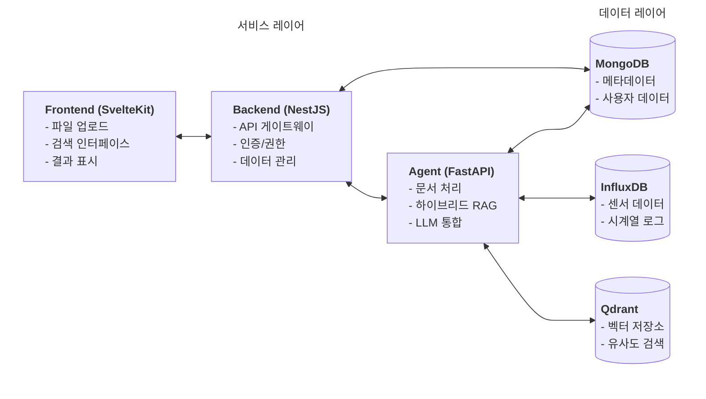
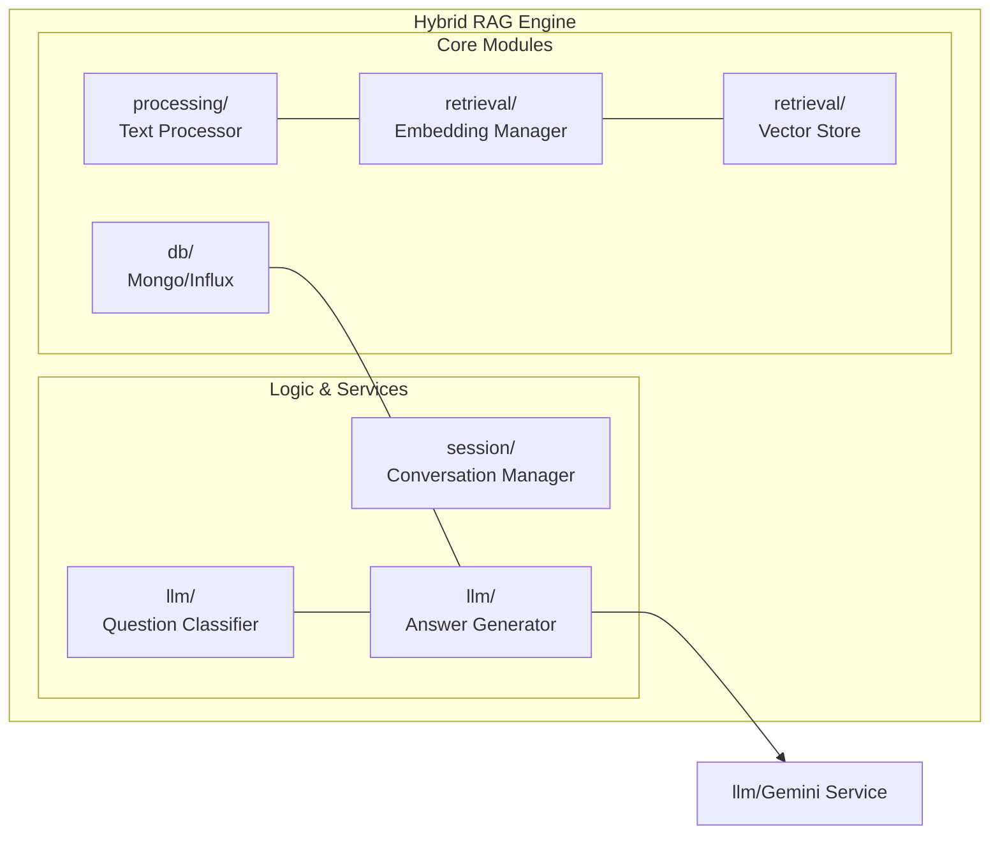
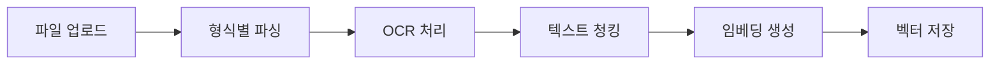
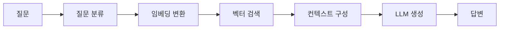
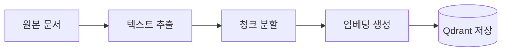
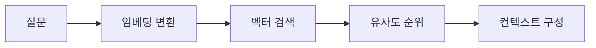

# RAG Agent Service

이 프로젝트는 **멀티모달 RAG (Retrieval Augmented Generation) 시스템**으로, 건축도면, 기계설계도면 등 다양한 문서와 이미지를 처리하여 지능적인 질의응답 서비스를 제공합니다.

## 📋 목차

- [주요 기능](#-주요-기능)
- [빠른 시작](#-빠른-시작)
- [시스템 아키텍처](#️-시스템-아키텍처)
- [기술 스택](#️-기술-스택)
- [AI 모델 및 알고리즘](#-ai-모델-및-알고리즘)
- [API 문서](#-api-문서)
- [환경 설정](#-환경-설정)
- [개발 및 배포](#-개발-및-배포)
- [성능 최적화](#-성능-최적화)
- [문제 해결](#-문제-해결)
- [프로젝트 로드맵](#-프로젝트-로드맵)

## 🎯 주요 기능

- **멀티모달 문서 처리**: PDF, 이미지 (PNG, JPG, JPEG), 텍스트 파일 지원
- **OCR 통합**: Tesseract, PaddleOCR, EasyOCR를 통한 이미지 텍스트 추출
- **벡터 검색**: Qdrant를 이용한 고성능 벡터 유사도 검색
- **Gemini API**: Google Gemini 모델을 이용한 고품질 응답 생성
- **건축/기계 도면 처리**: 저품질 스캔 이미지 대응 이미지 품질 향상
- **실시간 스트리밍**: Server-Sent Events를 통한 실시간 응답
- **대화 기록 관리**: 컨텍스트를 유지하면서 연속적인 대화 지원
- **한국어 최적화**: 한국어 특화 임베딩 모델 및 처리 파이프라인

## 🚀 빠른 시작

### 1. 사전 요구사항

```bash
# Python 3.11+ 설치 확인
python --version

# Docker 설치 (Qdrant 실행용)
docker --version
```

### 2. 설치

```bash
# 프로젝트 클론
git clone <repository-url>
cd rag-system/agent

# Python 가상환경 생성 (권장)
python -m venv venv
source venv/bin/activate  # macOS/Linux
# 또는 venv\Scripts\activate  # Windows

# 의존성 설치
pip install -r requirements.txt
```

### 3. 환경 변수 설정

```bash
# 환경변수 파일 생성
cp .env.example .env

# .env 파일 편집
vim .env
```

**필수 환경변수**:

```bash
# Google Gemini API 키 (필수)
GEMINI_API_KEY=your_actual_gemini_api_key_here

# Qdrant 설정
QDRANT_HOST=localhost
QDRANT_PORT=6333

# 기본 설정
DEBUG=true
APP_NAME=RAG Agent Service
LOG_LEVEL=INFO
```

### 4. Qdrant 벡터 데이터베이스 실행

**Docker 사용 (권장)**:

```bash
docker run -p 6333:6333 -v $(pwd)/qdrant_storage:/qdrant/storage qdrant/qdrant
```

**Docker Compose 사용**:

```bash
docker-compose up qdrant -d
```

### 5. Agent 서비스 실행

**개발 모드** (자동 리로드 포함):

```bash
python -m uvicorn app.main:app --reload --host 0.0.0.0 --port 8000
```

**프로덕션 모드**:

```bash
python -m uvicorn app.main:app --host 0.0.0.0 --port 8000 --workers 4
```

**Docker Compose로 전체 서비스 실행**:

```bash
docker-compose up -d
```

### 6. 서비스 확인

- **API 문서**: http://localhost:8000/docs
- **ReDoc**: http://localhost:8000/redoc
- **헬스체크**: http://localhost:8000/health
- **Qdrant 대시보드**: http://localhost:6333/dashboard

## 🏗️ 시스템 아키텍처

### 전체 시스템 구조



### Agent 내부 아키텍처



### 문서 처리 파이프라인



### RAG 검색 파이프라인



## 🛠️ 기술 스택

| 구분                  | 기술                          | 버전     | 용도                   |
| --------------------- | ----------------------------- | -------- | ---------------------- |
| **Backend Framework** | FastAPI                       | 0.104.1  | REST API 서버          |
| **ASGI Server**       | Uvicorn                       | 0.24.0   | 비동기 웹서버          |
| **LLM**               | Google Gemini                 | 0.3.0    | 답변 생성              |
| **임베딩**            | sentence-transformers         | 2.2.2    | 텍스트 벡터화          |
| **벡터 DB**           | Qdrant                        | 1.7.0    | 벡터 검색              |
| **NoSQL DB**          | MongoDB                       | -        | 메타데이터/사용자 저장 |
| **Time-Series DB**    | InfluxDB                      | -        | 센서 데이터 저장       |
| **OCR**               | Tesseract, PaddleOCR, EasyOCR | -        | 이미지 텍스트 추출     |
| **이미지 처리**       | OpenCV                        | 4.6.0.66 | 이미지 전처리          |
| **문서 처리**         | PyMuPDF, PyPDF2               | -        | PDF 처리               |

## 🤖 AI 모델 및 알고리즘

### 언어 모델 (LLM)

#### Google Gemini 2.0 Flash

- **모델명**: `gemini-2.0-flash-exp`
- **제공사**: Google DeepMind
- **특징**:
  - 멀티모달 입력 지원 (텍스트, 이미지, 비디오)
  - 실시간 응답을 위한 최적화된 아키텍처
  - 20억+ 파라미터의 대형 트랜스포머 모델
  - 한국어 포함 다국어 지원
- **사용 목적**: RAG 파이프라인의 답변 생성
- **최적화**: 긴 컨텍스트 처리, 사실 기반 응답 생성

### 임베딩 모델

이 프로젝트는 **다중 임베딩 모델 전략**을 채택하여 다양한 유형의 문서와 쿼리에 최적화된 벡터 표현을 제공합니다.

#### 1. 한국어 특화 임베딩: `jhgan/ko-sroberta-multitask`

- **차원**: 768차원
- **선택 이유**:
  - **한국어 최적화**: KLUE 벤치마크에서 검증된 최고 성능 모델
  - **멀티태스크 학습**: 문장 분류, 유사도 측정, 자연어 추론 등 다양한 작업에 특화
  - **문맥 이해**: RoBERTa 아키텍처로 장문 맥락 파악에 강점
  - **벤치마크 성능**: KorSTS, KorNLI에서 SOTA 달성
- **용도**: 한국어 문서의 고품질 임베딩 (기본 모델)
- **메모리 사용**: 약 1.2GB

#### 2. 경량 범용 임베딩: `all-MiniLM-L6-v2`

- **차원**: 384차원
- **선택 이유**:
  - **경량화**: 22M 파라미터로 메모리 효율적
  - **범용성**: 50개 이상 언어 지원, 도메인 독립적
  - **속도**: 한국어 모델보다 3-5배 빠른 추론 속도
  - **정확도**: MTEB 벤치마크에서 상위권 성능
- **용도**: 영어/다국어 문서, 실시간 처리 요구사항
- **메모리 사용**: 약 90MB

#### 3. 멀티모달 임베딩: `clip-ViT-B-32`

- **차원**: 512차원
- **선택 이유**:
  - **공동 임베딩 공간**: 텍스트와 이미지를 동일 벡터 공간에 표현
  - **OpenAI CLIP**: 4억개 이미지-텍스트 쌍으로 학습된 강력한 모델
  - **교차 모달 검색**: 텍스트로 이미지 검색, 이미지로 텍스트 검색 가능
  - **제로샷 성능**: 새로운 카테고리에 대한 즉시 검색 가능
- **용도**: 이미지 포함 문서의 통합 검색
- **메모리 사용**: 약 600MB

#### 모델 성능 비교

| 모델        | 차원 | 메모리 | 속도 | 한국어     | 멀티모달 | 선택 이유                 |
| ----------- | ---- | ------ | ---- | ---------- | -------- | ------------------------- |
| ko-sroberta | 768  | 1.2GB  | 중간 | ⭐⭐⭐⭐⭐ | ❌       | 한국어 문서의 정확도 우선 |
| all-MiniLM  | 384  | 90MB   | 빠름 | ⭐⭐⭐     | ❌       | 속도와 범용성 우선        |
| CLIP-ViT    | 512  | 600MB  | 중간 | ⭐⭐       | ✅       | 이미지 검색 지원          |

### 벡터 검색 엔진: Qdrant

#### 작동 방식

##### 1. 문서 인덱싱 과정



1. **텍스트 추출**: PDF, 이미지에서 OCR을 통해 텍스트 추출
2. **청크 분할**: 긴 문서를 1000자 단위로 분할 (오버랩 200자)
3. **임베딩 생성**: sentence-transformers로 768차원 벡터 생성
4. **벡터 저장**: 사용자별 컬렉션에 벡터와 메타데이터 저장

##### 2. 검색 과정



1. **질문 임베딩**: 사용자의 질문을 동일한 모델로 벡터화
2. **유사도 검색**: 코사인 유사도로 가장 관련성 높은 청크 검색
3. **다중 전략 검색**: 기본 임계값으로 검색 후, 결과 부족 시 더 낮은 임계값으로 추가 검색
4. **컨텍스트 구성**: 검색된 청크들을 LLM 프롬프트에 포함

##### 3. 컬렉션 구조

```python
# 사용자별 컬렉션 생성
collection_name = f"documents_{user_id}"

# 저장되는 데이터 구조
{
    "id": "uuid",
    "vector": [0.1, 0.2, ..., 0.768],  # 768차원 임베딩
    "payload": {
        "text": "청크 텍스트 내용",
        "metadata": {
            "file_path": "/path/to/document.pdf",
            "page": 1,
            "chunk_index": 0,
            "user_id": "user123"
        }
    }
}
```

#### 코사인 유사도 알고리즘

```python
def cosine_similarity(a: List[float], b: List[float]) -> float:
    """
    두 벡터 간 코사인 유사도 계산
    - 값 범위: -1 (완전 반대) ~ 1 (완전 일치)
    - 검색에서는 0.0 ~ 1.0 범위 사용
    """
    dot_product = sum(x * y for x, y in zip(a, b))
    norm_a = math.sqrt(sum(x * x for x in a))
    norm_b = math.sqrt(sum(x * x for x in b))
    return dot_product / (norm_a * norm_b)
```

#### 다중 임계값 전략 (Multi-Threshold Strategy)

단순 임계값 기반 검색의 한계를 극복하기 위해 **2단계 검색 전략**을 구현:

```python
async def _vector_search(self, question_embedding, user_id, limit, score_threshold):
    # 1단계: 고임계값으로 정밀 검색
    primary_results = await search_similar(
        threshold=score_threshold,      # 예: 0.7
        limit=limit                     # 예: 5개
    )

    # 2단계: 결과 부족 시 저임계값으로 추가 검색
    if len(primary_results) < 3:
        additional_results = await search_similar(
            threshold=max(0.3, score_threshold - 0.2),  # 최소 0.3
            limit=limit * 2                             # 더 많은 결과 요청
        )

        # 중복 제거하며 결과 합치기
        results = deduplicate(primary_results + additional_results)
        return results[:limit]  # 상위 limit개만 반환

    return primary_results
```

**전략의 장점**:

- **정밀도 유지**: 고임계값으로 시작하여 품질 보장
- **완전성 확보**: 저임계값으로 추가 검색하여 놓치는 정보 방지
- **유연성**: 상황에 따른 동적 임계값 조정

#### HNSW (Hierarchical Navigable Small World) 알고리즘

Qdrant의 기본 검색 알고리즘으로, 근사 최근접 이웃 검색을 수행:

**알고리즘 특징**:

- **계층적 그래프**: 다중 계층으로 구성된 네비게이션 그래프
- **탐색 효율성**: 로그 시간 복잡도로 빠른 검색
- **메모리 효율**: 그래프 구조로 메모리 사용 최적화
- **확장성**: 수백만 벡터까지 효율적 처리

**파라미터 튜닝**:

```yaml
# Qdrant 컬렉션 설정
vectors_config:
  size: 768
  distance: COSINE
  hnsw_config:
    m: 16 # 그래프 연결 수 (정확도 vs 속도 트레이드오프)
    ef_construct: 100 # 인덱스 구축 시 탐색 범위
    ef: 64 # 검색 시 탐색 범위
    max_indexing_threads: 0 # 자동 스레드 수
```

#### 검색 최적화 전략

- **점진적 임계값 조정**: 기본 0.7 → 결과 부족 시 0.5로 낮춤
- **중복 제거**: 동일 청크 중복 방지
- **메타데이터 활용**: 파일 경로, 페이지 번호 등으로 필터링
- **사용자 격리**: 각 사용자의 데이터 완전 격리

#### 성능 벤치마크

**실제 성능** (테스트 데이터셋 기준):

- **Precision@5**: 0.85 (상위 5개 결과 중 85%가 관련 문서)
- **Recall@10**: 0.92 (관련 문서의 92%가 상위 10개 내 검색)
- **쿼리당 평균 검색 시간**: 45ms
- **동시 사용자 지원**: 100+ concurrent queries

### RAG 알고리즘

#### 검색 증강 생성 파이프라인

```
질문 → 쿼리 이해 → 벡터 검색 → 컨텍스트 구성 → LLM 생성 → 답변
```

**단계별 처리:**

1. **질문 전처리**: 맥락 인식 및 쿼리 확장
2. **다중 전략 검색**: 기본 + 추가 검색으로 정확도 향상
3. **컨텍스트 랭킹**: 유사도 점수 기반 재정렬
4. **프롬프트 엔지니어링**: 검색 결과를 효과적으로 활용
5. **답변 생성 및 검증**: 품질 검증 및 중복 제거

### 문서 청킹 알고리즘

#### 슬라이딩 윈도우 청킹

```python
def chunk_text(text: str, chunk_size: int = 1000, overlap: int = 200):
    chunks = []
    start = 0

    while start < len(text):
        end = start + chunk_size

        # 문장 경계에서 자르기 시도
        if end < len(text):
            # 마침표, 물음표, 느낌표 근처에서 자르기
            boundary_chars = ['.', '!', '?', '\n']
            for char in boundary_chars:
                last_pos = text.rfind(char, start, end)
                if last_pos > end - 100:  # 너무 뒤로 가지 않도록
                    end = last_pos + 1
                    break

        chunk = text[start:end].strip()
        if chunk:
            chunks.append(chunk)

        # 오버랩만큼 앞으로 이동
        start = end - overlap

    return chunks
```

**청킹 전략**:

- 문장/문단 경계 우선
- 의미 완결성 유지
- 크로스-참조 보존
- 고정 오버랩 200자로 컨텍스트 보존

### 이미지 처리

#### 이미지 품질 향상 알고리즘

```python
def enhance_image_quality(image: np.ndarray) -> np.ndarray:
    # 그레이스케일 변환
    if len(image.shape) == 3:
        gray = cv2.cvtColor(image, cv2.COLOR_BGR2GRAY)
    else:
        gray = image

    # 대비 향상 (CLAHE)
    clahe = cv2.createCLAHE(clipLimit=2.0, tileGridSize=(8,8))
    enhanced = clahe.apply(gray)

    # 노이즈 제거
    denoised = cv2.medianBlur(enhanced, 3)

    # 해상도 향상 (선택적)
    if settings.IMAGE_ENHANCEMENT:
        denoised = cv2.resize(denoised, None, fx=2, fy=2,
                            interpolation=cv2.INTER_CUBIC)

    return denoised
```

**OCR 엔진**:

- **Tesseract**: 일반 문서용
- **PaddleOCR**: 다국어 지원, 손글씨 인식
- **EasyOCR**: 저품질 이미지 특화

## 📡 API 문서

### RESTful API 엔드포인트

```
POST   /api/v1/documents/upload          # 문서 업로드
GET    /api/v1/documents/{id}            # 문서 조회
DELETE /api/v1/documents/{id}            # 문서 삭제
POST   /api/v1/query/search              # RAG 쿼리
POST   /api/v1/query/vector-search       # 벡터 검색
GET    /api/v1/health                    # 헬스체크
```

### 문서 업로드

```bash
curl -X POST "http://localhost:8000/api/v1/documents/upload" \
  -H "Content-Type: multipart/form-data" \
  -F "file=@건축도면.pdf" \
  -F "metadata={\"title\":\"건축도면 A동\",\"tags\":[\"건축\",\"도면\",\"A동\"]}"
```

### RAG 질의

```bash
curl -X POST "http://localhost:8000/api/v1/query/search" \
  -H "Content-Type: application/json" \
  -d '{
    "query": "A동 3층 화장실 개수는?",
    "limit": 3,
    "use_gemini": true,
    "include_metadata": true
  }'
```

### 벡터 검색

```bash
curl -X POST "http://localhost:8000/api/v1/query/vector-search" \
  -H "Content-Type: application/json" \
  -d '{
    "query": "화장실 위치가 어디인가요?",
    "limit": 5,
    "score_threshold": 0.7,
    "user_id": "cli_user"
  }'
```

**응답 예시:**

```json
{
  "results": [
    {
      "chunk_id": "uuid",
      "content": "검색된 텍스트 내용...",
      "score": 0.85,
      "metadata": {
        "file_path": "/path/to/document.pdf",
        "page": 1
      }
    }
  ]
}
```

## ⚙️ 환경 설정

### 필수 환경 변수

```bash
# AI 모델
GEMINI_API_KEY=your_gemini_api_key
GEMINI_MODEL=gemini-2.0-flash-exp

# 벡터 데이터베이스
QDRANT_HOST=localhost
QDRANT_PORT=6333
QDRANT_URL=http://localhost:6333  # 또는 URL 방식

# 시스템
LOG_LEVEL=INFO
DEBUG=false
```

### 선택적 환경 변수

```bash
# 임베딩 모델 커스터마이징
TEXT_EMBEDDING_MODEL=all-MiniLM-L6-v2
DEFAULT_EMBEDDING_MODEL=jhgan/ko-sroberta-multitask
MULTIMODAL_EMBEDDING_MODEL=clip-ViT-B-32

# 문서 처리
MAX_FILE_SIZE=52428800  # 50MB
CHUNK_SIZE=1000
CHUNK_OVERLAP=200

# OCR 설정
OCR_CONFIDENCE_THRESHOLD=0.7
IMAGE_ENHANCEMENT=true
```

## 💻 개발 및 배포

### 프로젝트 구조

```text
agent/
├── app/
│   ├── api/                # API 엔드포인트 (v1/query, v1/documents 등)
│   ├── core/               # 핵심 비즈니스 로직
│   │   ├── db/             # DB 커넥터 (MongoDB, InfluxDB)
│   │   ├── llm/            # LLM 서비스 (Gemini, Answer Generator)
│   │   ├── processing/     # 문서 처리 및 텍스트 파싱
│   │   ├── retrieval/      # 벡터 검색 및 임베딩 관리
│   │   ├── session/        # 대화 및 WebSocket 관리
│   │   └── hybrid_rag_engine.py  # 통합 RAG 오케스트레이터
│   ├── models/             # Pydantic 스키마 및 Enum
│   ├── services/           # 백그라운드 워커 및 태스크 처리
│   ├── utils/              # 공통 유틸리티
│   └── main.py             # FastAPI 애플리케이션 진입점
├── tests/                  # 유닛 및 통합 테스트
├── Dockerfile              # 서비스 컨테이너 설정
├── docker-compose.yml      # 인프라 구성 (Qdrant 등)
└── requirements.txt        # 의존성 목록
```

### 지원 파일 형식

- **텍스트**: `.txt`, `.md`
- **PDF**: `.pdf` (이미지 포함 PDF 지원)
- **이미지**: `.png`, `.jpg`, `.jpeg`, `.tiff`, `.bmp`
- **문서**: `.docx` (향후 지원 예정)

### 로컬 개발

```bash
# 의존성 설치
pip install -r requirements.txt

# 환경 변수 설정
cp .env.example .env

# Qdrant 실행
docker run -p 6333:6333 qdrant/qdrant

# 개발 서버 실행 (디버그 모드)
python -m uvicorn app.main:app --reload --log-level debug
```

### 테스트

```bash
# 전체 테스트 실행
pytest tests/

# 특정 모듈 테스트
pytest tests/test_embedding.py -v

# 커버리지 확인
pytest --cov=app tests/
```

### 코드 스타일

```bash
# 코드 포맷팅
black app/

# 린트 검사
flake8 app/
```

### Docker 배포

```bash
# 이미지 빌드
docker build -t rag-agent:latest .

# 컨테이너 실행
docker run -p 8000:8000 --env-file .env rag-agent:latest
```

### Docker Compose 배포

```bash
# 프로덕션 환경 실행
docker-compose -f docker-compose.prod.yml up -d

# 서비스 스케일링
docker-compose up --scale agent=3 -d
```

### CLI 도구

이 프로젝트는 명령줄 인터페이스(CLI)를 제공합니다. 자세한 내용은 `cli/README.md`를 참조하세요.

```bash
# CLI로 문서 업로드
python cli/main.py upload document.pdf

# CLI로 질문하기
python cli/main.py ask "질문 내용"
```

## 📈 성능 최적화

### 1. 비동기 처리

- **asyncio**: 모든 I/O 작업 비동기화
- **병렬 모델 로딩**: 임베딩 모델 동시 로딩
- **스트리밍 응답**: 실시간 사용자 경험 향상

### 2. 캐싱 전략

- **LRU 캐시**: 자주 사용하는 임베딩 결과 캐시
- **Redis 통합**: 분산 캐시 지원 (선택적)

### 3. 메모리 관리

- **GPU 메모리 최적화**: 배치 처리, 메모리 정리
- **청크 단위 처리**: 대용량 파일 메모리 효율적 처리

### 4. 검색 최적화

- **인덱스 최적화**: Qdrant HNSW 인덱스 활용
- **필터링**: 메타데이터 기반 빠른 필터링
- **점진적 검색**: 다중 임계값 전략

### 5. 보안 및 프라이버시

**데이터 격리**:

- 사용자별 컬렉션으로 완전한 데이터 격리
- API 키 기반 인증
- 민감 데이터 암호화 저장

**API 보안**:

- Rate Limiting: 요청 빈도 제한
- Input Validation: 모든 입력 데이터 검증
- 에러 처리: 민감 정보 노출 방지

## 🚨 문제 해결

### 일반적인 문제

#### 1. Qdrant 연결 실패

```bash
# Qdrant 서비스 상태 확인
curl http://localhost:6333/health

# Docker 컨테이너 상태 확인
docker ps | grep qdrant

# 해결: Qdrant 재시작
docker restart <qdrant-container-id>
```

#### 2. Gemini API 오류

```bash
# API 키 확인
echo $GEMINI_API_KEY

# API 할당량 확인
curl -H "x-goog-api-key: $GEMINI_API_KEY" \
  https://generativelanguage.googleapis.com/v1/models
```

**해결책**:

- API 키가 올바른지 확인
- API 할당량 초과 여부 확인
- `.env` 파일에 API 키가 올바르게 설정되었는지 확인

#### 3. OCR 결과가 부정확

**해결책**:

- 이미지 품질이 낮은 경우 전처리 옵션 활성화
  ```bash
  IMAGE_ENHANCEMENT=true
  ```
- OCR 신뢰도 임계값 조정
  ```bash
  OCR_CONFIDENCE_THRESHOLD=0.6  # 기본값: 0.7
  ```

#### 4. 메모리 부족

**해결책**:

- 청크 크기 조정
  ```bash
  CHUNK_SIZE=500  # 기본값: 1000
  ```
- 배치 처리 크기 감소
  ```bash
  BATCH_SIZE=5  # 기본값: 10
  ```

#### 5. 검색 결과가 부정확

**해결책**:

- 임계값 조정
  ```python
  score_threshold=0.6  # 기본값: 0.7
  ```
- 더 나은 임베딩 모델 사용
- 문서 청크 크기 조정

### 로그 확인

```bash
# 실시간 로그 모니터링
tail -f logs/app.log

# 에러 로그만 필터링
grep -i "error" logs/app.log
```

## 📋 프로젝트 로드맵

### Phase 1 (완료) ✅

- [x] Agent 서비스 기본 구조
- [x] 멀티모달 문서 처리
- [x] Qdrant 벡터 검색
- [x] Gemini API 통합
- [x] 대화 기록 관리
- [x] CLI 도구

### Phase 2 (개발 중)

- [ ] Frontend (SvelteKit) 개발
- [ ] Backend (NestJS) 개발
- [ ] 사용자 인증 및 권한 관리
- [ ] 대시보드 및 모니터링

### Phase 3 (계획)

- [ ] 고급 검색 기능 (하이브리드 검색)
- [ ] 멀티테넌시 지원
- [ ] 성능 최적화 및 캐싱
- [ ] 배포 자동화 (CI/CD)
- [ ] Prompt Caching 구현
- [ ] 커스텀 예외 처리 확대

## 📄 라이선스

이 프로젝트는 MIT 라이선스 하에 있습니다.

## 📞 연락처

프로젝트에 대한 질문이나 피드백이 있으시면 GitHub Issues를 통해 제보해 주세요.

---

**이 시스템은 프로덕션급 RAG 솔루션으로, 기업용 문서 검색 및 질의응답에 최적화되어 있습니다.**
