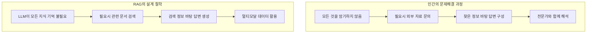
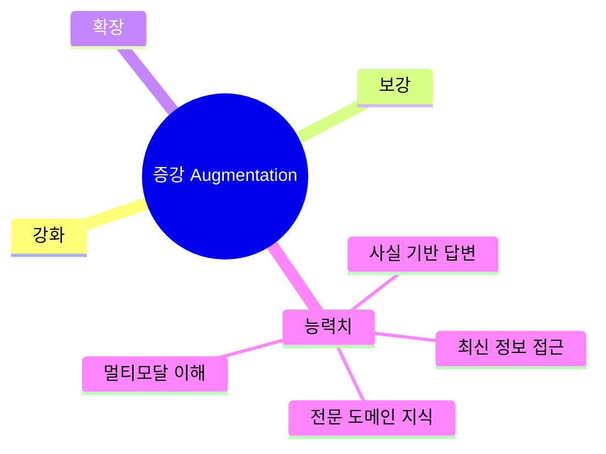
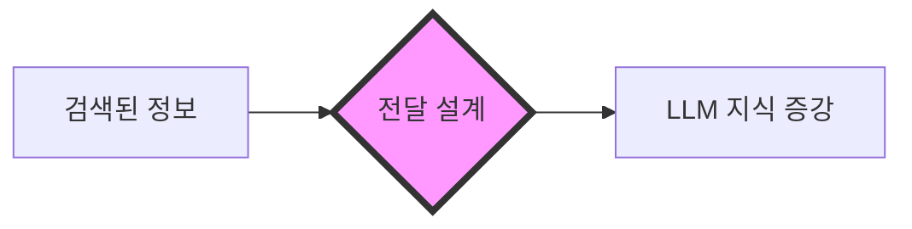
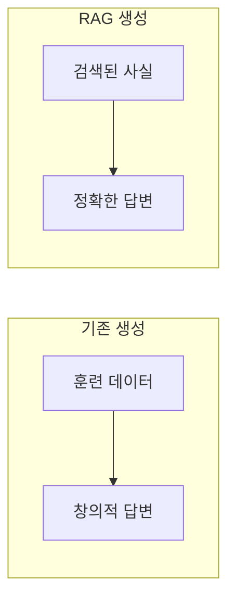
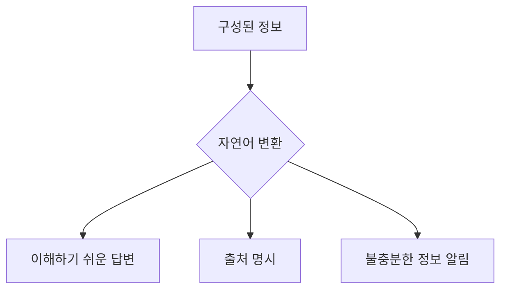
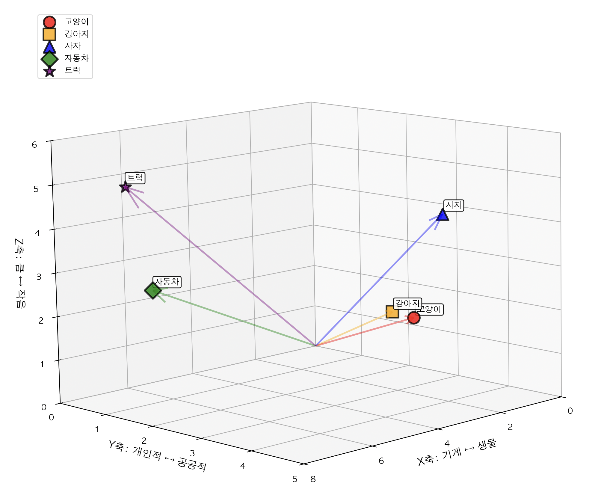
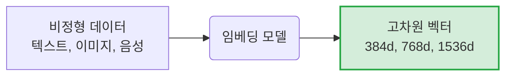
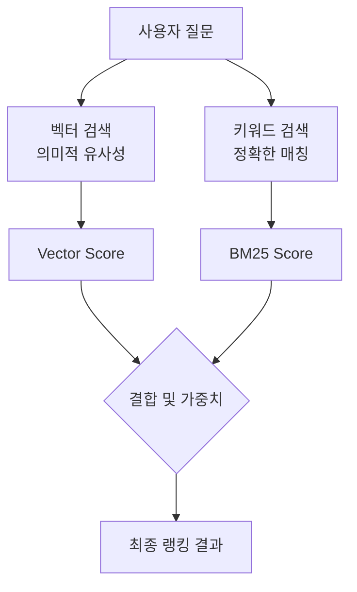

# RAG (Retrieval-Augmented Generation) 시스템 개념 정리

## 1. RAG란 무엇인가?

### 1.1 RAG의 기본 개념

- **Retrieval-Augmented Generation (RAG)** 은 대형 언어 모델(LLM)이 응답을 생성하기 전에 지정된 외부 문서 집합을 참조하도록 하는 기술입니다.

- **이름의 의미**
  - **"Retrieval-Augmented"**: 검색을 통해 LLM의 지식을 증강한다는 의미
  - **"Generation"**: 검색된 사실 정보 기반의 정확한 답변 생성한다는 의미
  - 즉, 외부 데이터베이스나 문서에서 관련 정보를 검색(Retrieve)하고, 이를 바탕으로 더 정확하고 맥락에 맞는 답변을 생성(Generate)하는 AI 시스템.

- **핵심 아이디어**
  - 외부 지식 베이스에서 관련 정보를 먼저 검색
  - 검색된 정보를 LLM의 프롬프트에 추가하여 맥락 제공
  - LLM이 제공된 맥락을 바탕으로 정확하고 관련성 높은 답변 생성

### 1.2 RAG의 작동 원리


**단계별 설명**

1. **질문 분석**: 사용자의 질문을 이해하고 검색 쿼리 생성
2. **문서 검색**: 벡터 데이터베이스에서 관련 문서 검색 (유사도 기반)
3. **맥락 구성**: 검색된 문서를 LLM이 이해할 수 있는 형태로 정리
4. **답변 생성**: 맥락이 포함된 프롬프트로 LLM이 답변 생성
5. **후처리**: 답변 품질 검증 및 포맷팅

### 1.3 RAG의 주요 특징

**장점:**

- ✅ **정확성 향상**: 환각 현상 감소, 사실 기반 답변
- ✅ **업데이트 용이성**: 새로운 정보 추가 시 재학습 불필요
- ✅ **비용 효율성**: 파인튜닝보다 저렴하고 빠름
- ✅ **확장성**: 다양한 도메인 지식 통합 가능

**단점:**

- ❌ **검색 품질 의존성**: 검색 결과가 좋지 않으면 답변 품질 저하
- ❌ **추론 복잡성**: 검색 + 생성의 2단계 프로세스로 인한 지연

## 2. RAG가 등장한 배경과 필요성

### 2.1 기존 AI 시스템의 한계

**전통적인 LLM의 근본적 문제들**

1. **환각 현상 (Hallucination)**

   ```
   문제: LLM이 그럴듯하지만 틀린 정보를 자신있게 제공
   원인: 훈련 데이터에 없거나 부정확한 패턴 학습

   예시:
   Q: "우리 회사의 2024년 Q3 매출은?"
   A: "약 500만 달러로 추정됩니다." (완전히 지어낸 답변)

   Q: "이 건축도면에서 보일러실 크기는?"
   A: "약 20평방미터로 보입니다." (이미지를 제대로 읽지 못했음에도 추정치 제공)
   ```

2. **도메인 특화 지식 부족**

   ```
   문제: 일반적인 LLM은 특정 기업/조직의 내부 지식 부족
   결과: 회사 정책, 내부 프로세스, 전문 기술 문서 이해 불가

   예시:
   Q: "우리 회사 휴가 정책이 어떻게 되나요?"
   A: "일반적인 휴가 정책에 대해 설명드리겠습니다..." (회사별 특수성 무시)

   Q: "이 기계설계도면의 치수 공차는?"
   A: "도면을 직접 해석할 수 없습니다." (전문 도면 해석 능력 부재)

   Q: "PDF 내 CAD 이미지의 부품 번호는?"
   A: "이미지 내 텍스트를 정확히 읽을 수 없습니다." (OCR 한계)
   ```

3. **비용과 확장성 문제**
   ```
   기존 해결책: LLM 파인튜닝 또는 재학습
   문제점:
   - 매번 수십만 달러의 GPU 비용
   - 몇 주에서 몇 달의 학습 시간
   - 새로운 정보 추가 시 전체 재학습 필요
   - 배포 및 유지보수 복잡성
   ```

### 2.2 RAG 등장의 필연성

**기존 LLM vs RAG 시스템 비교**

| 구분               | 기존 LLM 방식                               | RAG 방식                                      |
| ------------------ | ------------------------------------------- | --------------------------------------------- |
| **지식 저장 방식** | 모든 지식을 모델 파라미터(175B)에 압축 저장 | 외부 벡터 DB에 실시간 검색 가능한 형태로 저장 |
| **지식 업데이트**  | 새 지식 추가 시 전체 모델 재학습 필요       | 새 문서 추가만으로 즉시 지식 업데이트 가능    |
| **업데이트 비용**  | 수십만 달러 GPU 비용 + 몇 주 학습 시간      | 문서 저장 비용만 발생                         |
| **답변 생성 방식** | 파라미터에 저장된 지식으로만 답변 생성      | 질문 관련 문서를 검색하여 컨텍스트로 활용     |
| **확장성**         | 새로운 도메인마다 별도 모델 학습 필요       | 하나의 시스템으로 다양한 도메인 처리 가능     |
| **비용 효율성**    | 고비용, 저효율성                            | 저비용, 고효율성                              |
| **실시간성**       | 훈련 시점의 지식만 활용 가능                | 최신 정보까지 실시간 검색 가능                |

**핵심 차이점:**

- **기존 LLM**: "모든 것을 기억하고 스스로 답변 생성"
- **RAG 시스템**: "필요한 정보를 찾아서 함께 답변 생성"

### 2.3 RAG의 혁신적 아이디어



## 3. RAG의 핵심 개념

RAG(Retrieval-Augmented Generation)는 **검색 증강 생성** 기술로, 외부 데이터베이스나 문서에서 관련 정보를 검색(Retrieve)하고, 이를 바탕으로 더 정확하고 맥락에 맞는 답변을 생성(Generate)하는 AI 시스템입니다.

### 3.1 검색 (Retrieval) 개념

**왜 검색이 필요한가?**

```
문제: LLM은 훈련 시점까지의 지식만 가지고 있음
해결: 검색 기능을 활용하여 실시간으로 외부 지식베이스에서 정보를 검색하여 활용

"2024년 우리 회사 매출은?" → 훈련 데이터에 없음 → 검색을 통해 외부 DB에서 관련 정보 찾아 활용
"이 도면의 치수는?" → 이미지 이해 불가 → 검색을 통해 관련 문서와 도면 찾아 활용
```

**검색의 핵심 원리:**

1. **벡터 변환**: 텍스트/이미지를 수치 벡터로 변환
2. **유사도 계산**: 질문과 문서 간의 의미적 유사도 측정
3. **랭킹**: 가장 관련성 높은 문서들을 우선 선택
4. **컨텍스트 구성**: 선택된 문서들을 LLM이 이해할 수 있게 정리

### 3.2 증강 (Augmentation) 개념

**증강의 의미:**



**증강의 역할:**



**증강의 구체적 방법:**

1. **컨텍스트 주입 (Context Injection)**: 검색된 정보를 LLM의 입력 프롬프트에 추가

   ```
   예시)
   원래 프롬프트: "우리 회사 휴가 정책을 설명해주세요"

   컨텍스트 주입 후:
   "다음은 우리 회사 휴가 정책 관련 문서입니다:
   [검색된 문서 내용: 연차 휴가는 15일, 병가는 30일...]

   위 정보를 바탕으로 우리 회사 휴가 정책을 설명해주세요"

   💡 핵심: 질문 + 관련 문서 = 더 정확한 답변
   ```

2. **메타데이터 활용**: 출처, 신뢰도, 날짜 등의 부가 정보 활용
3. **멀티모달 통합**: 텍스트 + 이미지 정보를 함께 처리
4. **프롬프트 최적화 (Prompt Optimization)**: 검색 결과를 효과적으로 활용하는 프롬프트 구성

   ```
   검색 결과를 단순히 추가하는 것이 아니라, LLM이 더 잘 활용할 수 있도록 프롬프트를 설계하는 방법입니다.

   최적화 기법들:
   • 검색 결과 순서 정하기: 가장 관련성 높은 문서를 먼저 배치
   • 정보 구조화: 섹션별로 나누어 명확히 전달
   • 길이 제한: 너무 긴 검색 결과는 요약하거나 잘라내기
   • 지시사항 추가: "다음 정보를 바탕으로 답변하되, 출처를 명시하세요"

   예시)
   원래: [긴 검색 결과 전체를 그냥 붙임]

   최적화 후:
   "관련성 높은 문서 (우선순위 1):
   [핵심 내용만 요약]

   추가 참고 문서:
   [부가 정보]

   위 정보를 바탕으로 사용자의 질문에 답변해주세요."
   ```

### 3.3 생성 (Generation) 개념

**생성의 의미:**



**생성의 역할:**



**생성의 품질 향상 포인트:**

1. **사실 기반 답변**: 검색된 정보를 근거로 답변 생성
2. **출처 표시**: 답변의 근거가 되는 문서 표시
3. **불확실성 표현**: 정보가 불충분할 경우 명확히 표시
4. **멀티모달 출력**: 텍스트 답변 + 관련 이미지/도면 제공

## 4. RAG의 기술적 원리

### 4.1 벡터

#### 4.1.1) 왜 벡터가 필요한가?

```
문제: 컴퓨터는 "사과"와 "apple"이 같은 의미인지 알 수 없음
해결: 의미를 수치(벡터)로 변환하여 유사도 계산 가능

"사과" → [0.2, 0.8, 0.1, 0.4, ...]
"apple" → [0.3, 0.7, 0.2, 0.5, ...]  # 유사한 벡터
"자동차" → [0.9, 0.1, 0.8, 0.2, ...]  # 다른 벡터
```

**📊 실제 벡터 좌표로 보는 유사도 개념:**

```python
# 실제 벡터 좌표 예시 (3차원으로 확장하여 더 현실적인 표현)
# 의미적으로 유사한 개념들의 벡터 (3차원)

# 3D 공간상 위치 관계:
# X축: 생물/기계 구분 (낮은 값: 생물, 높은 값: 기계)
# Y축: 개인적/공공적 구분 (높은 값: 개인적, 낮은 값: 공공적)
# Z축: 크기 구분 (높은 값: 큼, 낮은 값: 작음)

vectors = {
    "고양이": np.array([2.1, 3.4, 1.8]),    # 🐱 [x, y, z] - 생물, 공공적, 작음
    "강아지": np.array([2.3, 3.1, 1.9]),    # 🐶 [x, y, z] - 생물, 공공적, 작음 (고양이와 유사)
    "사자": np.array([1.8, 3.8, 4.2]),      # 🦁 [x, y, z] - 생물, 공공적, 큼 (고양이과 동물)
    "자동차": np.array([7.2, 1.5, 2.8]),    # 🚗 [x, y, z] - 기계, 개인적, 중간크기
    "트럭": np.array([7.5, 1.2, 5.1]),      # 🚛 [x, y, z] - 기계, 개인적, 큼 (자동차와 유사)
}
```

**🌟 3D 벡터 공간의 입체적 시각화:**



#### 4.1.2) 벡터 유사도 측정

- 벡터 유사도 측정은 **두 벡터 간의 관계를 수치화하는 방법**입니다. 임베딩 공간에서 유사도는 **의미적 유사성**을 반영합니다.
  <small> \*임베딩공간: 텍스트나 데이터를 고차원 벡터로 변환하여 위치시키는 가상의 공간입니다. 이 공간에서 벡터 간의 거리나 각도가 의미적 유사성을 반영합니다.
  </small>

- 벡터 유사도를 측정하는 방식은 크게 **거리 기반**과 **각도 기반**으로 나뉩니다:

---

#### ① 📏 유클리드 거리 (거리 기반 유사도)

유클리드 거리는 두 점 사이의 **직선 거리**를 측정합니다. 피타고라스 정리를 일반화한 개념입니다.

```python
def euclidean_distance(vec1, vec2):
    """유클리드 거리 계산"""
    diff = vec1 - vec2
    return np.sqrt(np.sum(diff ** 2))

# 실제 계산 예시
print("=== 유클리드 거리 계산 ===")
print(f"고양이 ↔ 강아지: {euclidean_distance(cat_vec, dog_vec):.2f}")  # 가까움: 작은 값
print(f"고양이 ↔ 자동차: {euclidean_distance(cat_vec, car_vec):.2f}")  # 멀리 떨어짐: 큰 값
print(f"고양이 ↔ 고양이: {euclidean_distance(cat_vec, cat_vec):.2f}")  # 동일: 0.0
```

**유클리드 거리의 특징:**

- **범위**: 0 (완전 동일) ~ ∞ (완전 다름)
- **장점**: 직관적이고 계산이 간단함
- **단점**: 차원 수가 증가할수록 거리가 커지는 현상 (차원의 저주)

---

#### ② 📐 코사인 유사도 (각도 기반 유사도)

코사인 유사도는 두 벡터 간의 **각도**를 측정합니다. 벡터의 크기(norm)는 무시하고 방향만 고려합니다.

```python
import numpy as np

def cosine_similarity(vec1, vec2):
    """코사인 유사도 계산"""
    dot_product = np.dot(vec1, vec2)
    norm1 = np.linalg.norm(vec1)
    norm2 = np.linalg.norm(vec2)
    return dot_product / (norm1 * norm2)

# 실제 계산 예시
cat_vec = np.array([2.1, 3.4, 1.8])      # 고양이
dog_vec = np.array([2.3, 3.1, 1.9])      # 강아지
car_vec = np.array([7.2, 1.5, 2.8])      # 자동차

print("=== 코사인 유사도 계산 ===")
print(f"고양이 ↔ 강아지: {cosine_similarity(cat_vec, dog_vec):.3f}")  # 유사: 높은 값
print(f"고양이 ↔ 자동차: {cosine_similarity(cat_vec, car_vec):.3f}")  # 다름: 낮은 값
print(f"고양이 ↔ 고양이: {cosine_similarity(cat_vec, cat_vec):.3f}")  # 동일: 1.0
```

**코사인 유사도의 특징:**

- **범위**: -1 (완전 반대) ~ 1 (완전 동일)
- **장점**: 벡터 크기에 영향을 받지 않음
- **단점**: 각도만 고려하므로 크기 정보 손실

---

#### ③ 🏆 RAG 시스템에서 주로 사용되는 방식

RAG 시스템에서는 **코사인 유사도**를 아래와 같은 이유로 주로 사용합니다

✅ **범용적인 장점:**

1. **의미적 유사성 포착**: 텍스트 임베딩에서 **방향성**이 의미를 더 잘 표현
2. **벡터 크기 정규화**: 크기 차이를 무시하고 순수한 방향 비교
3. **표준화된 범위**: -1 ~ 1로 임계값 설정이 용이

✅ **기술적 장점:**

1. **벡터 DB 지원**: Qdrant, Pinecone, Weaviate 등 대부분의 벡터 DB가 코사인 기본 지원
2. **임베딩 모델 호환**: SentenceTransformers, OpenAI 등 주요 모델이 L2 정규화 사용<small>
   \*L2정규화: 벡터의 크기를 1로 맞추는 과정으로, 코사인 유사도 계산에 최적화됨
   </small>
3. **다국어 지원**: 언어 간 크기 차이를 무시한 공정한 비교

---

### 4.2 임베딩

#### 4.2.1) 임베딩의 개념

- 텍스트, 이미지, 음성 등의 비구조화 데이터를 고정된 크기의 벡터로 변환하는 기술입니다.
- 이 벡터는 원본 데이터의 의미적 정보를 수치로 압축하여 표현합니다.



👉 임베딩 방식은 크게 두 가지가 있습니다.

- **텍스트 임베딩(Text Embedding)**: 텍스트 데이터를 벡터로 변환하여 문서 간 의미 비교나 검색에 활용합니다.
- **멀티모달 임베딩(Multimodal Embedding)**: 텍스트, 이미지, 음성 등 서로 다른 형태의 데이터를 동일한 벡터 공간에 매핑하여 교차 검색이나 의미적 연결을 가능하게 합니다.

#### 4.2.2) 임베딩 모델의 종류

**① 텍스트 임베딩 모델**

- **Sentence-BERT 계열**
  - **개발 주체:** Google
  - **특징:** 문장 임베딩에 최적화, 대칭적 검색(문서↔문서)에 강점
  - **장점:** 문서 간 의미 비교에 강함, 다양한 사전학습 모델 존재, 오픈소스 제공
  - **단점:** 질문↔문서 같은 비대칭 검색에는 상대적으로 약함
  - **적합한 활용:** 문서 유사도, 의미 기반 검색

| 모델                                  | 차원   | 장점                           | 단점              | 활용                       |
| ------------------------------------- | ------ | ------------------------------ | ----------------- | -------------------------- |
| all-MiniLM-L6-v2                      | 384    | 빠름, 범용성 높음              | 품질은 중간 수준  | 실시간 검색, 대규모 서비스 |
| all-mpnet-base-v2                     | 768    | 높은 품질, 문장 의미 표현 우수 | 속도·자원 소모 큼 | 고품질 문서 검색           |
| paraphrase-multilingual-MiniLM-L12-v2 | 다국어 | 다양한 언어 처리 가능          | 언어별 품질 차이  | 글로벌 서비스, 다국어 검색 |

---

- **E5 계열**
  - **개발 주체:** Microsoft
  - **특징:** 범용 임베딩, 비대칭적 검색(질문↔문서)에 강점
  - **장점:** 질문-문서 매칭에 최적화, 다양한 크기 제공, 오픈소스 제공
  - **단점:** 대칭적 검색에는 상대적으로 약함
  - **적합한 활용:** QA 시스템, RAG

| 모델     | 차원 | 장점                             | 단점                    | 활용              |
| -------- | ---- | -------------------------------- | ----------------------- | ----------------- |
| E5-small | 384  | 빠른 속도, 경량                  | 품질은 중간 수준        | 실시간 질의응답   |
| E5-base  | 768  | 균형 잡힌 성능                   | 속도·품질 모두 중간     | 범용 검색         |
| E5-large | 1024 | 높은 품질, 복잡한 의미 표현 가능 | 속도 느림, 자원 소모 큼 | 고품질 QA, 연구용 |

---

- **Ko-SRoBERTa**
  - **개발 주체:** 국내 연구진
  - **특징:** 한국어 텍스트에 최적화, 문법·문화적 맥락 이해, 형태소 기반 토큰화
  - **장점:** 한국어 특화, 뉘앙스 이해 가능, 오픈소스 제공
  - **단점:** 영어 대비 생태계·리소스 적음
  - **적합한 활용:** 한국어 검색, 한국어 QA

| 모델                  | 차원 | 장점                         | 단점               | 활용                   |
| --------------------- | ---- | ---------------------------- | ------------------ | ---------------------- |
| ko-sroberta-multitask | 768  | 한국어 문법·문화적 맥락 이해 | 글로벌 생태계 부족 | 한국어 검색, 한국어 QA |

---

**② 멀티모달 임베딩 모델**

- **CLIP**
  - **개발 주체:** OpenAI
  - **특징:** 텍스트-이미지 통합 임베딩, 동일 공간 매핑
  - **장점:** 이미지와 텍스트를 동시에 처리, 강력한 검색 성능, 오픈소스 제공
  - **단점:** 텍스트·이미지 외 모달리티는 제한적
  - **적합한 활용:** 이미지 검색, 캡셔닝, 시각적 QA

| 모델 | 특징                      | 장점                                            | 단점                               | 활용                           |
| ---- | ------------------------- | ----------------------------------------------- | ---------------------------------- | ------------------------------ |
| CLIP | 텍스트-이미지 통합 임베딩 | 이미지와 텍스트를 동시에 처리, 강력한 검색 성능 | 텍스트·이미지 외 모달리티는 제한적 | 이미지 검색, 캡셔닝, 시각적 QA |

---

### 4.3 벡터 DB

#### 4.3.1) 벡터 DB란?

- Vector Database(벡터 데이터베이스)는 **고차원 벡터 데이터를 효율적으로 저장, 인덱싱, 검색할 수 있도록 최적화된 데이터베이스**입니다.
- 기존의 관계형 데이터베이스가 구조화된 데이터를 다룬다면, 벡터 데이터베이스는 **의미적 유사성**을 기반으로 데이터를 검색할 수 있습니다.

#### 4.3.2) 벡터 DB의 필요성

```
① 일반 RDBMS의 한계
  - 텍스트 검색만 가능 (LIKE, FULLTEXT)
  - 의미적 유사도 검색 불가
  - 고차원 벡터 연산 비효율적

② 고차원 벡터 공간에서의 한계
  - 거리 집중 현상: 모든 점들 사이의 거리가 비슷해지는 경향
  - 청크 모서리: 대부분의 데이터가 공간의 경계 근처에 위치
  - 밀도 급감: 데이터 점들 사이의 거리가 급속히 증가

③ 벡터 DB의 장점
  - 고차원 벡터 저장 및 검색 최적화
  - 코사인 유사도, L2 거리 등 다양한 유사도 측정
  - ANN (Approximate Nearest Neighbor) 알고리즘으로 초고속 검색
  - 메타데이터 필터링 지원
```

#### 4.3.3) 벡터 DB의 종류

- **Qdrant**: Rust 기반, 고성능, 오픈소스
- **Pinecone**: 클라우드 서비스, 관리형
- **Weaviate**: GraphQL 지원, 시맨틱 검색
- **Chroma**: Python 친화적, 개발자 친화

#### 4.3.4) 벡터 데이터베이스 비교

| DB           | 호스팅/배포         | 장점                                               | 단점                                                     | 적합한 사용처                                         |
| ------------ | ------------------- | -------------------------------------------------- | -------------------------------------------------------- | ----------------------------------------------------- |
| **Qdrant**   | 클라우드/셀프호스팅 | 오픈소스, 강력한 필터링, 대규모 검색에 강점        | 관리형 옵션 제한 → 운영·모니터링·확장을 직접 관리해야 함 | 대규모 RAG, 온프레미스 검색, 복잡한 필터링 전자상거래 |
| **Pinecone** | 클라우드 전용       | 완전 관리형, 서버리스, 글로벌 배포, 빠른 온보딩    | 비용 증가 가능, 플랫폼 종속성 큼                         | 글로벌 검색 서비스, 추천 시스템, 멀티 리전 RAG        |
| **Weaviate** | 클라우드/셀프호스팅 | GraphQL API, 시맨틱 검색, 오픈소스, 복합 쿼리 처리 | 학습 곡선 높음, 설정·버전 관리 복잡                      | 지식 그래프 검색, 카탈로그 검색, 멀티모달 검색        |
| **Chroma**   | 클라우드/셀프호스팅 | Python 친화적, 빠른 프로토타입, 개발자 경험 우수   | 확장성 및 안정성 낮음                                    | RAG 실험, 데모, 개인 프로젝트, 소규모 앱              |

**추천**: 자체 호스팅으로 무료 운영하면서 고성능이 필요한 경우 **Qdrant**가 최적

---

### 4.4 LangChain

#### 4.4.1) 정의

- LangChain은 대형 언어 모델(LLM)을 다양한 데이터 소스와 외부 도구에 연결하여, 검색·질의응답·자동화 워크플로우 같은 복잡한 AI 애플리케이션을 쉽게 구축할 수 있도록 지원하는 오픈소스 프레임워크입니다. 특히 벡터 데이터베이스와의 연동을 통해 **RAG(Retrieval-Augmented Generation) 구현을 강력하게 지원**합니다.

#### 4.4.2) 핵심 개념

- **체이닝(Chaining):** 여러 컴포넌트를 연결해 복잡한 워크플로우를 구성
- **모듈성(Modularity):** 프롬프트 관리, 메모리, 에이전트, 툴 연동 등 독립적 모듈 제공
- **외부 도구 연동:** API, 데이터베이스, 벡터 DB, 검색 엔진 등과 손쉬운 연결

#### 4.4.3) 주요 특징

- 다양한 LLM 지원 (OpenAI, Anthropic, Hugging Face 등)
- 메모리 관리 및 대화 맥락 유지
- 벡터 데이터베이스 연동으로 RAG 파이프라인 구축 가능
- 스트리밍 및 실시간 응답 처리
- 표준화된 인터페이스 제공

#### 4.4.4) 장점

- ✅ 빠른 프로토타이핑으로 개발 생산성 향상
- ✅ 다양한 컴포넌트 조합으로 맞춤형 구축 가능
- ✅ 대규모 애플리케이션으로 확장 용이
- ✅ 기존 LLM 활용으로 추가 학습 비용 절감

#### 4.4.5) 단점

- ❌ 학습 곡선: 다양한 컴포넌트로 인해 초보자에게 복잡
- ❌ 응답 지연: 체이닝으로 인한 추가 처리 시간 발생 가능
- ❌ 버전 관리: 빠르게 발전하는 생태계로 인해 의존성·호환성 관리 필요

#### 4.4.6) 지원하는 외부 데이터 유형

LangChain은 다양한 외부 데이터 소스를 지원하여 RAG 시스템의 유연성을 높입니다:

- **문서 파일**: PDF, TXT, DOCX, CSV, JSON 등 로컬 파일 로딩
- **웹 데이터**: 웹페이지, URL 기반 콘텐츠 검색 및 크롤링
- **관계형 데이터베이스**: MySQL, PostgreSQL, SQLite 등 SQL 쿼리 기반 검색
- **NoSQL 데이터베이스**: MongoDB, Redis 등 구조적/비구조적 데이터
- **API 연동**: REST API, GraphQL 등 외부 서비스 데이터 통합
- **클라우드 스토리지**: AWS S3, Google Cloud Storage 등
- **실시간 데이터**: 스트리밍 데이터, WebSocket 등 동적 콘텐츠

---

## 5. RAG의 적용 분야

### 5.1 기업 내부 지식 관리

**기업용 RAG의 가치:**

```
기업의 문제:
- 방대한 내부 문서 (매뉴얼, 정책, 보고서, 이메일)
- 전문 지식의 사일로화 (부서별로 흩어진 지식)
- 신입 교육 비용 증가
- 업무 효율성 저하

RAG의 해결:
- 모든 문서를 통합 검색 가능
- 자연어로 질문하면 관련 문서 자동 검색
- 업무 프로세스 표준화
- 지식 공유 문화 구축
```

**구체적 활용 사례:**

1. **HR 챗봇**: "연차 사용 정책이 어떻게 되나요?"
2. **기술 지원**: "서버 장애 대응 매뉴얼 알려주세요"
3. **법무 상담**: "계약서 템플릿 어디에 있나요?"
4. **영업 지원**: "이 고객의 과거 거래 내역은?"

### 5.2 전문 분야 Q&A 시스템

**전문 분야의 특징:**

```
의료: 정확성이 생명을 좌우
법률: 판례와 법령의 정확한 인용 필요
금융: 실시간 데이터와 규제 준수
기술: 복잡한 도면과 스펙 이해
```

**RAG의 강점:**

- **정확성**: 사실 기반 답변으로 환각 현상 방지
- **업데이트**: 새로운 법령, 연구 결과 즉시 반영
- **추적성**: 답변의 출처 명확히 표시
- **규제 준수**: 감사 로그와 설명 가능성 제공

### 5.3 멀티모달 문서 처리

**현실 세계 문서의 특징:**

```
기업 문서의 80% 이상이 멀티모달:
- PDF: 텍스트 + 이미지 + 표 + 도면
- 프레젠테이션: 텍스트 + 차트 + 다이어그램
- 이메일: 텍스트 + 첨부파일 + 링크
- CAD 파일: 3D 모델 + 치수 + 재료 정보
```

**멀티모달 RAG의 필요성:**

```
기존 텍스트만 처리: "이 도면의 치수를 알려주세요" → "도면을 읽을 수 없습니다"
멀티모달 RAG: "이 도면의 치수를 알려주세요" → "보일러실 가로 5m, 세로 3m입니다"
```

**멀티모달 처리 기술:**

1. **OCR**: 이미지 내 텍스트 추출
2. **이미지 캡셔닝**: 이미지 내용 설명 생성
3. **레이아웃 분석**: 문서 구조 이해
4. **표/차트 해석**: 데이터 시각화 이해

## 6. RAG의 최적화 기법

### 6.1 하이브리드 검색 (Hybrid Search)

**개념:** 벡터 기반 유사도 검색과 키워드 기반 검색을 결합하여 정확성과 포괄성을 동시에 확보하는 방식입니다.



- **필요성:**
  - 기존에는 벡터 검색만으로 의미적 유사도를 잘 잡았지만, **숫자·코드·고유명사** 같은 정확한 매칭이 필요한 항목을 놓치기 쉬웠습니다. 이렇게 하면 **정밀도**가 떨어져 핵심 문서를 누락할 수 있습니다.
  - 반면에 키워드 검색만으로는 정확한 매칭을 잘했지만, **표현이 달라지면** 의미적으로 관련된 문서를 찾지 못했습니다. 이렇게 하면 **재현율**이 낮아집니다.
  - 두 방식을 결합하면 **의미적 맥락과 정확한 매칭**을 동시에 반영하여, **정밀도와 재현율을 균형 있게** 끌어올릴 수 있습니다.

- **적용 방법:**
  - 벡터 점수와 BM25 점수를 정규화 후 가중치(α)로 합산
    <small> \*벡터점수: 의미적으로 얼마나 유사한가를 나타내는 점수
    \*BM25: 단어가 얼마나 정확히 매칭되는가를 나타내는 점수
    </small>
  - 교집합 우선, 부족 시 합집합 보충 등 결과 병합 전략 활용

- **튜닝 포인트:**
  - α 값 조정(도메인 특성에 따라 키워드/임베딩 비중 조절)
  - 한국어의 경우 형태소 분석 기반 토큰화 적용
  - 필드별 가중치(제목, 본문, 태그 등) 차등 적용

---

### 6.2 쿼리 확장 (Query Expansion)

**개념:** 사용자의 원본 질의를 동의어, 상위·하위 개념, 연관어 등으로 확장하여 검색 범위를 넓히는 기법입니다.

- **필요성:**
  - 기존에는 **짧거나 모호한 질의**로만 검색해 결과가 제한적이었습니다. 이렇게 하면 사용자의 의도를 충분히 포착하지 못해 **재현율**이 낮아집니다.
  - 확장 질의를 함께 사용하면 다양한 표현과 관련 개념을 포괄하게 되어, **의미적으로 맞는 문서**를 더 많이 회수할 수 있습니다. 이렇게 하면 재현율을 높이면서 **초기 검색의 빈틈**을 메울 수 있습니다.

- **확장 유형:**
  - **동의어:** "임베딩" ↔ "벡터화"
  - **상위/하위 개념:** "검색" ↔ "하이브리드 검색", "BM25"
  - **연관어:** "RAG" ↔ "지식 검색", "컨텍스트 주입"
  - **약어/변형:** "QA" ↔ "Question Answering"

- **적용 방법:**
  - 사전 기반(WordNet, 도메인 용어집)
  - 모델 기반(LLM을 활용한 패러프레이즈)
  - 통계 기반(공출현, PMI 등)

- **튜닝 포인트:**
  - 확장 수 제한(Top-K만 사용)
  - 가중치 차등 부여(원본 > 동의어 > 연관어)
  - 도메인 외 용어 필터링

---

### 6.3 리랭킹 (Re-ranking)

**개념:** 초기 검색 결과를 더 정교한 모델로 재정렬하여 최종 정확도를 높이는 기법입니다.

- **필요성:**
  - 기존에는 **초기 검색 점수만**으로 순위를 결정해 **문맥·의도 반영**이 부족했습니다. 이렇게 하면 상위 결과에 **덜 적합한 문서**가 포함되어 **답변 품질**이 떨어집니다.
  - 크로스 인코더나 LLM 기반 점수화를 적용하면 **쿼리–문서 상호작용**을 정밀하게 평가할 수 있습니다. 이렇게 하면 상위 결과의 **적합도**가 크게 개선되어 **최종 답변의 정확성**이 올라갑니다.

- **대표 접근법:**
  - **크로스 인코더:** 쿼리와 문서를 함께 입력해 문맥 상호작용을 모델링
  - **LLM 기반 점수화:** “이 문서가 질의에 얼마나 적합한가”를 평가
  - **학습된 랭커:** 최신성, 클릭 로그 등 도메인 피처 기반 랭킹 모델

- **튜닝 포인트:**
  - 리랭킹 대상 수(K) 설정(보통 50–200)
  - 초기 점수와 리랭킹 점수의 가중 합산
  - 긴 문서는 요약·슬라이싱 후 평가

---

## 7. 결론

RAG는 AI 기술의 한계를 극복하고 실질적인 비즈니스 가치를 창출하는 혁신적인 접근법입니다. 검색과 생성의 결합을 통해 정확성, 확장성, 비용 효율성 모두를 달성할 수 있습니다.

특히 기업 환경에서 내부 지식을 효과적으로 활용하고, 멀티모달 문서를 처리하며, 전문 분야의 정확한 답변을 제공하는 데 강력한 잠재력을 가지고 있습니다.

---

<!--
**다음 문서**:

- [02-System-Architecture.md](./02-System-Architecture.md) - RAG 시스템의 구체적인 아키텍처 설계
- [08-Embedding-Guide.md](./08-Embedding-Guide.md) - 임베딩과 벡터 검색의 심층 가이드 -->
