# RAG (Retrieval-Augmented Generation) 시스템 개념 정리

## 1. RAG가 등장한 배경과 필요성

### 1.1 기존 AI 시스템의 한계

**전통적인 LLM의 근본적 문제들**

1. **환각 현상 (Hallucination)**

   ```
   문제: LLM이 그럴듯하지만 틀린 정보를 자신있게 제공
   원인: 훈련 데이터에 없거나 부정확한 패턴 학습

   예시:
   Q: "우리 회사의 2024년 Q3 매출은?"
   A: "약 500만 달러로 추정됩니다." (완전히 지어낸 답변)

   Q: "이 건축도면에서 보일러실 크기는?"
   A: "약 20평방미터로 보입니다." (이미지를 제대로 읽지 못했음에도 추정치 제공)
   ```

2. **도메인 특화 지식 부족**

   ```
   문제: 일반적인 LLM은 특정 기업/조직의 내부 지식 부족
   결과: 회사 정책, 내부 프로세스, 전문 기술 문서 이해 불가

   예시:
   Q: "우리 회사 휴가 정책이 어떻게 되나요?"
   A: "일반적인 휴가 정책에 대해 설명드리겠습니다..." (회사별 특수성 무시)

   Q: "이 기계설계도면의 치수 공차는?"
   A: "도면을 직접 해석할 수 없습니다." (전문 도면 해석 능력 부재)

   Q: "PDF 내 CAD 이미지의 부품 번호는?"
   A: "이미지 내 텍스트를 정확히 읽을 수 없습니다." (OCR 한계)
   ```

3. **비용과 확장성 문제**
   ```
   기존 해결책: LLM 파인튜닝 또는 재학습
   문제점:
   - 매번 수십만 달러의 GPU 비용
   - 몇 주에서 몇 달의 학습 시간
   - 새로운 정보 추가 시 전체 재학습 필요
   - 배포 및 유지보수 복잡성
   ```

### 1.2 RAG 등장의 필연성

**2020년 Facebook AI의 RAG 논문 등장 배경**

Facebook AI Research(현 Meta AI)가 2020년에 발표한 "Retrieval-Augmented Generation for Knowledge-Intensive NLP Tasks" 논문은 다음과 같은 인사이트에서 출발했습니다:

```python
# 이 코드는 기존 LLM과 RAG 시스템의 접근 방식 차이를 개념적으로 보여줍니다

# 기존 방식의 문제점 - 모든 지식을 모델에 압축
class TraditionalLLM:
    """전통적인 LLM은 모든 지식을 모델 파라미터에 저장하는 방식"""
    def __init__(self):
        self.parameters = "175B"  # GPT-3 수준의 파라미터 수
        self.knowledge = "모든 지식이 파라미터에 압축됨"  # 훈련 시점의 지식만 포함
        self.update_cost = "매우 높음"  # 새 지식 추가 시 전체 재학습 필요

    def answer_question(self, question):
        """파라미터에 저장된 지식으로만 답변 생성 (외부 참조 불가)"""
        return self.generate_from_parameters(question)

# RAG의 혁신적 접근
class RAGSystem:
    """RAG는 외부 지식베이스와 연동하여 실시간으로 정보를 활용"""
    def __init__(self):
        self.llm = "더 작은 모델도 가능"  # 모든 지식을 저장할 필요 없어 효율적
        self.external_knowledge = "실시간 업데이트 가능한 외부 DB"  # 벡터 DB, 문서 저장소 등
        self.update_cost = "낮음"  # 새 문서 추가만으로 지식 업데이트 가능

    def answer_question(self, question):
        """질문에 맞는 관련 문서를 찾아서 함께 LLM에 전달하는 2단계 프로세스"""
        # 1. 외부 지식베이스에서 관련 정보 검색
        relevant_docs = self.retrieve(question)
        # 2. 검색된 지식과 질문을 함께 LLM에 전달하여 답변 생성
        return self.generate_with_context(question, relevant_docs)
```

### 1.3 RAG의 혁신적 아이디어

**"기억하지 말고 찾아라" 패러다임**

```
인간의 문제해결 과정:
1. 모든 것을 암기하지 않음
2. 필요할 때 책, 인터넷, 전문가, 도면, 매뉴얼에 문의
3. 찾은 정보(텍스트, 이미지, 도표)를 바탕으로 답변 구성
4. 복잡한 기술문서나 도면은 전문가와 함께 해석

RAG의 설계 철학:
1. LLM이 모든 지식을 기억할 필요 없음
2. 필요할 때 관련 문서(텍스트, 이미지, PDF)를 검색
3. 검색된 정보를 바탕으로 정확한 답변 생성
4. 이미지나 도면 같은 비정형 데이터도 활용 가능
```

## 2. RAG 시스템 전체 구조와 Agent 역할

### 2.1 RAG 시스템 3계층 아키텍처

**전체 시스템은 3개 독립적인 서비스로 구성됩니다:**

```
┌──────────────────────┐    ┌───────────────────────┐    ┌───────────────────────┐
│      Frontend        │    │       Backend         │    │        Agent          │
│    (SvelteKit)       │◄──►│      (NestJS)         │◄──►│   (Python/FastAPI)    │
│                      │    │                       │    │                       │
│   USER INTERFACE     │    │   API GATEWAY         │    │   AI LOGIC PROCESSING │
│   - Chat UI          │    │   - Authentication    │    │   - LLM Calls         │
│   - File Upload      │    │   - Data Management   │    │   - Embedding Creation│
│   - Search Results   │    │   - Logging/Monitoring│    │   - Vector Search     │
└──────────────────────┘    └───────────────────────┘    └───────────────────────┘
```

### 2.2 각 컴포넌트의 역할과 책임

#### 2.2.1 Agent (AI 처리 엔진) - 핵심!

**Agent가 담고 있는 것들:**

```python
# Agent의 전체 구조 - 모든 AI 관련 로직이 여기 집중
class RAGAgent:
    """RAG 시스템의 두뇌 역할 - 모든 AI 처리를 담당"""

    def __init__(self):
        # 1. LLM 클라이언트 (텍스트 생성)
        self.gemini_client = self._init_gemini()

        # 2. 임베딩 모델들 (벡터 변환) ← 여기서 임베딩 모델 관리!
        self.embedding_models = {
            "text": SentenceTransformer('all-MiniLM-L6-v2'),
            "multimodal": CLIPModel.from_pretrained("openai/clip-vit-base-patch32"),
            "korean": SentenceTransformer('jhgan/ko-sroberta-multitask')
        }

        # 3. 벡터 데이터베이스 연결
        self.vector_db = QdrantClient("localhost", port=6333)

        # 4. 문서 처리 파이프라인
        self.document_processor = MultiModalDocumentProcessor()

        # 5. OCR 엔진들 (이미지에서 텍스트 추출)
        self.ocr_engines = {
            "tesseract": pytesseract,
            "paddleocr": PaddleOCR(),
            "easyocr": easyocr.Reader(['ko', 'en'])
        }

        # 6. 이미지 전처리 (화질 개선)
        self.image_enhancer = ImageEnhancer()

    def process_document(self, file_path: str):
        """문서 업로드 시 호출 - 벡터화해서 DB에 저장"""
        # 1. 파일 타입에 따른 처리
        if file_path.endswith('.pdf'):
            content = self._process_pdf(file_path)
        elif file_path.endswith(('.jpg', '.png')):
            content = self._process_image(file_path)

        # 2. 임베딩 생성 (Agent 내부에서 처리)
        embeddings = self.embedding_models["text"].encode(content)

        # 3. 벡터 DB에 저장
        self.vector_db.upsert(
            collection_name="documents",
            points=[{"id": uuid.uuid4(), "vector": embeddings, "payload": {"content": content}}]
        )

    def query(self, user_question: str) -> str:
        """사용자 질문 처리 - RAG의 핵심 로직"""
        # 1. 질문을 벡터로 변환 (임베딩)
        question_vector = self.embedding_models["text"].encode([user_question])

        # 2. 유사한 문서 검색 (벡터 유사도)
        search_results = self.vector_db.search(
            collection_name="documents",
            query_vector=question_vector[0],
            limit=5
        )

        # 3. 검색된 컨텍스트 + 질문을 LLM에 전달
        context = "\n".join([result.payload["content"] for result in search_results])

        # 4. Gemini로 최종 답변 생성
        prompt = f"컨텍스트: {context}\n질문: {user_question}\n답변:"
        response = self.gemini_client.generate_content(prompt)

        return response.text
```

#### 2.2.2 Backend (비즈니스 로직)

**Agent와 Frontend를 연결하는 중간 계층:**

```python
# Backend의 역할 - Agent를 호출하고 결과를 관리
@Controller('rag')
class RAGController:
    """NestJS Backend - API 엔드포인트 제공"""

    def __init__(self):
        self.agent_client = HTTPClient("http://agent-service:8000")  # Agent 호출
        self.user_service = UserService()
        self.document_service = DocumentService()

    @Post('upload')
    async def upload_document(self, file: File, user_id: str):
        """파일 업로드 처리"""
        # 1. 사용자 권한 확인
        if not await self.user_service.check_permission(user_id):
            raise UnauthorizedException()

        # 2. 파일 저장
        file_path = await self.save_file(file)

        # 3. Agent에게 문서 처리 요청 (여기서 임베딩 처리됨)
        result = await self.agent_client.post('/process-document', {
            'file_path': file_path,
            'user_id': user_id
        })

        # 4. 메타데이터 DB에 저장
        await self.document_service.save_metadata(file_path, user_id, result)

        return {"status": "success", "document_id": result.document_id}

    @Post('query')
    async def query(self, question: str, user_id: str):
        """사용자 질문 처리"""
        # 1. 사용자 권한 확인
        await self.user_service.validate_user(user_id)

        # 2. Agent에게 질문 전달
        answer = await self.agent_client.post('/query', {
            'question': question,
            'user_id': user_id
        })

        # 3. 대화 이력 저장
        await self.chat_service.save_conversation(user_id, question, answer)

        return {"answer": answer, "timestamp": new Date()}
```

#### 2.2.3 Frontend (사용자 인터페이스)

**사용자가 실제로 보는 화면:**

```svelte
<!-- SvelteKit Frontend - 채팅 인터페이스 -->
<script>
    import { onMount } from 'svelte';

    let messages = [];
    let userInput = '';
    let isLoading = false;

    async function sendMessage() {
        if (!userInput.trim()) return;

        // 사용자 메시지 추가
        messages = [...messages, { type: 'user', content: userInput }];
        const question = userInput;
        userInput = '';
        isLoading = true;

        try {
            // Backend API 호출 (Backend이 Agent 호출)
            const response = await fetch('/api/rag/query', {
                method: 'POST',
                headers: { 'Content-Type': 'application/json' },
                body: JSON.stringify({ question })
            });

            const result = await response.json();

            // AI 응답 추가
            messages = [...messages, { type: 'ai', content: result.answer }];
        } catch (error) {
            messages = [...messages, { type: 'error', content: '오류가 발생했습니다.' }];
        } finally {
            isLoading = false;
        }
    }

    async function uploadFile(event) {
        const file = event.target.files[0];
        if (!file) return;

        const formData = new FormData();
        formData.append('file', file);

        // Backend에 파일 업로드 (Backend이 Agent에게 처리 요청)
        const response = await fetch('/api/rag/upload', {
            method: 'POST',
            body: formData
        });

        const result = await response.json();
        messages = [...messages, { type: 'system', content: `파일 "${file.name}" 업로드 완료` }];
    }
</script>

<div class="chat-container">
    <!-- 파일 업로드 -->
    <input type="file" on:change={uploadFile} accept=".pdf,.jpg,.png" />

    <!-- 채팅 메시지들 -->
    {#each messages as message}
        <div class="message {message.type}">
            {message.content}
        </div>
    {/each}

    <!-- 입력창 -->
    <form on:submit|preventDefault={sendMessage}>
        <input bind:value={userInput} placeholder="질문을 입력하세요..." />
        <button type="submit" disabled={isLoading}>
            {isLoading ? '처리중...' : '전송'}
        </button>
    </form>
</div>
```

### 2.3 임베딩 모델은 언제 어디서 개발하나?

**답: Agent 개발할 때 함께 작성합니다!**

```python
# Agent 서비스 개발 시 포함되는 임베딩 관련 코드들

# 1. requirements.txt (Agent 의존성)
"""
fastapi==0.104.1
sentence-transformers==2.2.2  # 임베딩 모델
qdrant-client==1.6.4          # 벡터 DB
torch==2.1.0                  # GPU 가속
transformers==4.35.0          # 허깅페이스 모델
google-generativeai==0.3.0    # Gemini API
pytesseract==0.3.10           # OCR
opencv-python==4.8.1          # 이미지 처리
"""

# 2. Agent 서비스의 임베딩 관리자
class EmbeddingManager:
    """임베딩 모델들을 통합 관리하는 클래스"""

    def __init__(self):
        # 여러 임베딩 모델을 용도별로 관리
        self.models = {}
        self._load_models()

    def _load_models(self):
        """시작할 때 모든 임베딩 모델 로드"""
        print("임베딩 모델들 로딩 중...")

        # 텍스트 임베딩 (가장 많이 사용)
        self.models['text'] = SentenceTransformer('all-MiniLM-L6-v2')

        # 한국어 특화 임베딩
        self.models['korean'] = SentenceTransformer('jhgan/ko-sroberta-multitask')

        # 멀티모달 임베딩 (텍스트+이미지)
        self.models['clip'] = SentenceTransformer('clip-ViT-B-32')

        print("임베딩 모델 로딩 완료!")

    def embed_text(self, text: str, model_type: str = 'text'):
        """텍스트를 벡터로 변환"""
        return self.models[model_type].encode([text])[0]

    def embed_batch(self, texts: List[str], model_type: str = 'text'):
        """여러 텍스트를 한번에 벡터로 변환 (성능 최적화)"""
        return self.models[model_type].encode(texts)

# 3. FastAPI Agent 서비스 메인 코드
from fastapi import FastAPI, UploadFile
import google.generativeai as genai

app = FastAPI(title="RAG Agent Service")

# 전역 객체들 (서버 시작시 한번만 초기화)
embedding_manager = EmbeddingManager()  # 임베딩 모델들
vector_db = QdrantClient("localhost", port=6333)  # 벡터 DB
genai.configure(api_key="YOUR_GEMINI_API_KEY")  # Gemini 설정
gemini_model = genai.GenerativeModel('gemini-pro')

@app.post("/process-document")
async def process_document(file_path: str, user_id: str):
    """Backend에서 호출 - 문서를 처리해서 벡터 DB에 저장"""

    # 1. 문서 내용 추출
    content = extract_content_from_file(file_path)

    # 2. 임베딩 생성 (여기서 임베딩 모델 사용!)
    embeddings = embedding_manager.embed_text(content, 'korean')

    # 3. 벡터 DB에 저장
    document_id = str(uuid.uuid4())
    vector_db.upsert(
        collection_name=f"user_{user_id}",
        points=[{
            "id": document_id,
            "vector": embeddings.tolist(),
            "payload": {"content": content, "file_path": file_path}
        }]
    )

    return {"document_id": document_id, "status": "processed"}

@app.post("/query")
async def query(question: str, user_id: str):
    """Backend에서 호출 - 질문에 답변 생성"""

    # 1. 질문을 벡터로 변환 (임베딩)
    question_vector = embedding_manager.embed_text(question, 'korean')

    # 2. 유사한 문서 검색
    search_results = vector_db.search(
        collection_name=f"user_{user_id}",
        query_vector=question_vector.tolist(),
        limit=5,
        score_threshold=0.7
    )

    # 3. 컨텍스트 생성
    context = "\n".join([hit.payload["content"] for hit in search_results])

    # 4. Gemini로 답변 생성
    prompt = f"""
    다음 컨텍스트를 참고해서 질문에 답해주세요:

    컨텍스트:
    {context}

    질문: {question}

    답변:
    """

    response = gemini_model.generate_content(prompt)

    return {
        "answer": response.text,
        "sources": [hit.payload["file_path"] for hit in search_results]
    }

if __name__ == "__main__":
    import uvicorn
    uvicorn.run(app, host="0.0.0.0", port=8000)
```

### 2.4 개발 순서와 타임라인

```
주차별 개발 계획:

1-2주차: Agent 기반 작업 (가장 중요!)
├── 임베딩 모델 선택 및 테스트
├── Gemini API 연동
├── Qdrant 벡터 DB 셋업
├── 문서 처리 파이프라인 구현
└── RAG 핵심 로직 완성

3주차: Backend 개발
├── NestJS API 서버 구축
├── Agent 서비스 호출 로직
├── 파일 업로드/관리
└── 사용자 인증/권한

4주차: Frontend 개발
├── SvelteKit 채팅 UI
├── 파일 업로드 인터페이스
├── Backend API 연동
└── 사용자 경험 개선

5주차: 통합 테스트 & 최적화
├── 전체 시스템 연동 테스트
├── 성능 최적화 (임베딩, 검색 속도)
├── 오류 처리 및 모니터링
└── 배포 준비
```

**핵심 포인트:**

- **임베딩 모델 = Agent 개발의 핵심 부분**
- **Agent가 모든 AI 로직을 담당** (LLM + 임베딩 + 벡터검색)
- **Backend는 단순히 Agent를 호출하는 역할**
- **Frontend는 사용자 인터페이스만 담당**

## 3. RAG의 핵심 개념

RAG(Retrieval-Augmented Generation)는 **검색 증강 생성** 기술로, 외부 데이터베이스나 문서에서 관련 정보를 검색(Retrieve)하고, 이를 바탕으로 더 정확하고 맥락에 맞는 답변을 생성(Generate)하는 AI 시스템입니다.

## 3. RAG의 핵심 구성 요소

### 3.1 문서 수집 및 전처리 (Document Processing)

**멀티모달(Multimodal)이란?**

멀티모달은 **여러 가지 형태의 데이터를 동시에 처리하는 능력**을 의미합니다.

```
모달(Modal) = 정보 전달 방식의 종류
- 텍스트 모달: 글자, 문장으로 된 정보
- 이미지 모달: 사진, 그림, 도면으로 된 정보
- 음성 모달: 소리로 전달되는 정보
- 비디오 모달: 움직이는 영상 정보

멀티모달 = 이런 여러 방식을 함께 처리
```

**일상 생활의 멀티모달 예시:**

- 📱 **스마트폰**: 터치(손가락) + 음성(시리) + 화면(시각)을 함께 사용
- 🎥 **유튜브**: 영상 + 음성 + 자막을 동시에 처리
- 🗺️ **내비게이션**: 지도 + 음성 안내 + GPS 데이터 통합

**기존 AI vs 멀티모달 AI:**

```
기존 AI (단일 모달):
텍스트 AI → 텍스트만 처리
이미지 AI → 이미지만 처리
음성 AI → 음성만 처리

멀티모달 AI:
텍스트 + 이미지를 함께 이해
→ "이 도면에서 보일러실 크기는?"
   (이미지 속 치수 + 텍스트 설명 통합 분석)
```

**회사 RAG 시스템의 멀티모달 필요성:**

```
기존 방식: PDF → 텍스트만 추출 → 제한적 답변
멀티모달: PDF → 텍스트 + 이미지 + 도면 + 표 모두 활용 → 완전한 답변
```

- **다양한 형식 지원**: PDF, Word, PowerPoint, 이미지 (JPG, PNG), CAD 파일
- **멀티모달 처리**: 텍스트 + 이미지 + 표/차트 + 도면 통합 처리
- **OCR 및 이미지 텍스트 추출**: 저화질 도면 및 스캔 문서 처리
- **메타데이터 추출**: 제목, 저자, 날짜, 카테고리, 도면 번호

### 3.2 검색 (Retrieval)

- **Vector Database**: 텍스트와 이미지를 벡터로 변환하여 저장
- **Multimodal Embedding**: 텍스트-이미지 통합 임베딩 모델
- **Hybrid Search**: 텍스트 유사도 + 이미지 유사도 + 메타데이터 필터링

### 3.3 증강 (Augmentation)

- **Context Enhancement**: 검색된 텍스트 + 이미지 정보를 프롬프트에 추가
- **Image Description**: 이미지 내용을 텍스트로 변환하여 컨텍스트 보강
- **Multi-modal Prompt Engineering**: 텍스트와 이미지를 함께 처리하는 프롬프트 구성

### 2.4 생성 (Generation)

- **Multimodal LLM**: GPT-4V, Claude 3, Gemini Pro Vision 등 이미지도 처리 가능한 모델
- **Response Optimization**: 텍스트 답변 + 관련 이미지/도면 참조 제공

## 3. RAG 구현을 위한 핵심 기술 스택

### 3.1 검색 (Retrieval) 구현 기술

#### 3.1.1 벡터 임베딩 기술

**왜 벡터가 필요한가?**

```
문제: 컴퓨터는 "사과"와 "apple"이 같은 의미인지 알 수 없음
해결: 의미를 수치(벡터)로 변환하여 유사도 계산 가능

"사과" → [0.2, 0.8, 0.1, 0.4, ...]
"apple" → [0.3, 0.7, 0.2, 0.5, ...]  # 유사한 벡터
"자동차" → [0.9, 0.1, 0.8, 0.2, ...]  # 다른 벡터
```

**임베딩 모델 기술 요구사항**

```python
# 이 코드는 RAG 시스템에서 임베딩 모델이 직면하는 주요 기술적 과제들을 정리합니다
# 실제 프로젝트에서 임베딩 모델을 선택할 때 고려해야 할 핵심 요소들

class EmbeddingChallenges:
    """임베딩 모델 선택 시 고려해야 할 기술적 도전과제와 요구사항 정의"""
    def __init__(self):
        # RAG 시스템에서 임베딩 모델이 반드시 해결해야 하는 핵심 과제들
        self.challenges = {
            "다국어 지원": "한국어, 영어, 일본어 등을 같은 벡터 공간에 매핑 (글로벌 서비스 필수)",
            "도메인 적응": "의료, 법률, 기술 문서의 전문 용어를 정확히 이해 (파인튜닝 고려)",
            "문맥 이해": "같은 단어도 문맥에 따라 다른 의미로 처리 (동음이의어 해결)",
            "확장성": "수백만 문서를 실시간으로 처리할 수 있는 성능 (배치 처리, GPU 최적화)"
        }

    def technical_requirements(self):
        return {
            "모델 아키텍처": ["BERT", "Sentence-BERT", "E5", "BGE", "OpenAI Ada"],
            "벡터 차원": "384~1536차원 (정확도 vs 속도 트레이드오프)",
            "처리 속도": "문서 1개당 10~100ms 이하",
            "메모리 효율": "GPU 메모리 최적화 (배치 처리, 양자화)"
        }
```

**구현 기술 스택**

```python
# 이 코드는 프로덕션 환경에서 사용할 수 있는 임베딩 서비스의 구조를 보여줍니다
# 다양한 언어와 도메인에 맞는 모델을 선택하고, 성능 최적화를 위한 배치 처리 구현

# 임베딩 파이프라인 구현 예시
from sentence_transformers import SentenceTransformer
import numpy as np
from typing import List, Dict

class ProductionEmbeddingService:
    """실제 서비스에서 사용할 수 있는 다중 모달 임베딩 생성 서비스"""
    def __init__(self):
        # 다양한 임베딩 모델 옵션
        self.text_models = {
            "multilingual": "paraphrase-multilingual-MiniLM-L12-v2",  # 50+ 언어 지원
            "korean": "jhgan/ko-sroberta-multitask",  # 한국어 특화 모델
            "english": "all-MiniLM-L6-v2",  # 영어 최적화 경량 모델
            "openai": "text-embedding-ada-002",  # OpenAI API 사용
            "google": "textembedding-gecko@001"  # Google Vertex AI 임베딩 (Gemini와 호환성 우수)
        }

        # 멀티모달 모델 (텍스트 + 이미지 통합)
        self.multimodal_models = {
            "clip": "openai/clip-vit-base-patch32",  # 텍스트-이미지 통합
            "layoutlm": "microsoft/layoutlm-base-uncased",  # 문서 레이아웃 이해
            "blip": "Salesforce/blip-image-captioning-base"  # 이미지 캐프셔닝
        }

        # OCR 엔진 (저화질 도면 처리용)
        self.ocr_engines = {
            "tesseract": "pytesseract",  # 오픈소스, 기본 OCR
            "paddleocr": "paddlepaddle/paddleocr",  # 성능 좋음, 다국어 지원
            "aws_textract": "boto3",  # AWS 관리형, 높은 정확도
            "easyocr": "easyocr"  # 사용 간편, 적당한 성능
        }

        # 성능 최적화를 위한 배치 처리 설정
        self.batch_size = 32  # GPU 메모리와 처리 속도의 균형점
        self.max_length = 512  # 토큰 길이 제한으로 메모리 사용량 제어

    def process_multimodal_document(self, file_path: str, file_type: str) -> Dict:
        """멀티모달 문서 처리 - PDF, 이미지, CAD 파일 등"""

        if file_type.lower() == 'pdf':
            return self._process_pdf_with_images(file_path)
        elif file_type.lower() in ['jpg', 'jpeg', 'png', 'tiff']:
            return self._process_image_document(file_path)
        elif file_type.lower() in ['dwg', 'dxf']:  # CAD 파일
            return self._process_cad_document(file_path)
        else:
            return self._process_text_document(file_path)

    def _process_pdf_with_images(self, pdf_path: str) -> Dict:
        """이미지가 포함된 PDF 문서 처리"""
        import fitz  # PyMuPDF

        doc = fitz.open(pdf_path)
        results = {
            "text_content": [],
            "images": [],
            "mixed_embeddings": []
        }

        for page_num in range(len(doc)):
            page = doc.load_page(page_num)

            # 텍스트 추출
            text = page.get_text()
            if text.strip():
                results["text_content"].append({
                    "page": page_num + 1,
                    "text": text,
                    "embedding": self._embed_text(text)
                })

            # 이미지 추출 및 OCR 처리
            image_list = page.get_images()
            for img_index, img in enumerate(image_list):
                image_data = self._extract_image_from_pdf(doc, img)

                # 저화질 이미지 품질 개선 시도
                enhanced_image = self._enhance_image_quality(image_data)

                # 다중 OCR 엔진으로 텍스트 추출 시도
                ocr_results = self._multi_ocr_extraction(enhanced_image)

                # 이미지 캐프션 생성
                image_caption = self._generate_image_caption(enhanced_image)

                results["images"].append({
                    "page": page_num + 1,
                    "image_index": img_index,
                    "ocr_text": ocr_results["best_result"],
                    "caption": image_caption,
                    "confidence": ocr_results["confidence"],
                    "embedding": self._embed_multimodal(ocr_results["best_result"], image_caption)
                })

        return results    def load_model(self, model_type: str):
        """모델 로드 및 최적화"""
        if model_type == "openai":
            import openai
            return openai
        else:
            model = SentenceTransformer(self.models[model_type])
            # GPU 사용 가능시 GPU로 이동
            if torch.cuda.is_available():
                model = model.to('cuda')
            return model

    def embed_documents(self, texts: List[str], model_type: str = "multilingual") -> np.ndarray:
        """배치 처리로 문서들을 벡터화"""
        model = self.load_model(model_type)

        # 텍스트 전처리
        processed_texts = [self.preprocess_text(text) for text in texts]

        # 배치별로 처리 (메모리 효율성)
        embeddings = []
        for i in range(0, len(processed_texts), self.batch_size):
            batch = processed_texts[i:i + self.batch_size]
            batch_embeddings = model.encode(
                batch,
                batch_size=self.batch_size,
                show_progress_bar=True,
                convert_to_numpy=True,
                normalize_embeddings=True  # 코사인 유사도 최적화
            )
            embeddings.append(batch_embeddings)

        return np.vstack(embeddings)

    def preprocess_text(self, text: str) -> str:
        """텍스트 전처리"""
        # 길이 제한
        if len(text) > self.max_length:
            text = text[:self.max_length]

        # 불필요한 공백 제거
        text = re.sub(r'\s+', ' ', text).strip()


    def _multi_ocr_extraction(self, image_data) -> Dict:
        """여러 OCR 엔진을 사용하여 최적 결과 선택"""
        ocr_results = {}

        try:
            # Tesseract OCR
            import pytesseract
            tesseract_result = pytesseract.image_to_string(
                image_data,
                config='--psm 6 --oem 3'
            )
            ocr_results["tesseract"] = {
                "text": tesseract_result,
                "confidence": self._calculate_text_confidence(tesseract_result)
            }
        except Exception as e:
            ocr_results["tesseract"] = {"text": "", "confidence": 0}

        try:
            # PaddleOCR (적은 노이즈에 강함)
            from paddleocr import PaddleOCR
            paddle_ocr = PaddleOCR(use_angle_cls=True, lang='en')
            paddle_result = paddle_ocr.ocr(image_data)

            combined_text = ""
            total_confidence = 0
            for line in paddle_result:
                for word_info in line:
                    combined_text += word_info[1][0] + " "
                    total_confidence += word_info[1][1]

            ocr_results["paddleocr"] = {
                "text": combined_text.strip(),
                "confidence": total_confidence / len(paddle_result) if paddle_result else 0
            }
        except Exception as e:
            ocr_results["paddleocr"] = {"text": "", "confidence": 0}

        # 가장 높은 신뢰도의 결과 선택
        best_engine = max(ocr_results, key=lambda x: ocr_results[x]["confidence"])

        return {
            "best_result": ocr_results[best_engine]["text"],
            "confidence": ocr_results[best_engine]["confidence"],
            "all_results": ocr_results,
            "best_engine": best_engine
        }

    def _enhance_image_quality(self, image_data):
        """저화질 도면 이미지 품질 개선"""
        import cv2
        import numpy as np

        # 그레이스케일 변환
        if len(image_data.shape) == 3:
            gray = cv2.cvtColor(image_data, cv2.COLOR_BGR2GRAY)
        else:
            gray = image_data

        # 노이즈 제거
        denoised = cv2.fastNlMeansDenoising(gray)

        # 이미지 선명화 (언샤프 마스크 사용)
        kernel = np.array([[-1,-1,-1], [-1,9,-1], [-1,-1,-1]])
        sharpened = cv2.filter2D(denoised, -1, kernel)

        # 컴트래스트 향상 (CLAHE - Contrast Limited Adaptive Histogram Equalization)
        clahe = cv2.createCLAHE(clipLimit=3.0, tileGridSize=(8,8))
        enhanced = clahe.apply(sharpened)

        # 이진화 (텍스트 추출 향상을 위해)
        _, binary = cv2.threshold(enhanced, 0, 255, cv2.THRESH_BINARY + cv2.THRESH_OTSU)

        return binary

    def _calculate_text_confidence(self, text: str) -> float:
        """추출된 텍스트의 품질 평가"""
        if not text or len(text.strip()) < 3:
            return 0.0

        # 영어 단어와 숫자의 비율
        import re
        words = re.findall(r'\b[a-zA-Z]+\b', text)
        numbers = re.findall(r'\d+', text)
        special_chars = len(re.findall(r'[^\w\s]', text))

        total_chars = len(text)
        if total_chars == 0:
            return 0.0

        # 점수 계산
        word_score = len(words) * 0.4
        number_score = len(numbers) * 0.3

        # 특수문자가 너무 많으면 감점 (OCR 오류 가능성)
        noise_penalty = min(special_chars / total_chars, 0.3)

        confidence = min((word_score + number_score) / total_chars - noise_penalty, 1.0)
        return max(confidence, 0.0)
```

#### 3.1.2 벡터 데이터베이스 기술

**왜 일반 DB가 아닌 벡터 DB가 필요한가?**

```sql
-- 이 SQL 예시는 기존 관계형 데이터베이스와 벡터 데이터베이스의 근본적 차이를 보여줍니다
-- 벡터 유사도 검색은 기존 DB로는 효율적으로 처리할 수 없는 새로운 검색 패러다임

-- 기존 SQL로는 불가능한 벡터 유사도 검색
SELECT * FROM documents
WHERE similarity(embedding, query_embedding) > 0.8
-- ❌ 일반 RDBMS는 고차원 벡터 간 유사도를 효율적으로 계산할 수 없음
--    인덱스도 없고, 수학적 거리 계산도 최적화되지 않음

-- 벡터 DB에서는 자연스럽게 가능한 검색
SELECT * FROM documents
ORDER BY embedding <-> query_embedding  -- <-> 는 코사인 거리 연산자
LIMIT 10
-- ✅ HNSW, IVF 등 전용 인덱스로 밀리세컨드 내 k-NN 검색 가능
```

**벡터 DB 기술적 요구사항**

```python
# 이 코드는 벡터 데이터베이스 선택 시 고려해야 할 핵심 기술 요소들을 정리합니다
# 실제 프로덕션에서 성능과 정확도를 보장하기 위한 필수 체크포인트

class VectorDBRequirements:
    """벡터 데이터베이스의 핵심 기술 요구사항과 성능 지표 정의"""
    def __init__(self):
        # 벡터 검색의 핵심 알고리즘들 - 각각 다른 용도와 성능 특성
        self.core_algorithms = {
            "인덱싱": {
                "HNSW": "가장 널리 사용, 높은 정확도와 속도 (Qdrant, Weaviate 등 채택)",
                "LSH": "해시 기반, 초대용량 데이터에 적합하지만 정확도 다소 낮음",
                "IVF": "클러스터 기반, 메모리 효율적이지만 클러스터 수 조정 필요",
                "Annoy": "트리 기반, 읽기 전용 워크로드에 최적화"
            },
            # 벡터 간 거리 측정 방법 - 데이터 타입에 따라 선택
            "거리_측정": {
                "Cosine": "텍스트 임베딩에 최적 (방향 중시, 크기 무시)",
                "Euclidean": "이미지, 음성 데이터에 적합 (절대 거리)",
                "Dot Product": "정규화된 벡터에서 빠른 연산",
                "Manhattan": "고차원 희소 벡터에서 노이즈에 강함"
            }
        }

    def performance_requirements(self):
        return {
            "응답속도": {
                "목표": "99%ile < 100ms",
                "영향요인": ["인덱스 타입", "벡터 차원", "데이터 크기", "하드웨어"]
            },
            "정확도": {
                "목표": "Recall@10 > 95%",
                "측정법": "실제 최근접 이웃 대비 검색 결과 비교"
            },
            "확장성": {
                "수평확장": "샤딩, 복제를 통한 분산 처리",
                "수직확장": "메모리, CPU 증설을 통한 성능 향상"
            }
        }
```

**실제 벡터 DB 구현 예시**

```python
# Qdrant 벡터 DB 구현
from qdrant_client import QdrantClient
from qdrant_client.models import Distance, VectorParams, PointStruct

class ProductionVectorDB:
    def __init__(self, host="localhost", port=6333):
        self.client = QdrantClient(host=host, port=port, prefer_grpc=True)
        self.collection_name = "documents"

    def setup_collection(self, vector_size=768):
        """컬렉션 생성 및 최적화"""
        # 컬렉션 생성
        self.client.create_collection(
            collection_name=self.collection_name,
            vectors_config=VectorParams(
                size=vector_size,
                distance=Distance.COSINE,  # 텍스트에 최적
                hnsw_config={
                    "m": 16,  # 연결성 vs 메모리 트레이드오프
                    "ef_construct": 100,  # 구축 시 정확도
                }
            ),
            optimizers_config={
                "default_segment_number": 2,  # 병렬 처리
                "indexing_threshold": 20000,  # 인덱싱 트리거
            }
        )

    def insert_documents(self, documents: List[Dict]):
        """대량 문서 삽입 (배치 최적화)"""
        points = []
        for doc in documents:
            points.append(PointStruct(
                id=doc["id"],
                vector=doc["embedding"],
                payload={
                    "content": doc["content"],
                    "metadata": doc["metadata"]
                }
            ))

        # 배치 삽입 (성능 최적화)
        self.client.upsert(
            collection_name=self.collection_name,
            points=points
        )

    def search_similar(self, query_vector: List[float], top_k=10, filter_conditions=None):
        """유사도 검색"""
        search_result = self.client.search(
            collection_name=self.collection_name,
            query_vector=query_vector,
            query_filter=filter_conditions,
            limit=top_k,
            score_threshold=0.7,  # 최소 유사도 임계값
            with_payload=True
        )

        return [
            {
                "id": hit.id,
                "score": hit.score,
                "content": hit.payload["content"],
                "metadata": hit.payload["metadata"]
            }
            for hit in search_result
        ]
```

### 3.2 증강 (Augmentation) 구현 기술

#### 3.2.1 컨텍스트 구성 기술

**왜 단순히 문서를 붙이면 안 되는가?**

```python
# ❌ 잘못된 방식 - 단순 연결
def naive_context_building(query, retrieved_docs):
    context = "\n".join([doc["content"] for doc in retrieved_docs])
    prompt = f"Context: {context}\nQuestion: {query}\nAnswer:"
    return prompt  # 문제: 토큰 제한, 노이즈, 순서 무시

# ✅ 올바른 방식 - 지능적 구성
def intelligent_context_building(query, retrieved_docs):
    # 1. 관련성 기반 재순서
    reranked_docs = rerank_by_relevance(query, retrieved_docs)

    # 2. 중복 제거
    deduplicated_docs = remove_semantic_duplicates(reranked_docs)

    # 3. 토큰 제한 내에서 최적 선택
    selected_docs = select_within_token_limit(deduplicated_docs, max_tokens=2000)

    # 4. 구조화된 프롬프트 구성
    return build_structured_prompt(query, selected_docs)
```

**고급 컨텍스트 구성 기술**

```python
# 이 코드는 단순히 검색된 문서들을 나열하는 것이 아니라,
# 질문과의 관련성을 다시 평가하고 중복을 제거하여 최적의 컨텍스트를 만드는 고급 기법

class AdvancedContextBuilder:
    """질문과 검색 결과를 지능적으로 분석하여 최적의 컨텍스트 구성"""
    def __init__(self):
        self.reranker = CrossEncoder('ms-marco-MiniLM-L-6-v2')  # 질문-문서 간 관련성 다시 평가
        self.max_tokens = 4000  # LLM 컨텍스트 창 크기 제한
        self.overlap_threshold = 0.8  # 의미적 중복 판단 임계값

    def build_context(self, query: str, retrieved_docs: List[Dict]) -> str:
        """단계별 지능적 컨텍스트 구성 프로세스"""

        # 1단계: 의미적 재순위 (벡터 검색보다 더 정밀한 Cross-Encoder 사용)
        query_doc_pairs = [[query, doc["content"]] for doc in retrieved_docs]
        rerank_scores = self.reranker.predict(query_doc_pairs)

        # 높은 관련성 순서로 정렬
        scored_docs = list(zip(retrieved_docs, rerank_scores))
        scored_docs.sort(key=lambda x: x[1], reverse=True)

        # 2단계: 의미적 중복 제거 (비슷한 내용 문서들 필터링)
        final_docs = []
        for doc, score in scored_docs:
            if not self._is_semantic_duplicate(doc, final_docs):
                final_docs.append((doc, score))

        # 3단계: 토큰 제한 내에서 최적 선택 (긴 문서들을 우선순위와 내용 기여도로 선별)
        selected_docs = self._select_within_token_limit(final_docs)

        # 4단계: 사용자 친화적이고 LLM이 이해하기 쉬운 구조화된 컨텍스트 생성
        return self._build_structured_context(query, selected_docs)    def _is_semantic_duplicate(self, doc, existing_docs, threshold=0.8):
        """의미적 중복 검사"""
        doc_embedding = self.embedder.encode(doc["content"])

        for existing_doc, _ in existing_docs:
            existing_embedding = self.embedder.encode(existing_doc["content"])
            similarity = cosine_similarity([doc_embedding], [existing_embedding])[0][0]

            if similarity > threshold:
                return True
        return False

    def _build_structured_context(self, query: str, docs: List[Tuple]) -> str:
        """구조화된 컨텍스트 생성"""
        context_parts = []

        # 메타데이터 포함 컨텍스트
        for i, (doc, score) in enumerate(docs, 1):
            context_parts.append(f"""
문서 {i} (관련도: {score:.3f}):
출처: {doc.get('source', 'Unknown')}
제목: {doc.get('title', 'Untitled')}
내용: {doc['content']}
""")

        # 최종 프롬프트 구성
        return f"""
다음 문서들을 참고하여 질문에 답변해주세요. 답변 시 반드시 출처를 명시해주세요.

참고 문서들:
{''.join(context_parts)}

질문: {query}

답변 가이드라인:
1. 제공된 문서의 정보만 사용하세요
2. 답변의 근거가 되는 문서 번호를 명시하세요
3. 확실하지 않은 정보는 추측하지 마세요
4. 문서에 없는 정보라면 솔직히 "제공된 문서에는 해당 정보가 없습니다"라고 답하세요

답변:
"""
```

#### 3.2.2 프롬프트 엔지니어링 기술

**RAG 전용 프롬프트 패턴**

```python
# 이 코드는 다양한 상황에 맞는 RAG 프롬프트 패턴들을 제공합니다
# 각 패턴은 특정 사용 사례에 최적화되어 있으며, LLM이 검색된 문서를 효과적으로 활용하도록 유도

class RAGPromptPatterns:
    """사용 목적에 따라 최적화된 다양한 RAG 프롬프트 패턴 모음"""
    def __init__(self):
        # 각 패턴의 사용 목적과 특징을 매핑
        self.patterns = {
            "basic_rag": self.basic_rag_pattern,  # 기본적인 질의응답용
            "chain_of_thought": self.cot_pattern,  # 복잡한 추론이 필요한 경우
            "structured_output": self.structured_pattern,  # JSON 등 구조화된 출력 필요시
            "multi_document": self.multi_doc_pattern,  # 여러 문서 간 비교 및 종합 분석
            "multimodal_rag": self.multimodal_pattern,  # 텍스트 + 이미지 통합 처리
            "technical_drawing": self.technical_drawing_pattern  # 도면 해석 전용
        }

    def basic_rag_pattern(self, query, context):
        """가장 기본적인 RAG 패턴 - 대부분의 일반적 질문에 적합"""
        return f"""
당신은 제공된 문서를 기반으로 정확하게 답변하는 AI 어시스턴트입니다.

참고 문서:
{context}

질문: {query}

규칙:
- 반드시 제공된 문서의 정보만 사용하세요
- 문서에 없는 정보는 추측하지 마세요
- 답변의 근거를 명시하세요

답변:
"""

    def cot_pattern(self, query, context):
        """사고 과정을 포함한 패턴 (복잡한 추론용)"""
        return f"""
문서를 분석하여 단계별로 추론해서 답변해주세요.

참고 문서:
{context}

질문: {query}

다음 형식으로 답변해주세요:

1. 문서 분석:
   - 관련 정보 요약
   - 핵심 데이터 추출

2. 추론 과정:
   - 논리적 연결고리
   - 단계별 분석

3. 최종 답변:
   - 결론
   - 근거 문서 명시

답변:
"""

    def structured_pattern(self, query, context):
        """구조화된 출력용 패턴"""
        return f"""
문서를 분석하여 JSON 형식으로 답변해주세요.

참고 문서:
{context}

질문: {query}

출력 형식:
{{
  "answer": "답변 내용",
  "confidence": "높음/보통/낮음",
  "sources": ["문서1", "문서2"],
  "key_facts": ["주요 사실1", "주요 사실2"],
  "limitations": "답변의 한계점"
}}

JSON 답변:
"""

    def multimodal_pattern(self, query, text_context, image_descriptions):
        """멀티모달 문서 처리용 패턴 - 텍스트와 이미지 정보 통합"""
        return f"""
당신은 텍스트 문서와 이미지를 모두 분석하여 종합적인 답변을 제공하는 AI 어시스턴트입니다.

텍스트 문서:
{text_context}

이미지 정보:
{image_descriptions}

질문: {query}

답변 지침:
1. 텍스트와 이미지 정보를 모두 활용하세요
2. 이미지에서 읽은 정보와 텍스트 정보 간 일치/불일치를 확인하세요
3. 이미지가 저화질이어서 불확실한 부분은 명시하세요
4. 답변에 참조한 문서 페이지와 이미지를 명시하세요

답변:
"""

    def technical_drawing_pattern(self, query, drawing_text, drawing_metadata):
        """기술 도면 해석 전용 패턴 - 건축/기계 도면 분석"""
        return f"""
당신은 기술 도면을 전문적으로 해석하는 엔지니어링 AI입니다.

도면에서 추출된 정보:
{drawing_text}

도면 메타데이터:
{drawing_metadata}

질문: {query}

도면 해석 지침:
1. 치수와 공차 정보를 정확히 파악하세요
2. 기호와 표준 규격을 해석하세요
3. 도면의 스케일과 단위를 고려하세요
4. OCR로 읽기 어려운 부분은 "불확실함"으로 표시하세요
5. 안전상 중요한 정보는 반드시 확인을 권하세요

주의사항:
- 도면이 저화질일 경우 중요한 치수는 원본 확인을 권장합니다
- 구조적/안전 관련 판단은 전문가 검토가 필요합니다

답변:
"""
```

### 3.3 생성 (Generation) 구현 기술

#### 3.3.1 LLM 선택 및 최적화

**RAG용 LLM 선택 기준**

```python
class LLMSelectionCriteria:
    def __init__(self):
        self.criteria = {
            "컨텍스트 창 크기": {
                "요구사항": "긴 문서들을 포함할 수 있는 충분한 토큰 수",
                "옵션": {
                    "GPT-4 Turbo": "128K 토큰",
                    "Claude-3": "200K 토큰",
                    "Gemini Pro": "32K 토큰",
                    "LLaMA-2": "4K 토큰 (확장 가능)"
                }
            },
            "instruction_following": {
                "중요도": "매우 높음",
                "이유": "정확한 형식과 규칙 준수 필요",
                "측정법": "복잡한 지시사항 따르기 테스트"
            },
            "비용_대비_성능": {
                "고려사항": ["API 비용", "응답 속도", "품질"],
                "계산": "월간 쿼리 수 × 토큰당 비용"
            }
        }

    def calculate_monthly_cost(self, queries_per_month, avg_tokens_per_query):
        """월간 운영 비용 계산"""
        costs = {
            "gpt-4-turbo": {"input": 0.01/1000, "output": 0.03/1000},
            "gpt-3.5-turbo": {"input": 0.001/1000, "output": 0.002/1000},
            "claude-3-sonnet": {"input": 0.003/1000, "output": 0.015/1000},
            "gemini-pro": {"input": 0.000125/1000, "output": 0.000375/1000}  # Google Gemini 요금
        }

        results = {}
        for model, pricing in costs.items():
            input_cost = queries_per_month * avg_tokens_per_query * pricing["input"]
            output_cost = queries_per_month * 500 * pricing["output"]  # 평균 500토큰 출력
            results[model] = {
                "monthly_cost": input_cost + output_cost,
                "cost_per_query": (input_cost + output_cost) / queries_per_month
            }

        return results
```

## 4. LLM별 임베딩 모델 필요성

### 4.1 Gemini API 사용 시 임베딩 요구사항

**Gemini LLM은 별도 임베딩 모델이 반드시 필요합니다**

```python
# 제미나이 API 사용 시 임베딩 모델 통합 예시
# Gemini는 텍스트 생성만 담당하고, 벡터 검색을 위한 임베딩은 별도 모델 사용

class GeminiRAGSystem:
    """Gemini API와 외부 임베딩 모델을 결합한 RAG 시스템"""
    def __init__(self):
        # Gemini는 텍스트 생성용
        self.gemini_client = self._init_gemini()

        # 임베딩은 별도 모델 필요 (3가지 옵션)
        self.embedding_options = {
            "google_vertex": {
                "model": "textembedding-gecko@001",  # Google Vertex AI 임베딩
                "dimension": 768,
                "cost": "$0.00002/1000 토큰",
                "장점": "Gemini와 같은 Google 생태계, 일관성 좋음",
                "단점": "별도 비용 발생"
            },
            "openai": {
                "model": "text-embedding-ada-002",  # OpenAI 임베딩
                "dimension": 1536,
                "cost": "$0.0001/1000 토큰",
                "장점": "검증된 성능, 다국어 지원 우수",
                "단점": "경쟁사 서비스, Gemini와 다른 벤더"
            },
            "local_model": {
                "model": "sentence-transformers/all-MiniLM-L6-v2",
                "dimension": 384,
                "cost": "인프라 비용만",
                "장점": "비용 효율적, 완전 자체 제어",
                "단점": "자체 운영 부담, 성능 최적화 필요"
            }
        }

    def _init_gemini(self):
        """Gemini API 클라이언트 초기화"""
        import google.generativeai as genai
        genai.configure(api_key="YOUR_GEMINI_API_KEY")
        return genai.GenerativeModel('gemini-pro')

    def query_with_rag(self, user_question: str) -> str:
        """RAG 파이프라인: 검색 → Gemini 생성"""

        # 1단계: 질문을 임베딩으로 변환 (별도 모델 필요!)
        question_embedding = self.embed_text(user_question)

        # 2단계: 벡터 DB에서 유사한 문서 검색
        relevant_docs = self.vector_db.search(
            vector=question_embedding,
            limit=5
        )

        # 3단계: 검색 결과와 질문을 Gemini에 전달
        context = "\n".join([doc.content for doc in relevant_docs])
        prompt = f"""
        다음 컨텍스트를 바탕으로 질문에 답해주세요:

        컨텍스트:
        {context}

        질문: {user_question}

        답변:
        """

        # 4단계: Gemini로 최종 답변 생성
        response = self.gemini_client.generate_content(prompt)
        return response.text

    def embed_text(self, text: str):
        """선택한 임베딩 모델로 텍스트 벡터화"""
        # Google Vertex AI 임베딩 사용 예시
        if self.embedding_provider == "google_vertex":
            from vertexai.language_models import TextEmbeddingModel
            model = TextEmbeddingModel.from_pretrained("textembedding-gecko@001")
            embeddings = model.get_embeddings([text])
            return embeddings[0].values

        # OpenAI 임베딩 사용 예시
        elif self.embedding_provider == "openai":
            import openai
            response = openai.Embedding.create(
                model="text-embedding-ada-002",
                input=text
            )
            return response['data'][0]['embedding']

        # 로컬 모델 사용 예시
        else:
            from sentence_transformers import SentenceTransformer
            model = SentenceTransformer('all-MiniLM-L6-v2')
            return model.encode([text])[0]
```

### 4.2 왜 Gemini는 별도 임베딩이 필요한가?

**API 기반 LLM의 구조적 특징**

```python
class LLMComparisonChart:
    """각 LLM 서비스의 임베딩 제공 여부 비교"""
    def __init__(self):
        self.llm_services = {
            "OpenAI": {
                "llm_models": ["GPT-4", "GPT-3.5"],
                "embedding_api": "✅ text-embedding-ada-002 제공",
                "통합성": "같은 API에서 LLM + 임베딩 모두 제공",
                "비용": "LLM: $0.01-0.03/1K토큰, 임베딩: $0.0001/1K토큰"
            },
            "Google Gemini": {
                "llm_models": ["Gemini Pro", "Gemini Pro Vision"],
                "embedding_api": "❌ 별도 Vertex AI 임베딩 사용 필요",
                "통합성": "서로 다른 서비스로 분리됨",
                "비용": "LLM: $0.000125-0.000375/1K토큰, 임베딩: $0.00002/1K토큰"
            },
            "Anthropic Claude": {
                "llm_models": ["Claude-3 Sonnet", "Claude-3 Haiku"],
                "embedding_api": "❌ 외부 임베딩 모델 필요",
                "통합성": "텍스트 생성만 제공",
                "비용": "LLM: $0.003-0.015/1K토큰, 임베딩: 별도 서비스"
            }
        }

    def get_embedding_strategy(self, llm_choice: str) -> dict:
        """LLM 선택에 따른 임베딩 전략 가이드"""
        strategies = {
            "gemini": {
                "권장 임베딩": "Google Vertex AI textembedding-gecko",
                "이유": "같은 Google 생태계로 호환성 최적",
                "대안1": "OpenAI text-embedding-ada-002 (성능 우수)",
                "대안2": "로컬 SentenceTransformer (비용 절약)",
                "구현 복잡도": "중간 (2개 서비스 연동)"
            },
            "openai": {
                "권장 임베딩": "OpenAI text-embedding-ada-002",
                "이유": "같은 API로 통합 관리 가능",
                "대안": "없음 (OpenAI 임베딩이 최적)",
                "구현 복잡도": "낮음 (단일 서비스)"
            },
            "claude": {
                "권장 임베딩": "OpenAI text-embedding-ada-002",
                "이유": "검증된 성능과 안정성",
                "대안": "로컬 다국어 모델",
                "구현 복잡도": "중간 (2개 서비스 연동)"
            }
        }
        return strategies.get(llm_choice, "지원하지 않는 LLM")
```

### 4.3 Gemini + 임베딩 모델 비용 분석

```python
class GeminiCostAnalysis:
    """Gemini 사용 시 임베딩 포함 총 비용 계산"""
    def __init__(self):
        self.pricing = {
            "gemini_pro": {
                "input": 0.000125/1000,   # $0.000125 per 1K tokens
                "output": 0.000375/1000   # $0.000375 per 1K tokens
            },
            "embedding_options": {
                "vertex_ai": 0.00002/1000,      # Google Vertex AI
                "openai_ada": 0.0001/1000,      # OpenAI embedding
                "local_model": 0                 # 자체 운영 시 API 비용 없음
            }
        }

    def calculate_total_cost(self, monthly_queries: int):
        """월간 RAG 시스템 운영 비용 계산"""
        # 가정: 질문당 평균 1000토큰 입력, 500토큰 출력, 5개 문서 검색

        scenarios = {}

        for embedding_type, embedding_cost in self.pricing["embedding_options"].items():
            # Gemini LLM 비용
            gemini_input_cost = monthly_queries * 1000 * self.pricing["gemini_pro"]["input"]
            gemini_output_cost = monthly_queries * 500 * self.pricing["gemini_pro"]["output"]

            # 임베딩 비용 (질문 1회 + 문서 임베딩)
            embedding_monthly_cost = monthly_queries * 1000 * embedding_cost

            total_cost = gemini_input_cost + gemini_output_cost + embedding_monthly_cost

            scenarios[f"gemini + {embedding_type}"] = {
                "gemini_cost": gemini_input_cost + gemini_output_cost,
                "embedding_cost": embedding_monthly_cost,
                "total_monthly": total_cost,
                "cost_per_query": total_cost / monthly_queries
            }

        return scenarios

# 사용 예시
analyzer = GeminiCostAnalysis()
costs = analyzer.calculate_total_cost(monthly_queries=10000)

print("월 1만 쿼리 기준 비용 비교:")
for scenario, cost in costs.items():
    print(f"{scenario}: 월 ${cost['total_monthly']:.2f} (쿼리당 ${cost['cost_per_query']:.4f})")

"""
예상 출력:
gemini + vertex_ai: 월 $1.45 (쿼리당 $0.0001)  ← 가장 통합성 좋음
gemini + openai_ada: 월 $2.45 (쿼리당 $0.0002) ← 성능 좋음, 비용 조금 높음
gemini + local_model: 월 $1.25 (쿼리당 $0.0001) ← 가장 경제적, 운영 부담
"""
```

**결론: Gemini 사용 시 권장사항**

1. **Google Vertex AI 임베딩 추천** - 같은 생태계로 호환성 우수
2. **OpenAI 임베딩도 좋은 선택** - 검증된 성능, 약간의 추가 비용
3. **로컬 모델은 대용량 서비스용** - 초기 셋업 복잡하지만 장기적 비용 절약

**LLM 최적화 기술**

```python
class LLMOptimization:
    def __init__(self, model_name="gemini-pro"):
        self.model = model_name
        self.cache = {}  # 응답 캐싱

    def optimize_prompt_tokens(self, prompt: str) -> str:
        """프롬프트 토큰 최적화"""
        # 1. 불필요한 공백 제거
        prompt = re.sub(r'\s+', ' ', prompt).strip()

        # 2. 반복되는 패턴 압축
        prompt = self._compress_repetitive_patterns(prompt)

        # 3. 토큰 수 체크 및 조정
        if self._count_tokens(prompt) > self.max_tokens:
            prompt = self._truncate_intelligently(prompt)

        return prompt

    def implement_response_caching(self, query_hash: str, response: str):
        """응답 캐싱으로 비용 절약"""
        self.cache[query_hash] = {
            "response": response,
            "timestamp": time.time(),
            "hit_count": 0
        }

    def batch_processing(self, queries: List[str]) -> List[str]:
        """배치 처리로 효율성 향상"""
        # 유사한 쿼리들을 그룹화
        grouped_queries = self._group_similar_queries(queries)

        responses = []
        for group in grouped_queries:
            # 그룹 내 쿼리들을 하나의 요청으로 처리
            batch_response = self._process_query_batch(group)
            responses.extend(batch_response)

        return responses
```

### 3.4 시스템 통합 기술

#### 3.4.1 실시간 파이프라인 구현

**전체 RAG 파이프라인 통합**

```python
import asyncio
from typing import List, Dict, Any
import time

class ProductionRAGPipeline:
    def __init__(self):
        self.embedding_service = ProductionEmbeddingService()
        self.vector_db = ProductionVectorDB()
        self.context_builder = AdvancedContextBuilder()
        self.llm_optimizer = LLMOptimization()

        # 성능 모니터링
        self.metrics = {
            "total_queries": 0,
            "avg_response_time": 0,
            "cache_hit_rate": 0
        }

    async def process_query(self, query: str, user_context: Dict = None) -> Dict[str, Any]:
        """전체 RAG 파이프라인 실행"""
        start_time = time.time()

        try:
            # 1단계: 쿼리 벡터화
            query_embedding = await self._embed_query(query)

            # 2단계: 벡터 검색
            retrieved_docs = await self._search_documents(query_embedding, user_context)

            # 3단계: 컨텍스트 구성
            context = self._build_context(query, retrieved_docs)

            # 4단계: LLM 생성
            response = await self._generate_response(query, context)

            # 5단계: 후처리
            final_response = self._post_process_response(response, retrieved_docs)

            # 성능 메트릭 업데이트
            self._update_metrics(time.time() - start_time)

            return final_response

        except Exception as e:
            return self._handle_error(e, query)

    async def _embed_query(self, query: str) -> List[float]:
        """쿼리 임베딩 생성 (캐싱 포함)"""
        query_hash = hash(query)

        if query_hash in self.embedding_cache:
            return self.embedding_cache[query_hash]

        embedding = self.embedding_service.embed_documents([query])[0]
        self.embedding_cache[query_hash] = embedding

        return embedding

    async def _search_documents(self, query_embedding: List[float],
                              user_context: Dict = None) -> List[Dict]:
        """문서 검색 (필터링 포함)"""
        # 사용자 컨텍스트 기반 필터링
        filter_conditions = None
        if user_context:
            filter_conditions = self._build_filter_conditions(user_context)

        # 벡터 검색 수행
        search_results = self.vector_db.search_similar(
            query_vector=query_embedding,
            top_k=20,  # 재순위를 위해 더 많이 검색
            filter_conditions=filter_conditions
        )

        return search_results

    def _build_context(self, query: str, retrieved_docs: List[Dict]) -> str:
        """컨텍스트 구성"""
        return self.context_builder.build_context(query, retrieved_docs)

    async def _generate_response(self, query: str, context: str) -> str:
        """LLM 응답 생성"""
        # 프롬프트 최적화
        optimized_prompt = self.llm_optimizer.optimize_prompt_tokens(
            self._build_final_prompt(query, context)
        )

        # LLM 호출 (비동기)
        response = await self._call_llm_async(optimized_prompt)

        return response

    def _post_process_response(self, response: str, sources: List[Dict]) -> Dict[str, Any]:
        """응답 후처리"""
        return {
            "answer": response,
            "sources": [{"title": doc.get("title"), "url": doc.get("url")} for doc in sources[:3]],
            "confidence": self._calculate_confidence(response, sources),
            "response_time": f"{time.time() - self.start_time:.2f}s"
        }
```

이제 추가로 평가 지표와 도전 과제 부분도 보강하겠습니다.

```mermaid
graph LR
    A[사용자 질문] --> B[질문 벡터화]
    B --> C[벡터 DB 검색]
    C --> D[관련 문서 검색]
    D --> E[컨텍스트 구성]
    E --> F[LLM 생성]
    F --> G[최종 답변]
```



### 3.1 단계별 프로세스

1. **질문 입력**: 사용자가 자연어로 질문
2. **벡터화**: 질문을 임베딩 모델로 벡터 변환
3. **유사도 검색**: 벡터 DB에서 유사한 문서 검색
4. **컨텍스트 구성**: 검색된 문서를 프롬프트에 포함
5. **답변 생성**: LLM이 컨텍스트를 바탕으로 답변 생성
6. **응답 반환**: 최종 답변을 사용자에게 전달

## 4. RAG의 장점

### 4.1 정확성 향상

- 최신 정보 반영 가능
- 도메인 특화 지식 활용
- 할루시네이션(환각) 현상 감소

### 4.2 비용 효율성

- LLM 재학습 불필요
- 실시간 정보 업데이트 가능
- 계산 비용 최적화

### 4.3 투명성

- 답변의 근거 제시 가능
- 출처 추적 가능
- 신뢰성 향상

## 5. RAG vs 기존 방식 비교

| 구분          | 기존 LLM    | RAG 시스템      |
| ------------- | ----------- | --------------- |
| 지식 업데이트 | 재학습 필요 | 실시간 가능     |
| 도메인 특화   | 제한적      | 높음            |
| 비용          | 높음        | 상대적으로 낮음 |
| 투명성        | 낮음        | 높음            |
| 정확성        | 보통        | 높음            |

## 6. 주요 사용 사례

### 6.1 기업 내부 QA 시스템

- 사내 문서 기반 질의응답
- 정책 및 규정 안내
- 기술 문서 검색

### 6.2 고객 지원

- FAQ 자동 응답
- 제품 정보 안내
- 문제 해결 가이드

### 6.3 연구 및 학술

- 논문 검색 및 요약
- 연구 자료 분석
- 문헌 리뷰

## 7. 성능 평가 지표

### 7.1 검색 성능

- **Recall**: 관련 문서 검색율
- **Precision**: 검색 정확도
- **MRR (Mean Reciprocal Rank)**: 평균 역순위

### 7.2 생성 성능

- **BLEU Score**: 번역 품질 평가
- **ROUGE Score**: 요약 품질 평가
- **Human Evaluation**: 인간 평가

### 7.3 전체 시스템 성능

- **Response Time**: 응답 시간
- **Relevance Score**: 관련성 점수
- **User Satisfaction**: 사용자 만족도

## 8. 도전 과제

### 8.1 기술적 과제

- **벡터 품질**: 임베딩 모델의 성능
- **검색 정확도**: 관련성 높은 문서 검색
- **컨텍스트 길이**: LLM 입력 제한

### 8.2 운영적 과제

- **데이터 품질**: 소스 문서의 품질 관리
- **실시간 업데이트**: 문서 변경 시 즉시 반영
- **확장성**: 대용량 데이터 처리

## 9. 최신 트렌드

### 9.1 Advanced RAG

- **Multi-hop Reasoning**: 다단계 추론
- **Graph RAG**: 지식 그래프 활용
- **Agentic RAG**: 에이전트 기반 RAG

### 9.2 기술 발전

- **Dense Retrieval**: 밀집 표현 기반 검색
- **Hybrid Search**: 키워드 + 벡터 검색
- **Adaptive RAG**: 적응형 RAG

## 5. RAG 시스템 구현 시 고려사항

### 5.1 보안 및 개인정보 처리

**왜 RAG 시스템에서 보안이 중요한가?**

```python
class RAGSecurityChallenges:
    def __init__(self):
        self.security_concerns = {
            "데이터 유출": {
                "위험": "벡터 DB에서 민감 정보 검색될 수 있음",
                "해결책": ["접근 권한 관리", "데이터 마스킹", "쿼리 필터링"]
            },
            "프롬프트 인젝션": {
                "위험": "악의적 쿼리로 시스템 조작 가능",
                "해결책": ["입력 검증", "프롬프트 템플릿화", "출력 필터링"]
            },
            "모델 역추론": {
                "위험": "임베딩으로부터 원본 데이터 추정 가능",
                "해결책": ["차분 개인정보보호", "노이즈 추가", "접근 로그 관리"]
            }
        }
```

### 5.2 비용 최적화 전략

**클라우드 vs 온프레미스 비용 분석**

```python
# 이 코드는 RAG 시스템 운영 비용을 상세히 계산하고 최적화 방안을 제시합니다
# 실제 비즈니스 환경에서 ROI를 계산하고 비용 효율적인 방안을 찾을 때 활용

class CostOptimization:
    """운영 비용 분석 및 최적화 전략 제공"""
    def calculate_monthly_costs(self, usage_stats: Dict) -> Dict:
        """사용량 통계를 바탕으로 월간 운영 비용 상세 계산"""

        # 사용자 입력 데이터에서 기본 지표 추출
        queries_per_month = usage_stats["queries_per_month"]  # 월간 쿼리 수
        avg_docs_per_query = usage_stats["avg_docs_per_query"]  # 쿼리당 검색 문서 수
        avg_tokens_per_doc = usage_stats["avg_tokens_per_doc"]  # 문서당 평균 토큰 수

        costs = {}

        # 1. 임베딩 비용 계산 (처음 한 번만 생성, 그 뒤는 재사용)
        embedding_tokens = (
            queries_per_month * 100 +  # 사용자 쿼리 임베딩 (평균 100토큰)
            usage_stats["new_docs_per_month"] * avg_tokens_per_doc  # 새로 추가되는 문서
        )
        costs["embedding"] = embedding_tokens * 0.0001 / 1000  # OpenAI 임베딩 API 요금        # 벡터 DB 비용 (Qdrant 자체 호스팅)
        costs["vector_db"] = 100  # 월간 서버 비용

        # LLM 생성 비용
        context_tokens_per_query = avg_docs_per_query * avg_tokens_per_doc
        total_input_tokens = queries_per_month * (100 + context_tokens_per_query)
        total_output_tokens = queries_per_month * 200  # 평균 답변 길이

        costs["llm_input"] = total_input_tokens * 0.01 / 1000  # GPT-4 input
        costs["llm_output"] = total_output_tokens * 0.03 / 1000  # GPT-4 output

        # 총 비용
        costs["total"] = sum(costs.values())

        return costs
```

## 6. 결론 및 다음 단계

### 6.1 RAG 시스템 구현 체크리스트

#### 필수 기술 스택 준비사항

- [ ] **멀티모달 임베딩 모델**: 텍스트 + 이미지 통합 처리 (CLIP, LayoutLM)
- [ ] **OCR 엔진**: 저화질 도면 처리 (PaddleOCR, AWS Textract, Tesseract)
- [ ] **이미지 전처리**: 노이즈 제거, 선명화, 이진화 파이프라인
- [ ] **벡터 데이터베이스**: 멀티모달 데이터 확장 가능한 검색 성능
- [ ] **멀티모달 LLM**: 텍스트와 이미지 동시 처리 (GPT-4V, Claude 3, Gemini Pro Vision)
- [ ] **PDF 파싱**: 텍스트 + 이미지 추출 및 레이아웃 분석
- [ ] **CAD 파일 지원**: DWG, DXF 파일 읽기 및 레이어별 정보 추출
- [ ] **평가 시스템**: 멀티모달 검색/생성 품질 측정

#### 멀티모달 RAG 특화 요구사항

- [ ] **이미지 품질 개선**: 저해상도 도면의 OCR 정확도 향상
- [ ] **도면 해석 능력**: 건축/기계 도면의 기호, 치수, 공차 이해
- [ ] **하이브리드 검색**: 텍스트 + 이미지 + 메타데이터 통합 검색
- [ ] **멀티모달 프롬프트**: 텍스트와 이미지 정보를 함께 처리하는 프롬프트 엔지니어링
- [ ] **신뢰도 표시**: OCR 결과의 신뢰도 및 불확실성 명시
- [ ] **전문가 검토 워크플로우**: 중요한 기술 정보는 전문가 확인 프로세스

#### 비기능 요구사항

- [ ] **보안**: 접근 제어, 데이터 익명화, 감사 로그
- [ ] **성능**: 응답시간 < 3초, 처리량 > 100 qps
- [ ] **비용**: 월 운영비용 최적화, ROI 측정
- [ ] **모니터링**: 헬스 체크, 알림, 성능 대시보드
- [ ] **확장성**: 트래픽 증가 대응, 수평 확장

### 6.2 성공적인 RAG 구현을 위한 핵심 포인트

1. **단계별 구현**: MVP부터 시작해서 점진적 개선
2. **데이터 품질**: 고품질 문서, 정확한 메타데이터
3. **사용자 중심**: 실제 사용 패턴 분석 및 최적화
4. **지속적 평가**: A/B 테스트, 사용자 피드백 수집
5. **운영 고려**: 모니터링, 알림, 장애 대응 프로세스

### 6.3 향후 발전 방향

```python
future_enhancements = {
    "멀티모달_RAG": {
        "description": "텍스트 + 이미지 + 테이블 통합 검색",
        "technologies": ["CLIP", "LayoutLM", "Multimodal Embeddings"],
        "timeline": "6-12개월"
    },
    "에이전트_RAG": {
        "description": "자율적 정보 수집 및 추론 에이전트",
        "technologies": ["AutoGPT", "LangGraph", "Tool Usage"],
        "timeline": "3-6개월"
    },
    "실시간_RAG": {
        "description": "스트리밍 데이터 실시간 처리",
        "technologies": ["Kafka", "Delta Lake", "Stream Processing"],
        "timeline": "9-12개월"
    }
}
```

RAG 시스템은 단순한 검색-생성을 넘어서 지능적인 정보 처리 플랫폼으로 진화하고 있습니다. 성공적인 구현을 위해서는 기술적 완성도뿐만 아니라 사용자 경험, 운영 효율성, 비용 최적화를 모두 고려한 종합적 접근이 필요합니다.

---

**다음 문서**: [02-System-Architecture.md](./02-System-Architecture.md) - RAG 시스템의 구체적인 아키텍처 설계

## 10. 결론

RAG 시스템은 AI의 한계를 극복하고 더 정확하고 신뢰할 수 있는 AI 서비스를 구축하는 핵심 기술입니다. 특히 기업 환경에서 내부 지식을 활용한 AI 서비스 구축에 매우 효과적입니다.
