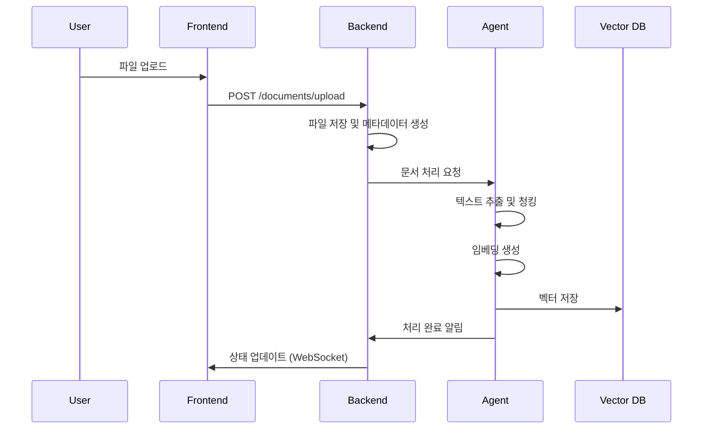
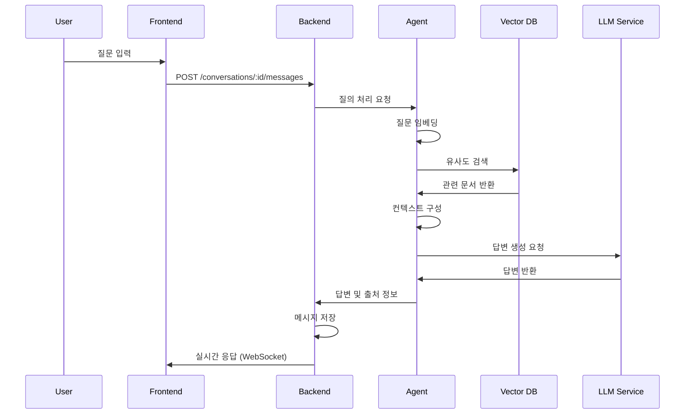

# RAG 시스템 전체 아키텍처 설계

## 1. 시스템 개요

### 1.1 전체 구조

```
┌──────────────────────┐    ┌──────────────────────┐    ┌──────────────────────┐
│      Frontend        │    │       Backend        │    │        Agent         │
│    (SvelteKit)       │◄──►│      (NestJS)        │◄──►│   (Python/FastAPI)   │
│                      │    │                      │    │                      │
│   사용자 인터페이스   │    │   API 게이트웨이     │    │   AI 로직 처리       │
│   - 채팅 UI          │    │   - 인증/권한        │    │   - LLM 호출         │
│   - 파일 업로드      │    │   - 데이터 관리      │    │   - 임베딩 생성      │
│   - 검색 결과 표시   │    │   - 로깅/모니터링    │    │   - 벡터 검색        │
└──────────────────────┘    └──────────────────────┘    └──────────────────────┘
                              │                        │
                              ▼                        ▼
                       ┌─────────────────┐    ┌─────────────────┐
                       │   PostgreSQL    │    │   Vector DB     │
                       │   (메타데이터)    │    │   (Qdrant)      │
                       └─────────────────┘    └─────────────────┘
```

### 1.2 주요 컴포넌트

- **Frontend**: 사용자 인터페이스 및 채팅 UI
- **Backend**: API 서버, 인증, 파일 관리
- **Agent**: AI 로직 처리, 임베딩 모델, LLM 통합
- **Database**: 메타데이터 및 벡터 저장

## 2. 기술 스택

### 2.1 Frontend (SvelteKit)

```typescript
// 주요 라이브러리
{
  "dependencies": {
    "@sveltejs/kit": "^2.0.0",
    "svelte": "^4.0.0",
    "tailwindcss": "^3.3.0",
    "daisyui": "^4.0.0",
    "lucide-svelte": "^0.294.0",
    "socket.io-client": "^4.7.0",
    "marked": "^9.1.0",
    "prismjs": "^1.29.0"
  }
}
```

### 2.2 Backend (NestJS)

```typescript
// 주요 라이브러리
{
  "dependencies": {
    "@nestjs/core": "^10.0.0",
    "@nestjs/common": "^10.0.0",
    "@nestjs/typeorm": "^10.0.0",
    "@nestjs/passport": "^10.0.0",
    "@nestjs/jwt": "^10.1.0",
    "@nestjs/websockets": "^10.0.0",
    "typeorm": "^0.3.17",
    "pg": "^8.11.0",
    "multer": "^1.4.5",
    "socket.io": "^4.7.0",
    "class-validator": "^0.14.0",
    "class-transformer": "^0.5.1"
  }
}
```

### 2.3 Agent (Python/FastAPI)

```python
# Python 라이브러리
fastapi==0.104.1
sentence-transformers==2.2.2  # 임베딩 모델
qdrant-client==1.7.0          # 벡터 DB
google-generativeai==0.3.0    # Gemini API
pytesseract==0.3.10           # OCR
opencv-python==4.8.1          # 이미지 처리
torch==2.1.0                  # GPU 가속
transformers==4.35.0          # 허깅페이스 모델
pypdf2==3.0.1
python-docx==1.1.0
pandas==2.1.4
numpy==1.24.3
```

## 3. 데이터베이스 설계

### 3.1 PostgreSQL (메타데이터)

#### Users 테이블

```sql
CREATE TABLE users (
    id UUID PRIMARY KEY DEFAULT gen_random_uuid(),
    email VARCHAR(255) UNIQUE NOT NULL,
    password_hash VARCHAR(255) NOT NULL,
    name VARCHAR(100) NOT NULL,
    role VARCHAR(20) DEFAULT 'user',
    created_at TIMESTAMP DEFAULT CURRENT_TIMESTAMP,
    updated_at TIMESTAMP DEFAULT CURRENT_TIMESTAMP
);
```

#### Documents 테이블

```sql
CREATE TABLE documents (
    id UUID PRIMARY KEY DEFAULT gen_random_uuid(),
    user_id UUID REFERENCES users(id) ON DELETE CASCADE,
    title VARCHAR(500) NOT NULL,
    file_path VARCHAR(1000) NOT NULL,
    file_type VARCHAR(50) NOT NULL,
    file_size BIGINT NOT NULL,
    chunk_count INTEGER DEFAULT 0,
    status VARCHAR(20) DEFAULT 'processing',
    metadata JSONB,
    created_at TIMESTAMP DEFAULT CURRENT_TIMESTAMP,
    updated_at TIMESTAMP DEFAULT CURRENT_TIMESTAMP
);
```

#### Conversations 테이블

```sql
CREATE TABLE conversations (
    id UUID PRIMARY KEY DEFAULT gen_random_uuid(),
    user_id UUID REFERENCES users(id) ON DELETE CASCADE,
    title VARCHAR(500),
    created_at TIMESTAMP DEFAULT CURRENT_TIMESTAMP,
    updated_at TIMESTAMP DEFAULT CURRENT_TIMESTAMP
);
```

#### Messages 테이블

```sql
CREATE TABLE messages (
    id UUID PRIMARY KEY DEFAULT gen_random_uuid(),
    conversation_id UUID REFERENCES conversations(id) ON DELETE CASCADE,
    role VARCHAR(20) NOT NULL, -- 'user' or 'assistant'
    content TEXT NOT NULL,
    sources JSONB, -- 참조된 문서 정보
    created_at TIMESTAMP DEFAULT CURRENT_TIMESTAMP
);
```

### 3.2 Vector Database (Qdrant)

#### 컬렉션 구조

```python
# Qdrant 컬렉션 설정
from qdrant_client import QdrantClient
from qdrant_client.models import Distance, VectorParams, CollectionInfo

# Qdrant 클라이언트 연결
client = QdrantClient(
    host="localhost",  # 자체 서버
    port=6333,
    prefer_grpc=True
)

# 컬렉션 생성
collection_config = {
    "collection_name": "rag_documents",
    "vectors_config": VectorParams(
        size=1536,  # OpenAI text-embedding-ada-002
        distance=Distance.COSINE
    )
}

client.create_collection(
    collection_name="rag_documents",
    vectors_config=VectorParams(size=1536, distance=Distance.COSINE)
)
```

#### Qdrant Docker 설정

```yaml
# docker-compose.yml
version: "3.8"
services:
  qdrant:
    image: qdrant/qdrant:v1.7.0
    container_name: rag_qdrant
    ports:
      - "6333:6333" # HTTP API
      - "6334:6334" # gRPC API
    volumes:
      - ./qdrant_storage:/qdrant/storage
    environment:
      - QDRANT__SERVICE__HTTP_PORT=6333
      - QDRANT__SERVICE__GRPC_PORT=6334
    restart: unless-stopped
```

#### 벡터 메타데이터 구조

```json
{
  "document_id": "uuid",
  "chunk_index": 0,
  "content": "텍스트 내용",
  "document_title": "문서 제목",
  "document_type": "pdf|docx|txt",
  "page_number": 1,
  "user_id": "uuid"
}
```

## 4. API 설계

### 4.1 인증 API

```typescript
// POST /auth/login
{
  "email": "user@example.com",
  "password": "password"
}

// POST /auth/register
{
  "email": "user@example.com",
  "password": "password",
  "name": "사용자명"
}

// GET /auth/me
// Authorization: Bearer {token}
```

### 4.2 문서 관리 API

```typescript
// POST /documents/upload
// multipart/form-data

// GET /documents
// 사용자의 문서 목록

// DELETE /documents/:id
// 문서 삭제

// GET /documents/:id/status
// 문서 처리 상태 확인
```

### 4.3 채팅 API

```typescript
// POST /conversations
// 새 대화 생성

// GET /conversations
// 대화 목록

// POST /conversations/:id/messages
{
  "content": "질문 내용"
}

// GET /conversations/:id/messages
// 대화 기록
```

### 4.4 RAG Agent API (FastAPI)

```python
# POST /process-document
{
  "file_path": "/path/to/document.pdf",
  "user_id": "uuid"
}

# Response
{
  "document_id": "uuid",
  "status": "processed",
  "embedding_count": 42
}

# POST /query
{
  "question": "질문 내용",
  "user_id": "uuid"
}

# Response
{
  "answer": "답변 내용",
  "sources": [
    {
      "document_id": "uuid",
      "file_path": "/path/to/source.pdf",
      "relevance_score": 0.85
    }
  ],
  "processing_time": 1.2
}
```

## 5. 시스템 플로우

### 5.1 문서 업로드 및 처리



### 5.2 질의응답 플로우



## 6. 보안 및 성능

### 6.1 보안 고려사항

- **JWT 기반 인증**
- **파일 업로드 검증** (크기, 확장자, 바이러스 스캔)
- **Rate Limiting** (API 호출 제한)
- **CORS 설정**
- **입력 데이터 검증 및 sanitization**

### 6.2 성능 최적화

- **캐싱 전략** (Redis 활용)
- **데이터베이스 인덱싱**
- **벡터 검색 최적화**
- **응답 스트리밍** (Server-Sent Events)
- **파일 압축 및 CDN 활용**

## 7. 모니터링 및 로깅

### 7.1 로깅 전략

- **구조화된 로깅** (JSON 형태)
- **분산 추적** (Correlation ID)
- **에러 모니터링** (Sentry)
- **성능 메트릭** (응답 시간, 처리량)

### 7.2 메트릭 수집

```typescript
// 주요 메트릭
{
  "query_response_time": "ms",
  "document_processing_time": "ms",
  "vector_search_accuracy": "score",
  "user_satisfaction": "rating",
  "system_resource_usage": "percentage"
}
```

## 8. 확장성 고려사항

### 8.1 수평 확장

- **마이크로서비스 아키텍처** 준비
- **로드 밸런서** 구성
- **데이터베이스 샤딩** 계획
- **캐시 클러스터링**

### 8.2 기능 확장

- **다중 언어 지원**
- **다양한 파일 형식 지원**
- **고급 검색 필터**
- **사용자 권한 관리**
- **API 버전 관리**
