# Agent (RAG Engine) 개발 프로세스 및 계획

## 📋 개발 일정 (4일)

### Day 1: 프로젝트 초기 설정 및 DB 연동

- [ ] Python/FastAPI 프로젝트 초기화
- [ ] MongoDB 커넥터 구현 (motor)
- [ ] InfluxDB 커넥터 구현 (influxdb-client)
- [ ] 임베딩 모델 및 Qdrant 설정
- [ ] Gemini API 연동 및 설정

### Day 2: 문서 처리 및 DB 쿼리 인터페이스

- [ ] 멀티모달 문서 파싱 파이프라인 (PDF, 이미지, OCR)
- [ ] 청킹 및 벡터 저장 (Qdrant)
- [ ] MongoDB 알람/기기 조회 인터페이스 구현
- [ ] InfluxDB 시계열 데이터 쿼리 인터페이스 구현

### Day 3: 하이브리드 RAG 엔진 (Intent Routing)

- [ ] 질문 의도 분류기(Intent Classifier) 구현
- [ ] 데이터 소스별 라우팅 로직 (Doc vs DB vs Sensor)
- [ ] 병렬 데이터 수집 및 컨텍스트 통합
- [ ] 통합 답변 생성 프롬프트 엔지니어링

### Day 4: 최적화 및 최종 통합

- [ ] 성능 최적화 (캐싱, 병렬 처리)
- [ ] 하이브리드 쿼리 에러 핸들링
- [ ] API 최종 구현 및 테스트
- [ ] 배포 준비 (Docker 컨테이너화)

## 🛠 기술 스택

### 핵심 라이브러리

```python
# requirements.txt
fastapi==0.104.1
uvicorn[standard]==0.24.0

# AI 모델 및 임베딩
sentence-transformers==2.2.2  # 임베딩 모델
transformers==4.36.0
torch==2.1.0
google-generativeai==0.3.0    # Gemini API

# 벡터 데이터베이스
qdrant-client==1.7.0

# 외부 데이터베이스 (Hybrid RAG)
motor==3.3.2                  # MongoDB Async Driver
influxdb-client==1.38.0       # InfluxDB Client

# OCR 및 이미지 처리
pytesseract==0.3.10
opencv-python==4.8.1
paddlepaddle==2.5.1
paddleocr==2.7.0
easyocr==1.7.0

# 문서 처리
pypdf2==3.0.1
PyMuPDF==1.23.5               # PDF + 이미지 추출
python-docx==1.1.0
python-multipart==0.0.6
chardet==5.2.0
beautifulsoup4==4.12.2

# 데이터 처리
pandas==2.1.4
numpy==1.24.3
tiktoken==0.5.2

# 유틸리티
pydantic==2.5.0
python-dotenv==1.0.0
httpx==0.25.2
aiofiles==23.2.0
redis==5.0.1

# 개발 도구
pytest==7.4.3
pytest-asyncio==0.21.1
black==23.11.0
isort==5.12.0
mypy==1.7.1
```

## 📁 폴더 구조

> **현재 프로젝트 구조 반영** - 기능별 서브 디렉토리로 모듈화

```
agent/
├── app/
│   ├── api/v1/                  # API 라우터
│   │   ├── documents.py         # 문서 업로드/관리
│   │   ├── query.py             # 하이브리드 쿼리
│   │   └── health.py            # 상태 체크
│   ├── core/
│   │   ├── llm/                 # LLM 관련 모듈
│   │   │   ├── gemini_service.py      # Gemini API 연동
│   │   │   ├── answer_generator.py    # 답변 생성 로직
│   │   │   └── question_classifier.py # 질문 의도 분류
│   │   ├── processing/          # 문서 처리
│   │   │   ├── document_processor.py  # PDF/DOCX 파싱
│   │   │   └── text_processor.py      # 청킹, 전처리
│   │   ├── retrieval/           # 검색 관련
│   │   │   ├── embedding_manager.py   # 임베딩 모델
│   │   │   └── vector_store.py        # Qdrant 연동
│   │   ├── session/             # 세션/대화 관리
│   │   │   ├── conversation_manager.py
│   │   │   └── websocket_manager.py
│   │   ├── db/                  # ⭐ 외부 DB 연동 (하이브리드 RAG)
│   │   │   ├── __init__.py
│   │   │   ├── mongodb_connector.py   # 알람/기기/사용자 조회
│   │   │   └── influxdb_connector.py  # 시계열 센서 데이터
│   │   ├── config.py            # 환경 설정
│   │   ├── rag_engine.py        # 문서 RAG 엔진
│   │   └── hybrid_rag_engine.py # ⭐ 통합 하이브리드 RAG
│   ├── services/
│   │   ├── document_worker.py   # 백그라운드 처리
│   │   └── processing_task.py   # 처리 태스크
│   ├── models/
│   │   ├── schemas.py           # Pydantic 스키마
│   │   └── enums.py             # 열거형
│   └── main.py                  # FastAPI 진입점
├── tests/
├── Dockerfile
├── docker-compose.yml
├── requirements.txt
└── README.md
```

## 🔧 핵심 컴포넌트 구현

### 1. FastAPI 앱 설정

```python
# app/main.py
from fastapi import FastAPI, HTTPException
from fastapi.middleware.cors import CORSMiddleware
from fastapi.middleware.gzip import GZipMiddleware
import logging
from contextlib import asynccontextmanager

from app.api.v1 import documents, query, health
from app.core.config import settings
from app.core.vector_store import VectorStore
from app.utils.logger import setup_logging

# 로깅 설정
setup_logging()
logger = logging.getLogger(__name__)

@asynccontextmanager
async def lifespan(app: FastAPI):
    # 시작 시 초기화
    logger.info("Initializing RAG Agent...")

    # Vector Store 초기화
    app.state.vector_store = VectorStore()
    await app.state.vector_store.initialize()

    yield

    # 종료 시 정리
    logger.info("Shutting down RAG Agent...")
    if hasattr(app.state, 'vector_store'):
        await app.state.vector_store.close()

app = FastAPI(
    title="RAG Agent API",
    description="RAG 시스템의 핵심 처리 엔진",
    version="1.0.0",
    lifespan=lifespan
)

# 미들웨어 설정
app.add_middleware(
    CORSMiddleware,
    allow_origins=settings.ALLOWED_HOSTS,
    allow_credentials=True,
    allow_methods=["*"],
    allow_headers=["*"],
)
app.add_middleware(GZipMiddleware, minimum_size=1000)

# 라우터 등록
app.include_router(health.router, prefix="/health", tags=["health"])
app.include_router(documents.router, prefix="/api/v1/documents", tags=["documents"])
app.include_router(query.router, prefix="/api/v1/query", tags=["query"])

@app.exception_handler(Exception)
async def global_exception_handler(request, exc):
    logger.error(f"Global exception: {exc}", exc_info=True)
    return HTTPException(status_code=500, detail="Internal server error")

if __name__ == "__main__":
    import uvicorn
    uvicorn.run(
        "main:app",
        host="0.0.0.0",
        port=8000,
        reload=settings.DEBUG,
        log_level="info"
    )
```

### 2. 멀티모달 문서 처리 파이프라인

```python
# app/core/document_processor.py
import asyncio
import logging
from pathlib import Path
from typing import List, Dict, Any, Optional
import aiofiles
import fitz  # PyMuPDF
import uuid
from PIL import Image
import cv2
import numpy as np

from app.core.ocr_engine import MultiOCREngine
from app.core.image_enhancer import ImageEnhancer
from app.core.embedding_manager import EmbeddingManager
from app.models.schemas import DocumentChunk, ProcessingResult

logger = logging.getLogger(__name__)

class MultiModalDocumentProcessor:
    """멀티모달 문서 처리 - PDF, 이미지, 도면 등을 통합 처리"""

    def __init__(self):
        self.ocr_engine = MultiOCREngine()
        self.image_enhancer = ImageEnhancer()
        self.embedding_manager = EmbeddingManager()

    async def process_document(
        self,
        file_path: str,
        user_id: str
    ) -> ProcessingResult:
        """문서를 처리하고 임베딩 생성"""
        try:
            file_extension = Path(file_path).suffix.lower()

            if file_extension == '.pdf':
                return await self._process_pdf_with_images(file_path, user_id)
            elif file_extension in ['.jpg', '.jpeg', '.png', '.tiff']:
                return await self._process_image_document(file_path, user_id)
            else:
                return await self._process_text_document(file_path, user_id)

        except Exception as e:
            logger.error(f"문서 처리 실패: {e}")
            raise

    async def _process_pdf_with_images(self, pdf_path: str, user_id: str) -> ProcessingResult:
        """이미지가 포함된 PDF 문서 처리"""
        doc = fitz.open(pdf_path)
        results = {
            "text_chunks": [],
            "image_chunks": [],
            "total_embeddings": 0
        }

        for page_num in range(len(doc)):
            page = doc.load_page(page_num)

            # 텍스트 추출
            text = page.get_text()
            if text.strip():
                # 텍스트 임베딩 생성
                embedding = await self.embedding_manager.embed_text(text)
                chunk = DocumentChunk(
                    id=str(uuid.uuid4()),
                    content=text,
                    embedding=embedding,
                    metadata={"page": page_num + 1, "type": "text"}
                )
                results["text_chunks"].append(chunk)

            # 이미지 추출 및 OCR 처리
            image_list = page.get_images()
            for img_index, img in enumerate(image_list):
                try:
                    # 이미지 데이터 추출
                    image_data = self._extract_image_from_pdf(doc, img)

                    # 화질 개선 (저품질 도면 대응)
                    enhanced_image = await self.image_enhancer.enhance_quality(image_data)

                    # 멀티 OCR 엔진으로 텍스트 추출
                    ocr_results = await self.ocr_engine.extract_text_multi_engine(enhanced_image)

                    if ocr_results["confidence"] > 0.7:  # 신뢰도 임계값
                        # 멀티모달 임베딩 생성 (텍스트 + 이미지 정보)
                        embedding = await self.embedding_manager.embed_multimodal(
                            text=ocr_results["text"],
                            image_path=None  # 이미지 캡션도 추가 가능
                        )

                        chunk = DocumentChunk(
                            id=str(uuid.uuid4()),
                            content=ocr_results["text"],
                            embedding=embedding,
                            metadata={
                                "page": page_num + 1,
                                "type": "image_ocr",
                                "confidence": ocr_results["confidence"],
                                "ocr_engine": ocr_results["best_engine"]
                            }
                        )
                        results["image_chunks"].append(chunk)

                except Exception as e:
                    logger.warning(f"이미지 처리 실패 (page {page_num}, img {img_index}): {e}")

        results["total_embeddings"] = len(results["text_chunks"]) + len(results["image_chunks"])
        return ProcessingResult(**results)
```

            # 2. 메타데이터 생성
            metadata = await self._generate_metadata(file_path, document_id, user_id)

            # 3. 텍스트 분할
            chunks = await self._split_text(
                text_content,
                metadata,
                strategy=chunk_strategy
            )

            logger.info(f"Document {document_id} processed: {len(chunks)} chunks created")

            return ProcessingResult(
                document_id=document_id,
                chunk_count=len(chunks),
                chunks=chunks,
                metadata=metadata,
                status="success"
            )

        except Exception as e:
            logger.error(f"Error processing document {document_id}: {e}")
            return ProcessingResult(
                document_id=document_id,
                chunk_count=0,
                chunks=[],
                metadata={},
                status="error",
                error_message=str(e)
            )

    async def _extract_text(self, file_path: str) -> str:
        """파일에서 텍스트 추출"""
        path = Path(file_path)

        if not path.exists():
            raise FileNotFoundError(f"파일을 찾을 수 없습니다: {file_path}")

        if path.suffix.lower() == '.pdf':
            return await self._extract_pdf_text(file_path)
        elif path.suffix.lower() in ['.docx', '.doc']:
            return await self._extract_docx_text(file_path)
        elif path.suffix.lower() == '.txt':
            return await self._extract_txt_text(file_path)
        else:
            raise ValueError(f"지원하지 않는 파일 형식: {path.suffix}")

    async def _extract_pdf_text(self, file_path: str) -> str:
        """PDF에서 텍스트 추출"""
        def extract():
            with open(file_path, 'rb') as file:
                reader = PyPDF2.PdfReader(file)
                text = ""
                for page_num, page in enumerate(reader.pages):
                    try:
                        page_text = page.extract_text()
                        if page_text:
                            text += f"\n\n--- Page {page_num + 1} ---\n{page_text}"
                    except Exception as e:
                        logger.warning(f"Error extracting text from page {page_num + 1}: {e}")
                return text

        return await asyncio.to_thread(extract)

    async def _extract_docx_text(self, file_path: str) -> str:
        """DOCX에서 텍스트 추출"""
        def extract():
            doc = docx.Document(file_path)
            paragraphs = [paragraph.text for paragraph in doc.paragraphs]
            return "\n\n".join(paragraphs)

        return await asyncio.to_thread(extract)

    async def _extract_txt_text(self, file_path: str) -> str:
        """TXT 파일에서 텍스트 추출"""
        async with aiofiles.open(file_path, 'rb') as file:
            raw_data = await file.read()

### 3. 임베딩 매니저

```python
# app/core/embedding_manager.py
import logging
from typing import List, Union, Optional
import numpy as np
from sentence_transformers import SentenceTransformer
import torch

logger = logging.getLogger(__name__)

class EmbeddingManager:
    """다양한 임베딩 모델을 통합 관리하는 클래스"""

    def __init__(self):
        self.models = {}
        self.device = "cuda" if torch.cuda.is_available() else "cpu"
        self._load_models()

    def _load_models(self):
        """임베딩 모델들 로딩"""
        print("임베딩 모델들 로딩 중...")

        # 텍스트 임베딩 (가장 많이 사용)
        self.models['text'] = SentenceTransformer('all-MiniLM-L6-v2', device=self.device)

        # 한국어 특화 임베딩
        self.models['korean'] = SentenceTransformer('jhgan/ko-sroberta-multitask', device=self.device)

        # 멀티모달 임베딩 (텍스트+이미지)
        self.models['clip'] = SentenceTransformer('clip-ViT-B-32', device=self.device)

        print("임베딩 모델 로딩 완료!")

    async def embed_text(self, text: str, model_type: str = 'korean') -> List[float]:
        """텍스트를 벡터로 변환"""
        try:
            if model_type not in self.models:
                model_type = 'text'  # 기본값으로 폴백

            embedding = self.models[model_type].encode([text], convert_to_numpy=True)
            return embedding[0].tolist()

        except Exception as e:
            logger.error(f"텍스트 임베딩 생성 실패: {e}")
            raise

    async def embed_batch(self, texts: List[str], model_type: str = 'korean') -> List[List[float]]:
        """여러 텍스트를 한번에 벡터로 변환 (성능 최적화)"""
        try:
            if model_type not in self.models:
                model_type = 'text'

            embeddings = self.models[model_type].encode(
                texts,
                convert_to_numpy=True,
                batch_size=32,  # GPU 메모리 효율성
                show_progress_bar=True
            )
            return embeddings.tolist()

        except Exception as e:
            logger.error(f"배치 임베딩 생성 실패: {e}")
            raise

    async def embed_multimodal(self, text: str, image_path: Optional[str] = None) -> List[float]:
        """텍스트와 이미지를 함께 임베딩 (멀티모달)"""
        try:
            # CLIP 모델로 텍스트-이미지 통합 임베딩
            if image_path:
                # 이미지 + 텍스트 통합 임베딩 (실제 구현시 이미지 로딩 필요)
                embedding = self.models['clip'].encode([text])
            else:
                # 텍스트만 임베딩
                embedding = self.models['clip'].encode([text])

            return embedding[0].tolist()

        except Exception as e:
            logger.error(f"멀티모달 임베딩 생성 실패: {e}")
            # 폴백: 일반 텍스트 임베딩 사용
            return await self.embed_text(text)
```

### 4. 하이브리드 RAG 엔진 로직

하이브리드 RAG 엔진은 질문의 의도를 분석하여 문서(Qdrant), 실시간 데이터(MongoDB), 시계열 데이터(InfluxDB)를 적절히 조합합니다.

#### 하이브리드 쿼리 흐름 (Mermaid)

```mermaid
sequenceDiagram
    participant User
    participant Agent
    participant Intent as Intent Classifier
    participant DB as MongoDB/InfluxDB
    participant Vector as Qdrant
    participant LLM as Gemini

    User->>Agent: "거실 온도가 너무 높은데 해결법은?"
    Agent->>Intent: 질문 분석 (Source Routing)
    Intent-->>Agent: {source: [sensor, manual], device: "aircon"}
    
    par DB Query
        Agent->>DB: 현재 거실 온도 & 기기 상태 조회
        DB-->>Agent: {temp: 32.5°C, status: error}
    and Vector Search
        Agent->>Vector: 에어컨 온도 관련 해결 매뉴얼 검색
        Vector-->>Agent: [Manual Chunks]
    end

    Agent->>LLM: 질문 + 센서 데이터 + 매뉴얼 전송
    LLM-->>Agent: 통합 답변 생성
    Agent-->>User: "현재 온도는 32.5도입니다. 필터를 청소하세요..."
```



#### 하이브리드 엔진 구현 (Concept)

```python
# app/core/hybrid_rag_engine.py

class HybridRAGEngine:
    def __init__(self):
        self.mongo = MongoDBConnector()
        self.influx = InfluxDBConnector()
        self.vector = VectorStore()
        self.classifier = IntentClassifier()

    async def execute_query(self, question: str, user_id: str):
        # 1. 의도 분류 (Intent Classification)
        intent = await self.classifier.analyze(question)
        
        tasks = []
        # 2. 소스별 데이터 병렬 수집
        if intent.needs_db:
            tasks.append(self.mongo.get_device_data(intent.target))
        if intent.needs_sensor:
            tasks.append(self.influx.get_series_data(intent.target))
        if intent.needs_docs:
            tasks.append(self.vector.search(question))
            
        results = await asyncio.gather(*tasks)
        
        # 3. 통합 컨텍스트 생성 및 답변
        context = self._combine_results(results)
        return await self.gemini.generate(question, context)
```

### 5. 데이터베이스 커넥터 (DB Connectors)

에이전트는 백엔드를 거치지 않고 직접 데이터베이스에서 컨텍스트를 추출합니다.

- **MongoDB Connector**: 질문에 언급된 특정 `device_id`나 `alarm_id`의 상세 속성을 가져와 LLM이 구체적인 상황을 인지하게 합니다.
- **InfluxDB Connector**: "온도가 갑자기 올랐어?" 같은 질문에 대해 최근 1시간의 집계 데이터(mean, max)를 추출하여 트렌드 정보를 제공합니다.

### 5. OCR 엔진 (저화질 도면 처리용)

        encoding = chardet.detect(raw_data)['encoding'] or 'utf-8'

        try:
            return raw_data.decode(encoding)
        except UnicodeDecodeError:
            return raw_data.decode('utf-8', errors='ignore')

    async def _generate_metadata(
        self,
        file_path: str,
        document_id: str,
        user_id: str
    ) -> Dict[str, Any]:
        """문서 메타데이터 생성"""
        path = Path(file_path)
        stat = path.stat()

        return {
            "document_id": document_id,
            "user_id": user_id,
            "filename": path.name,
            "file_type": path.suffix.lower(),
            "file_size": stat.st_size,
            "created_at": stat.st_ctime,
            "modified_at": stat.st_mtime,
        }

    async def _split_text(
        self,
        text: str,
        metadata: Dict[str, Any],
        strategy: str = "recursive"
    ) -> List[DocumentChunk]:
        """텍스트를 청크로 분할"""

        if strategy == "semantic":
            chunks = await self.semantic_splitter.split_text(text)
        else:
            chunks = self.text_splitter.split_text(text)

        document_chunks = []
        for i, chunk in enumerate(chunks):
            chunk_metadata = {
                **metadata,
                "chunk_index": i,
                "chunk_id": f"{metadata['document_id']}_chunk_{i}",
                "total_chunks": len(chunks)
            }

            document_chunks.append(DocumentChunk(
                content=chunk,
                metadata=chunk_metadata,
                chunk_index=i
            ))

        return document_chunks

````

### 3. 벡터 데이터베이스 연동

```python
# app/core/vector_store.py
import logging
from typing import List, Dict, Any, Optional
from qdrant_client import QdrantClient
from qdrant_client.models import Distance, VectorParams, PointStruct, Filter, FieldCondition, MatchValue
from langchain_qdrant import Qdrant
from langchain.embeddings import OpenAIEmbeddings
from langchain.schema import Document

from app.core.config import settings
from app.models.schemas import DocumentChunk, SearchResult

logger = logging.getLogger(__name__)

class VectorStore:
    def __init__(self):
        self.embeddings = OpenAIEmbeddings(
            openai_api_key=settings.OPENAI_API_KEY,
            model="text-embedding-ada-002"
        )
        self.collection_name = settings.QDRANT_COLLECTION_NAME
        self.client: Optional[QdrantClient] = None
        self.vector_store: Optional[Qdrant] = None

    async def initialize(self):
        """Qdrant 초기화"""
        try:
            self.client = QdrantClient(
                host=settings.QDRANT_HOST,
                port=settings.QDRANT_PORT,
                prefer_grpc=True
            )

            # 컬렉션 존재 확인
            collections = await self.client.get_collections()
            collection_names = [col.name for col in collections.collections]

            if self.collection_name not in collection_names:
                logger.info(f"Creating Qdrant collection: {self.collection_name}")
                await self.client.create_collection(
                    collection_name=self.collection_name,
                    vectors_config=VectorParams(
                        size=1536,  # OpenAI embedding dimension
                        distance=Distance.COSINE
                    )
                )

            self.vector_store = Qdrant(
                client=self.client,
                collection_name=self.collection_name,
                embeddings=self.embeddings
            )

            logger.info("Vector store initialized successfully")

        except Exception as e:
            logger.error(f"Error initializing vector store: {e}")
            raise

    async def add_documents(self, chunks: List[DocumentChunk]) -> bool:
        """문서 청크들을 벡터 저장소에 추가"""
        try:
            documents = []
            for chunk in chunks:
                doc = Document(
                    page_content=chunk.content,
                    metadata=chunk.metadata
                )
                documents.append(doc)

            # 벡터 저장소에 추가
            await self.vector_store.aadd_documents(documents)

            logger.info(f"Added {len(documents)} document chunks to vector store")
            return True

        except Exception as e:
            logger.error(f"Error adding documents to vector store: {e}")
            return False

    async def similarity_search(
        self,
        query: str,
        k: int = 5,
        user_id: Optional[str] = None,
        filter_metadata: Optional[Dict[str, Any]] = None
    ) -> List[SearchResult]:
        """유사도 기반 검색"""
        try:
            # 필터 구성
            search_filter = {}
            if user_id:
                search_filter["user_id"] = user_id
            if filter_metadata:
                search_filter.update(filter_metadata)

            # 검색 실행
            results = await self.vector_store.asimilarity_search_with_score(
                query=query,
                k=k,
                filter=search_filter if search_filter else None
            )

            search_results = []
            for doc, score in results:
                search_results.append(SearchResult(
                    content=doc.page_content,
                    metadata=doc.metadata,
                    relevance_score=float(1 - score)  # 거리를 유사도로 변환
                ))

            logger.info(f"Similarity search returned {len(search_results)} results")
            return search_results

        except Exception as e:
            logger.error(f"Error in similarity search: {e}")
            return []

    async def delete_documents(self, document_id: str) -> bool:
        """특정 문서의 모든 청크 삭제"""
        try:
            # Qdrant에서 문서 ID로 필터링하여 삭제
            delete_filter = Filter(
                must=[
                    FieldCondition(
                        key="document_id",
                        match=MatchValue(value=document_id)
                    )
                ]
            )

            result = await self.client.delete(
                collection_name=self.collection_name,
                points_selector=delete_filter
            )

            logger.info(f"Deleted vectors for document: {document_id}, operation_id: {result.operation_id}")
            return True

        except Exception as e:
            logger.error(f"Error deleting document vectors: {e}")
            return False

    async def close(self):
        """리소스 정리"""
        # 필요한 경우 정리 작업 수행
        logger.info("Vector store connection closed")
````

### 4. RAG 엔진 구현

```python
# app/core/rag_engine.py
import logging
from typing import List, Dict, Any, Optional, AsyncGenerator
from langchain.chat_models import ChatOpenAI
from langchain.schema import AIMessage, HumanMessage, SystemMessage
from langchain.prompts import ChatPromptTemplate, HumanMessagePromptTemplate, SystemMessagePromptTemplate

from app.core.vector_store import VectorStore
from app.core.config import settings
from app.models.schemas import QueryRequest, QueryResponse, SearchResult
from app.services.cache_service import CacheService

logger = logging.getLogger(__name__)

class RAGEngine:
    def __init__(self, vector_store: VectorStore):
        self.vector_store = vector_store
        self.llm = ChatOpenAI(
            openai_api_key=settings.OPENAI_API_KEY,
            model_name="gpt-4-turbo-preview",
            temperature=0.1,
            streaming=True
        )
        self.cache_service = CacheService()

        # 시스템 프롬프트 템플릿
        self.system_prompt = SystemMessagePromptTemplate.from_template(
            """당신은 도움이 되는 AI 어시스턴트입니다. 제공된 문서 컨텍스트를 기반으로 정확하고 유용한 답변을 제공해주세요.

답변 가이드라인:
1. 제공된 컨텍스트만을 기반으로 답변하세요
2. 컨텍스트에 없는 정보는 "제공된 문서에서 해당 정보를 찾을 수 없습니다"라고 명시하세요
3. 답변에는 출처 정보를 포함하세요
4. 명확하고 구조화된 답변을 제공하세요
5. 한국어로 답변하세요

컨텍스트:
{context}"""
        )

        self.human_prompt = HumanMessagePromptTemplate.from_template(
            "질문: {question}"
        )

        self.chat_prompt = ChatPromptTemplate.from_messages([
            self.system_prompt,
            self.human_prompt
        ])

    async def query(self, request: QueryRequest) -> QueryResponse:
        """RAG 쿼리 처리"""
        try:
            # 1. 캐시 확인
            cache_key = f"query:{hash(request.query)}:{request.user_id}"
            cached_result = await self.cache_service.get(cache_key)
            if cached_result:
                logger.info("Returning cached result")
                return QueryResponse(**cached_result)

            # 2. 벡터 검색
            search_results = await self.vector_store.similarity_search(
                query=request.query,
                k=request.top_k or 5,
                user_id=request.user_id
            )

            if not search_results:
                return QueryResponse(
                    answer="죄송합니다. 질문과 관련된 문서를 찾을 수 없습니다.",
                    sources=[],
                    query=request.query
                )

            # 3. 컨텍스트 구성
            context = self._build_context(search_results)

            # 4. LLM 쿼리
            answer = await self._generate_answer(request.query, context)

            # 5. 응답 구성
            response = QueryResponse(
                answer=answer,
                sources=search_results,
                query=request.query,
                context_used=len(search_results)
            )

            # 6. 캐시 저장
            await self.cache_service.set(cache_key, response.dict(), ttl=3600)

            return response

        except Exception as e:
            logger.error(f"Error in RAG query: {e}")
            return QueryResponse(
                answer="죄송합니다. 질문을 처리하는 중에 오류가 발생했습니다.",
                sources=[],
                query=request.query,
                error=str(e)
            )

    async def query_stream(self, request: QueryRequest) -> AsyncGenerator[str, None]:
        """스트리밍 RAG 쿼리"""
        try:
            # 벡터 검색
            search_results = await self.vector_store.similarity_search(
                query=request.query,
                k=request.top_k or 5,
                user_id=request.user_id
            )

            if not search_results:
                yield "죄송합니다. 질문과 관련된 문서를 찾을 수 없습니다."
                return

            # 컨텍스트 구성
            context = self._build_context(search_results)

            # 스트리밍 응답 생성
            async for chunk in self._generate_answer_stream(request.query, context):
                yield chunk

        except Exception as e:
            logger.error(f"Error in streaming RAG query: {e}")
            yield f"오류가 발생했습니다: {str(e)}"

    def _build_context(self, search_results: List[SearchResult]) -> str:
        """검색 결과로부터 컨텍스트 구성"""
        context_parts = []

        for i, result in enumerate(search_results, 1):
            source_info = f"문서: {result.metadata.get('filename', '알 수 없음')}"
            if 'chunk_index' in result.metadata:
                source_info += f" (섹션 {result.metadata['chunk_index'] + 1})"

            context_parts.append(f"[출처 {i}] {source_info}\n{result.content}")

        return "\n\n".join(context_parts)

    async def _generate_answer(self, query: str, context: str) -> str:
        """LLM을 사용하여 답변 생성"""
        try:
            messages = self.chat_prompt.format_messages(
                context=context,
                question=query
            )

            response = await self.llm.agenerate([messages])
            return response.generations[0][0].text.strip()

        except Exception as e:
            logger.error(f"Error generating answer: {e}")
            raise

    async def _generate_answer_stream(self, query: str, context: str) -> AsyncGenerator[str, None]:
        """스트리밍 답변 생성"""
        try:
            messages = self.chat_prompt.format_messages(
                context=context,
                question=query
            )

            async for chunk in self.llm.astream(messages[0].content):
                if hasattr(chunk, 'content'):
                    yield chunk.content

        except Exception as e:
            logger.error(f"Error in streaming generation: {e}")
            yield f"생성 오류: {str(e)}"

    async def get_conversation_context(
        self,
        conversation_id: str,
        max_messages: int = 5
    ) -> List[Dict[str, Any]]:
        """대화 컨텍스트 가져오기"""
        # 실제로는 데이터베이스에서 대화 히스토리를 가져와야 함
        # 여기서는 캐시를 사용한 예시
        cache_key = f"conversation:{conversation_id}"
        conversation = await self.cache_service.get(cache_key)

        if conversation:
            return conversation.get("messages", [])[-max_messages:]

        return []
```

### 6. API 엔드포인트 구현

```python
# app/api/v1/documents.py - 문서 처리 API
from fastapi import APIRouter, HTTPException, UploadFile, File
from typing import Dict, Any
import logging

from app.core.document_processor import MultiModalDocumentProcessor
from app.core.vector_store import VectorStore
from app.models.schemas import ProcessingResult

logger = logging.getLogger(__name__)
router = APIRouter()

processor = MultiModalDocumentProcessor()
vector_store = VectorStore()

@router.post("/process-document")
async def process_document(
    file_path: str,
    user_id: str
) -> Dict[str, Any]:
    """Backend에서 호출하는 문서 처리 엔드포인트"""
    try:
        logger.info(f"문서 처리 시작: {file_path} (사용자: {user_id})")

        # 멀티모달 문서 처리
        result = await processor.process_document(file_path, user_id)

        # 벡터 DB에 저장
        collection_name = f"documents_{user_id}"
        await vector_store.store_embeddings(collection_name, result)

        return {
            "document_id": f"doc_{hash(file_path)}",
            "status": "processed",
            "text_chunks": len(result.text_chunks),
            "image_chunks": len(result.image_chunks),
            "total_embeddings": result.total_embeddings
        }

    except Exception as e:
        logger.error(f"문서 처리 실패: {e}")
        raise HTTPException(status_code=500, detail=str(e))


# app/api/v1/query.py - 질문 처리 API
from fastapi import APIRouter, HTTPException
from typing import Dict, Any
import logging

from app.core.rag_engine import RAGEngine
from app.models.schemas import QueryRequest, QueryResponse

logger = logging.getLogger(__name__)
router = APIRouter()

rag_engine = RAGEngine()

@router.post("/query")
async def query(
    question: str,
    user_id: str
) -> Dict[str, Any]:
    """Backend에서 호출하는 질문 처리 엔드포인트"""
    try:
        logger.info(f"질문 처리: {question[:50]}... (사용자: {user_id})")

        request = QueryRequest(question=question, user_id=user_id)
        response = await rag_engine.query(request)

        return {
            "answer": response.answer,
            "sources": [
                {
                    "document_id": source.document_id,
                    "file_path": source.metadata.get("file_path", ""),
                    "relevance_score": source.score
                }
                for source in response.sources
            ],
            "processing_time": 1.2,  # 실제 측정 값
            "confidence": response.confidence
        }

    except Exception as e:
        logger.error(f"질문 처리 실패: {e}")
        raise HTTPException(status_code=500, detail=str(e))


# app/main.py - 메인 FastAPI 앱
from fastapi import FastAPI
from fastapi.middleware.cors import CORSMiddleware
import logging

from app.api.v1 import documents, query
from app.core.embedding_manager import EmbeddingManager
from app.core.vector_store import VectorStore

# 로깅 설정
logging.basicConfig(level=logging.INFO)
logger = logging.getLogger(__name__)

app = FastAPI(
    title="RAG Agent Service",
    description="멀티모달 RAG 시스템의 AI 처리 엔진",
    version="1.0.0"
)

# CORS 설정
app.add_middleware(
    CORSMiddleware,
    allow_origins=["*"],  # 개발용, 프로덕션에서는 제한
    allow_credentials=True,
    allow_methods=["*"],
    allow_headers=["*"],
)

# 전역 객체 초기화
@app.on_event("startup")
async def startup_event():
    """앱 시작시 모델 로딩"""
    logger.info("RAG Agent 서비스 시작...")

    # 임베딩 모델 로딩 (시간이 오래 걸림)
    app.state.embedding_manager = EmbeddingManager()

    # 벡터 DB 연결
    app.state.vector_store = VectorStore()

    logger.info("RAG Agent 서비스 준비 완료!")

# API 라우터 등록
app.include_router(documents.router, tags=["documents"])
app.include_router(query.router, tags=["query"])

@app.get("/health")
async def health_check():
    """헬스 체크"""
    return {"status": "healthy", "service": "rag-agent"}

if __name__ == "__main__":
    import uvicorn
    uvicorn.run(app, host="0.0.0.0", port=8000)

# app/api/v1/documents.py
from fastapi import APIRouter, HTTPException, BackgroundTasks
import logging

from app.models.schemas import DocumentProcessRequest, ProcessingResult
from app.services.document_service import DocumentService

logger = logging.getLogger(__name__)
router = APIRouter()

@router.post("/process", response_model=ProcessingResult)
async def process_document(
    request: DocumentProcessRequest,
    background_tasks: BackgroundTasks
):
    """문서 처리 요청"""
    try:
        service = DocumentService()

        # 백그라운드에서 문서 처리
        background_tasks.add_task(
            service.process_document_async,
            request.document_id,
            request.file_path,
            request.user_id
        )

        return ProcessingResult(
            document_id=request.document_id,
            status="processing",
            message="문서 처리가 시작되었습니다."
        )

    except Exception as e:
        logger.error(f"Error processing document: {e}")
        raise HTTPException(status_code=500, detail=str(e))

@router.delete("/{document_id}/vectors")
async def delete_document_vectors(document_id: str):
    """문서 벡터 삭제"""
    try:
        service = DocumentService()
        success = await service.delete_document_vectors(document_id)

        if success:
            return {"message": "문서 벡터가 삭제되었습니다."}
        else:
            raise HTTPException(status_code=404, detail="문서를 찾을 수 없습니다.")

    except Exception as e:
        logger.error(f"Error deleting document vectors: {e}")
        raise HTTPException(status_code=500, detail=str(e))
```

## 📊 성능 모니터링 및 최적화

### 메트릭 수집 시스템

```python
# app/utils/metrics.py
import time
import logging
from functools import wraps
from typing import Dict, Any, Callable
from prometheus_client import Counter, Histogram, Gauge, generate_latest

logger = logging.getLogger(__name__)

# Prometheus 메트릭 정의
query_counter = Counter('rag_queries_total', 'Total RAG queries', ['user_id', 'status'])
query_duration = Histogram('rag_query_duration_seconds', 'RAG query duration')
document_processing_counter = Counter('documents_processed_total', 'Total documents processed', ['status'])
vector_search_duration = Histogram('vector_search_duration_seconds', 'Vector search duration')
active_connections = Gauge('active_websocket_connections', 'Active WebSocket connections')

class MetricsCollector:
    def __init__(self):
        self.start_time = time.time()

    def track_query(self, user_id: str, status: str):
        query_counter.labels(user_id=user_id, status=status).inc()

    def track_document_processing(self, status: str):
        document_processing_counter.labels(status=status).inc()

    def get_metrics(self) -> str:
        return generate_latest()

metrics = MetricsCollector()

def track_time(metric_histogram):
    """실행 시간 추적 데코레이터"""
    def decorator(func: Callable) -> Callable:
        @wraps(func)
        async def async_wrapper(*args, **kwargs):
            start_time = time.time()
            try:
                result = await func(*args, **kwargs)
                return result
            finally:
                duration = time.time() - start_time
                metric_histogram.observe(duration)

        @wraps(func)
        def sync_wrapper(*args, **kwargs):
            start_time = time.time()
            try:
                result = func(*args, **kwargs)
                return result
            finally:
                duration = time.time() - start_time
                metric_histogram.observe(duration)

        return async_wrapper if asyncio.iscoroutinefunction(func) else sync_wrapper
    return decorator
```

### 캐싱 전략

```python
# app/services/cache_service.py
import json
import logging
from typing import Any, Optional
import aioredis
from app.core.config import settings

logger = logging.getLogger(__name__)

class CacheService:
    def __init__(self):
        self.redis: Optional[aioredis.Redis] = None

    async def initialize(self):
        """Redis 연결 초기화"""
        try:
            self.redis = await aioredis.from_url(
                settings.REDIS_URL,
                decode_responses=True
            )
            logger.info("Cache service initialized")
        except Exception as e:
            logger.error(f"Error initializing cache: {e}")
            self.redis = None

    async def get(self, key: str) -> Optional[Any]:
        """캐시에서 값 조회"""
        if not self.redis:
            return None

        try:
            value = await self.redis.get(key)
            return json.loads(value) if value else None
        except Exception as e:
            logger.error(f"Error getting from cache: {e}")
            return None

    async def set(self, key: str, value: Any, ttl: int = 3600) -> bool:
        """캐시에 값 저장"""
        if not self.redis:
            return False

        try:
            await self.redis.setex(key, ttl, json.dumps(value))
            return True
        except Exception as e:
            logger.error(f"Error setting cache: {e}")
            return False

    async def delete(self, key: str) -> bool:
        """캐시에서 값 삭제"""
        if not self.redis:
            return False

        try:
            await self.redis.delete(key)
            return True
        except Exception as e:
            logger.error(f"Error deleting from cache: {e}")
            return False
```

## 🧪 테스트 전략

### 단위 테스트

```python
# tests/unit/test_rag_engine.py
import pytest
from unittest.mock import AsyncMock, MagicMock
from app.core.rag_engine import RAGEngine
from app.models.schemas import QueryRequest, SearchResult

@pytest.fixture
def mock_vector_store():
    store = AsyncMock()
    store.similarity_search.return_value = [
        SearchResult(
            content="테스트 문서 내용",
            metadata={"filename": "test.pdf", "chunk_index": 0},
            relevance_score=0.85
        )
    ]
    return store

@pytest.fixture
def rag_engine(mock_vector_store):
    engine = RAGEngine(mock_vector_store)
    engine.llm = AsyncMock()
    engine.llm.agenerate.return_value.generations = [[MagicMock(text="테스트 답변")]]
    return engine

@pytest.mark.asyncio
async def test_query_processing(rag_engine):
    request = QueryRequest(
        query="테스트 질문",
        user_id="test-user",
        top_k=3
    )

    response = await rag_engine.query(request)

    assert response.answer == "테스트 답변"
    assert len(response.sources) == 1
    assert response.query == "테스트 질문"
```

### 통합 테스트

```python
# tests/integration/test_api.py
import pytest
from httpx import AsyncClient
from app.main import app

@pytest.mark.asyncio
async def test_query_endpoint():
    async with AsyncClient(app=app, base_url="http://test") as client:
        response = await client.post(
            "/api/v1/query/",
            json={
                "query": "테스트 질문",
                "user_id": "test-user"
            }
        )

    assert response.status_code == 200
    data = response.json()
    assert "answer" in data
    assert "sources" in data
```

## 🚀 배포 및 운영

### Docker 설정

```dockerfile
# Dockerfile
FROM python:3.11-slim

WORKDIR /app

# 시스템 의존성 설치
RUN apt-get update && apt-get install -y \
    build-essential \
    curl \
    && rm -rf /var/lib/apt/lists/*

# Python 의존성 설치
COPY requirements.txt .
RUN pip install --no-cache-dir -r requirements.txt

# 애플리케이션 코드 복사
COPY . .

# 헬스체크
HEALTHCHECK --interval=30s --timeout=30s --start-period=5s --retries=3 \
    CMD curl -f http://localhost:8000/health || exit 1

# 애플리케이션 실행
CMD ["uvicorn", "app.main:app", "--host", "0.0.0.0", "--port", "8000"]
```

### 환경 설정

```python
# app/core/config.py
from pydantic_settings import BaseSettings
from typing import List

class Settings(BaseSettings):
    # API 설정
    DEBUG: bool = False
    ALLOWED_HOSTS: List[str] = ["*"]

    # OpenAI 설정
    OPENAI_API_KEY: str

    # Qdrant 설정
    QDRANT_HOST: str = "localhost"
    QDRANT_PORT: int = 6333
    QDRANT_COLLECTION_NAME: str = "rag_documents"

    # Redis 설정
    REDIS_URL: str = "redis://localhost:6379"

    # 로깅 설정
    LOG_LEVEL: str = "INFO"

    class Config:
        env_file = ".env"

settings = Settings()
```

## ✅ 체크리스트

### 개발 완료 기준

- [ ] MongoDB 및 InfluxDB 커넥터 구현 완료
- [ ] 질문 의도 분류기(Intent Classifier) 구현 완료
- [ ] 하이브리드 RAG 엔진 통합 완료
- [ ] 문서 처리 파이프라인 (OCR 포함) 구현 완료
- [ ] 단위 테스트 및 하이브리드 통합 테스트 작성 완료
- [ ] Docker 컨테이너화 및 환경 설정 완료
