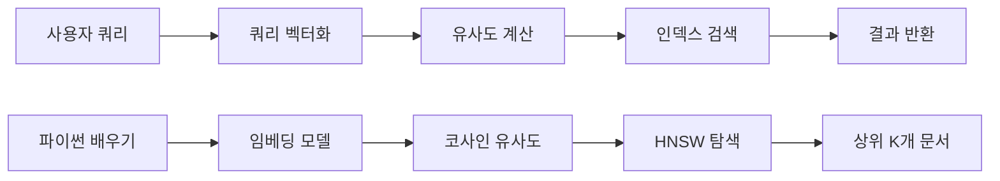

# Vector Database (벡터 데이터베이스) 완전 가이드

## 1. Vector Database란 무엇인가?

Vector Database(벡터 데이터베이스)는 **고차원 벡터 데이터를 효율적으로 저장, 인덱싱, 검색할 수 있도록 최적화된 데이터베이스**입니다. 기존의 관계형 데이터베이스가 구조화된 데이터를 다룬다면, 벡터 데이터베이스는 **의미적 유사성**을 기반으로 데이터를 검색할 수 있습니다.

### 고차원 벡터 공간의 수학적 이해

**차원의 저주(Curse of Dimensionality)**

고차원 공간에서는 직관과 다른 현상이 발생합니다:

1. **거리 집중 현상**: 모든 점들 사이의 거리가 비슷해지는 경향
2. **청크 모서리**: 대부분의 데이터가 공간의 경계 근처에 위치
3. **밀도 급감**: 데이터 점들 사이의 거리가 급속히 증가

```python
import numpy as np
from scipy.spatial.distance import cosine, euclidean

# 차원별 거리 분포 비교
dimensions = [2, 10, 100, 1000]
for dim in dimensions:
    # 랜덤 벡터 생성
    vectors = np.random.normal(0, 1, (1000, dim))

    # 모든 쌍 사이의 코사인 유사도 계산
    distances = []
    for i in range(len(vectors)):
        for j in range(i+1, len(vectors)):
            distances.append(cosine(vectors[i], vectors[j]))

    mean_dist = np.mean(distances)
    std_dist = np.std(distances)

    print(f"{dim}차원: 평균 {mean_dist:.3f}, 표준편차 {std_dist:.3f}")
    # 결과: 차원이 증가할수록 표준편차가 감소 (= 거리 집중)
```

**이러한 문제를 해결하는 Vector Database의 전략:**

1. **효율적 인덱싱**: HNSW, LSH 등의 근사 검색 알고리즘
2. **거리 메트릭 최적화**: Cosine, Dot Product, Euclidean 중 최적 선택
3. **차원 축소**: PCA, t-SNE 등을 통한 전처리
4. **양자화**: 벡터 압축을 통한 메모리 효율성 향상

### 1.1 벡터란?

벡터는 **다차원 공간의 점을 나타내는 숫자 배열**입니다. AI/ML 분야에서 벡터는 텍스트, 이미지, 음성 등의 비구조화 데이터를 수치로 표현한 것입니다.

```python
# 예시: 3차원 벡터
vector_a = [0.2, 0.8, 0.1]
vector_b = [0.3, 0.7, 0.2]

# 실제 텍스트 임베딩 벡터 (1536차원 예시)
text_embedding = [0.023, -0.041, 0.087, ..., 0.156]  # 1536개 요소
```

### 1.2 왜 Vector Database가 필요한가?

#### 전통적인 검색의 한계

```sql
-- 전통적인 키워드 검색
SELECT * FROM documents
WHERE content LIKE '%Python 프로그래밍%';
```

위 검색은 정확한 키워드 매치만 찾을 수 있습니다. "파이썬 개발", "Python coding" 등은 찾지 못합니다.

#### 벡터 검색의 장점

```python
# 의미 기반 검색
query = "Python 프로그래밍"
query_vector = embedding_model.encode(query)
similar_docs = vector_db.similarity_search(query_vector, top_k=5)
```

벡터 검색은 **의미적으로 유사한** 문서들을 찾을 수 있습니다.

## 2. Vector Database의 작동 원리

### 2.1 데이터 저장 과정

```mermaid
graph LR
    A[원본 데이터] --> B[임베딩 모델]
    B --> C[벡터 변환]
    C --> D[인덱스 생성]
    D --> E[벡터 DB 저장]

    A1[텍스트: "Python은 프로그래밍 언어다"]
    A1 --> B1[BERT/OpenAI 임베딩]
    B1 --> C1[1536차원 벡터]
    C1 --> D1[HNSW/LSH 인덱스]
    D1 --> E1[Pinecone/Weaviate]
```

#### 단계별 세부 과정

1. **데이터 전처리**

   ```python
   # 텍스트 정제
   text = "Python은 강력한 프로그래밍 언어입니다."
   cleaned_text = preprocess_text(text)
   ```

2. **벡터 변환 (임베딩)**

   ```python
   # OpenAI 임베딩 사용 예시
   import openai

   response = openai.Embedding.create(
       input=cleaned_text,
       model="text-embedding-ada-002"
   )
   vector = response['data'][0]['embedding']  # 1536차원 벡터
   ```

3. **메타데이터 연결**
   ```python
   # 벡터와 메타데이터 결합
   document = {
       "id": "doc_123",
       "vector": vector,  # 1536차원 벡터
       "metadata": {
           "title": "Python 튜토리얼",
           "author": "김개발",
           "created_at": "2024-01-01",
           "category": "programming"
       }
   }
   ```

### 2.2 검색 과정



#### 유사도 계산 방법

1. **코사인 유사도 (가장 일반적)**

   ```python
   import numpy as np

   def cosine_similarity(vec_a, vec_b):
       dot_product = np.dot(vec_a, vec_b)
       norm_a = np.linalg.norm(vec_a)
       norm_b = np.linalg.norm(vec_b)
       return dot_product / (norm_a * norm_b)

   # 계산 예시
   query_vec = [0.2, 0.8, 0.1]
   doc_vec = [0.3, 0.7, 0.2]
   similarity = cosine_similarity(query_vec, doc_vec)
   # 결과: 0.987 (매우 유사)
   ```

2. **유클리드 거리**

   ```python
   def euclidean_distance(vec_a, vec_b):
       return np.linalg.norm(vec_a - vec_b)
   ```

3. **내적 (Dot Product)**
   ```python
   def dot_product_similarity(vec_a, vec_b):
       return np.dot(vec_a, vec_b)
   ```

## 3. 인덱싱 알고리즘

고차원 벡터 검색을 효율적으로 하기 위해 다양한 인덱싱 알고리즘이 사용됩니다. **정확한 검색(Exact Search)**은 시간 복잡도가 O(n)이므로, 대규모 데이터에서는 **근사 최근접 이웃(Approximate Nearest Neighbor, ANN)** 알고리즘이 필수입니다.

### 인덱싱 알고리즘의 성능 트레이드오프

- **정확도 vs 속도**: 더 빠른 검색을 위해 일부 정확도 희생
- **메모리 vs 속도**: 더 많은 인덱스 저장으로 검색 속도 향상
- **구축 시간 vs 검색 시간**: 복잡한 인덱스 구축으로 검색 최적화

### 3.1 HNSW (Hierarchical Navigable Small World)

HNSW는 현재 가장 인기 있는 ANN 알고리즘으로, **small world 네트워크 이론**에 기반합니다.

**핵심 아이디어:**

1. **계층적 구조**: 여러 계층의 그래프로 구성
2. **탐욕적 탐색**: 각 계층에서 가장 가까운 이웃으로 이동
3. **확률적 연결**: 거리 기반 확률로 노드 간 연결

```python
# HNSW 작동 원리 (개념적 구현)
import heapq
import random
import math
from collections import defaultdict

class HNSW:
    def __init__(self, max_connections=16, ef_construction=200, max_layers=16):
        self.max_connections = max_connections  # M 파라미터
        self.ef_construction = ef_construction   # efConstruction
        self.max_layers = max_layers
        self.layers = defaultdict(dict)  # 각 계층의 그래프
        self.entry_point = None          # 최상위 계층 진입점
        self.ml = 1 / math.log(2.0)     # 계층 선택 확률 조절

    def _get_random_level(self):
        """노드가 속할 계층 수준을 확률적으로 결정"""
        level = 0
        while random.random() < 0.5 and level < self.max_layers:
            level += 1
        return level

    def insert(self, vector_id, vector, metadata=None):
        """새로운 벡터를 인덱스에 삽입"""
        level = self._get_random_level()

        # 1. 진입점부터 탐색 시작
        current_closest = []
        if self.entry_point is not None:
            # 최상위 계층부터 level+1까지 탐욕적 탐색
            current_closest = [self.entry_point]

            for layer in range(self.max_layers, level, -1):
                if layer in self.layers:
                    current_closest = self._search_layer(
                        vector, current_closest, 1, layer
                    )

        # 2. level 계층부터 0 계층까지 연결 구축
        for layer in range(min(level + 1, self.max_layers), -1, -1):
            candidates = self._search_layer(
                vector, current_closest, self.ef_construction, layer
            )

            # 최적 연결 선택 (휴리스틱 적용)
            selected = self._select_neighbors_heuristic(
                candidates, self.max_connections, vector
            )

            # 양방향 연결 구축
            for neighbor_id in selected:
                self._add_connection(vector_id, neighbor_id, layer)
                self._add_connection(neighbor_id, vector_id, layer)

                # 이웃 노드의 연결 수가 초과되면 가지치기
                self._prune_connections(neighbor_id, layer)

            current_closest = selected

        # 3. 새 노드가 더 높은 계층에 있다면 진입점 업데이트
        if level > self._get_level(self.entry_point):
            self.entry_point = vector_id

    def _search_layer(self, query_vector, entry_points, ef, layer):
        """특정 계층에서 ef개의 가장 가까운 후보들 찾기"""
        visited = set()
        candidates = []  # 최소 힙 (거리, node_id)
        dynamic_candidates = []  # 최대 힙

        # 초기 후보들 추가
        for ep in entry_points:
            if ep not in visited:
                dist = self._distance(query_vector, self._get_vector(ep))
                heapq.heappush(candidates, (dist, ep))
                heapq.heappush(dynamic_candidates, (-dist, ep))
                visited.add(ep)

        # 탐욕적 탐색
        while candidates:
            current_dist, current_id = heapq.heappop(candidates)

            # 현재 후보가 이미 발견된 것보다 멀면 종료
            if dynamic_candidates and current_dist > -dynamic_candidates[0][0]:
                break

            # 현재 노드의 이웃들 검사
            if layer in self.layers and current_id in self.layers[layer]:
                for neighbor_id in self.layers[layer][current_id]:
                    if neighbor_id not in visited:
                        visited.add(neighbor_id)
                        dist = self._distance(query_vector, self._get_vector(neighbor_id))

                        # ef개보다 적거나 더 가까운 이웃이면 추가
                        if len(dynamic_candidates) < ef or dist < -dynamic_candidates[0][0]:
                            heapq.heappush(candidates, (dist, neighbor_id))
                            heapq.heappush(dynamic_candidates, (-dist, neighbor_id))

                            # ef 제한 유지
                            if len(dynamic_candidates) > ef:
                                heapq.heappop(dynamic_candidates)

        return [node_id for _, node_id in dynamic_candidates]

    def _select_neighbors_heuristic(self, candidates, max_conn, query_vector):
        """휴리스틱을 사용해 최적의 이웃들 선택 (다양성 고려)"""
        if len(candidates) <= max_conn:
            return candidates

        # 거리순 정렬
        candidates_with_dist = [
            (self._distance(query_vector, self._get_vector(c)), c)
            for c in candidates
        ]
        candidates_with_dist.sort()

        selected = []
        for dist, candidate in candidates_with_dist:
            if len(selected) >= max_conn:
                break

            # 다이버시티 체크: 이미 선택된 노드들과 너무 가깝지 않은지 확인
            should_add = True
            candidate_vector = self._get_vector(candidate)

            for selected_id in selected:
                selected_vector = self._get_vector(selected_id)
                if self._distance(candidate_vector, selected_vector) < dist * 0.8:
                    should_add = False
                    break

            if should_add:
                selected.append(candidate)

        return selected

    def search(self, query_vector, k=10, ef=None):
        """k개의 가장 유사한 벡터 검색"""
        if ef is None:
            ef = max(k, self.ef_construction)

        if self.entry_point is None:
            return []

        # 최상위 계층부터 1계층까지 탐욕적 탐색
        current_closest = [self.entry_point]

        for layer in range(self.max_layers, 0, -1):
            if layer in self.layers:
                current_closest = self._search_layer(
                    query_vector, current_closest, 1, layer
                )

        # 0계층에서 ef개 후보 탐색
        candidates = self._search_layer(
            query_vector, current_closest, ef, 0
        )

        # 상위 k개 반환
        results_with_dist = [
            (self._distance(query_vector, self._get_vector(c)), c)
            for c in candidates
        ]
        results_with_dist.sort()

        return [node_id for _, node_id in results_with_dist[:k]]

# 실제 사용 예시 (hnswlib 라이브러리)
import hnswlib
import numpy as np

# HNSW 인덱스 생성
dim = 128  # 벡터 차원
max_elements = 10000  # 최대 요소 수

index = hnswlib.Index(space='cosine', dim=dim)
index.init_index(max_elements=max_elements, ef_construction=200, M=16)

# 데이터 추가
data = np.random.randn(1000, dim)
ids = np.arange(1000)
index.add_items(data, ids)

# 검색 성능 조절
index.set_ef(50)  # ef 값이 클수록 정확도 향상, 속도 감소

# 검색 수행
query = np.random.randn(dim)
labels, distances = index.knn_query(query, k=10)
```

**HNSW의 장점:**

- **높은 성능**: 대부분의 벤치마크에서 최고 성능
- **메모리 효율성**: 그래프 기반으로 공간 복잡도 최적화
- **동적 업데이트**: 런타임 중 데이터 추가/삭제 가능
- **파라미터 튜닝**: M, efConstruction으로 성능 조절

**HNSW의 한계:**

- **구축 시간**: 초기 인덱스 구축 시간이 오래 걸림
- **메모리 사용량**: 연결 그래프 저장으로 메모리 오버헤드
- **삭제 복잡성**: 노드 삭제 시 그래프 재구성 필요

### 3.2 LSH (Locality Sensitive Hashing)

        pass

    def search(self, query_vector, k=10):
        # 1. 최상위 계층에서 시작
        # 2. 계층을 내려가며 더 정확한 탐색
        # 3. 최하위 계층에서 k개 최근접 이웃 반환
        pass

````

### 3.2 LSH (Locality Sensitive Hashing)

유사한 벡터들을 같은 해시 버킷에 배치하는 기법입니다.

```python
# LSH 개념 예시
class LSH:
    def __init__(self, num_hash_tables=10, hash_size=10):
        self.hash_tables = [RandomProjection() for _ in range(num_hash_tables)]

    def hash_vector(self, vector):
        hashes = []
        for hash_table in self.hash_tables:
            hash_value = hash_table.hash(vector)
            hashes.append(hash_value)
        return hashes

    def insert(self, vector, doc_id):
        hashes = self.hash_vector(vector)
        for i, hash_value in enumerate(hashes):
            self.buckets[i][hash_value].append(doc_id)
````

### 3.3 IVF (Inverted File Index)

벡터 공간을 클러스터로 분할하여 검색 속도를 향상시킵니다.

```python
# IVF 개념
class IVF:
    def __init__(self, num_clusters=1000):
        self.centroids = None  # 클러스터 중심점들
        self.inverted_lists = {}  # 각 클러스터의 벡터 목록

    def train(self, vectors):
        # K-means로 클러스터링
        self.centroids = kmeans(vectors, self.num_clusters)

    def search(self, query_vector, nprobe=10):
        # 1. 쿼리와 가장 가까운 nprobe개 클러스터 선택
        # 2. 선택된 클러스터들에서만 검색
        pass
```

## 4. 주요 Vector Database 솔루션

### 4.1 Qdrant (오픈소스, 자체 호스팅)

**Qdrant**는 Rust로 작성된 고성능 벡터 데이터베이스로, 자체 서버에서 무료로 운영할 수 있습니다.

#### Qdrant 설치 및 설정

```bash
# Docker Compose로 Qdrant 실행
# docker-compose.yml
version: '3.8'
services:
  qdrant:
    image: qdrant/qdrant:v1.7.0
    container_name: rag_qdrant
    ports:
      - "6333:6333"  # HTTP API
      - "6334:6334"  # gRPC API
    volumes:
      - ./qdrant_storage:/qdrant/storage
    environment:
      - QDRANT__SERVICE__HTTP_PORT=6333
      - QDRANT__SERVICE__GRPC_PORT=6334
    restart: unless-stopped

# 실행
docker-compose up -d
```

#### Qdrant Python 클라이언트 사용법

```python
# Qdrant 사용 예시
from qdrant_client import QdrantClient
from qdrant_client.models import Distance, VectorParams, PointStruct, Filter, FieldCondition, MatchValue
import uuid

# 클라이언트 연결
client = QdrantClient(
    host="localhost",
    port=6333,
    prefer_grpc=True  # 더 빠른 성능
)

# 컬렉션 생성
client.create_collection(
    collection_name="rag_documents",
    vectors_config=VectorParams(
        size=1536,  # OpenAI 임베딩 차원
        distance=Distance.COSINE
    )
)

# 벡터 업서트
points = [
    PointStruct(
        id=str(uuid.uuid4()),
        vector=[0.1, 0.2, ...],  # 1536차원 벡터
        payload={
            "document_id": "doc1",
            "title": "Python 가이드",
            "content": "Python은 프로그래밍 언어입니다.",
            "chunk_index": 0
        }
    ),
    PointStruct(
        id=str(uuid.uuid4()),
        vector=[0.3, 0.4, ...],
        payload={
            "document_id": "doc2",
            "title": "JavaScript 튜토리얼",
            "content": "JavaScript는 웹 개발 언어입니다.",
            "chunk_index": 0
        }
    )
]

client.upsert(
    collection_name="rag_documents",
    points=points
)

# 검색
query_vector = [0.15, 0.25, ...]
search_result = client.search(
    collection_name="rag_documents",
    query_vector=query_vector,
    limit=5,
    with_payload=True,
    score_threshold=0.7  # 최소 유사도 임계값
)

print(f"Found {len(search_result)} results")
for result in search_result:
    print(f"Score: {result.score}, Document: {result.payload['title']}")

# 필터링 검색
filtered_result = client.search(
    collection_name="rag_documents",
    query_vector=query_vector,
    query_filter=Filter(
        must=[
            FieldCondition(
                key="document_id",
                match=MatchValue(value="doc1")
            )
        ]
    ),
    limit=5
)
```

#### Qdrant의 장점

1. **무료 오픈소스**: 라이선스 비용 없음
2. **자체 호스팅**: 데이터 완전 제어
3. **고성능**: Rust 기반 최적화
4. **확장성**: 클러스터링 지원
5. **풍부한 기능**: 필터링, 하이브리드 검색 지원

#### LangChain과 Qdrant 통합

```python
from langchain_qdrant import Qdrant
from langchain.embeddings import OpenAIEmbeddings
from qdrant_client import QdrantClient

# Qdrant 클라이언트 초기화
client = QdrantClient(host="localhost", port=6333)

# LangChain Qdrant 벡터스토어 생성
embeddings = OpenAIEmbeddings()
vectorstore = Qdrant(
    client=client,
    collection_name="rag_documents",
    embeddings=embeddings
)

# 문서 추가
from langchain.schema import Document

docs = [
    Document(
        page_content="Python은 프로그래밍 언어입니다.",
        metadata={"title": "Python 가이드", "document_id": "doc1"}
    ),
    Document(
        page_content="JavaScript는 웹 개발 언어입니다.",
        metadata={"title": "JS 튜토리얼", "document_id": "doc2"}
    )
]

vectorstore.add_documents(docs)

# 유사도 검색
query = "프로그래밍 언어에 대해 알려주세요"
results = vectorstore.similarity_search(query, k=3)

for doc in results:
    print(f"Content: {doc.page_content}")
    print(f"Metadata: {doc.metadata}")
    print("---")
```

### 4.2 Weaviate (오픈소스, 자체 호스팅)

    filter={"category": "programming"}

)

````

**장점:**

- 완전 관리형 서비스
- 자동 스케일링
- 높은 성능과 안정성

**단점:**

- 비용이 높음
- 벤더 락인

### 4.2 Weaviate (오픈소스)

```python
# Weaviate 사용 예시
import weaviate

client = weaviate.Client("http://localhost:8080")

# 스키마 정의
schema = {
    "classes": [{
        "class": "Document",
        "vectorizer": "text2vec-openai",
        "properties": [{
            "name": "title",
            "dataType": ["string"]
        }, {
            "name": "content",
            "dataType": ["text"]
        }]
    }]
}

client.schema.create(schema)

# 데이터 추가
client.data_object.create({
    "title": "Python 프로그래밍",
    "content": "Python은 간단하고 강력한 언어입니다."
}, "Document")

# 검색
result = client.query\
    .get("Document", ["title", "content"])\
    .with_near_text({"concepts": ["프로그래밍 언어"]})\
    .with_limit(5)\
    .do()
````

**장점:**

- 오픈소스
- 다양한 벡터화 모듈 지원
- GraphQL API

**단점:**

- 직접 관리 필요
- 설정 복잡성

### 4.3 Chroma (경량 오픈소스)

```python
# Chroma 사용 예시
import chromadb

client = chromadb.Client()
collection = client.create_collection("documents")

# 문서 추가
collection.add(
    documents=["Python은 프로그래밍 언어입니다.", "JavaScript는 웹 개발에 사용됩니다."],
    metadatas=[{"type": "tutorial"}, {"type": "tutorial"}],
    ids=["doc1", "doc2"]
)

# 검색
results = collection.query(
    query_texts=["프로그래밍 배우기"],
    n_results=2
)
```

**장점:**

- 경량화
- 간단한 사용법
- 빠른 프로토타이핑

**단점:**

- 제한적인 확장성
- 기본적인 기능만 제공

### 4.4 Qdrant (Rust 기반)

```python
# Qdrant 사용 예시
from qdrant_client import QdrantClient
from qdrant_client.models import Distance, VectorParams, PointStruct

client = QdrantClient("localhost", port=6333)

# 컬렉션 생성
client.create_collection(
    collection_name="documents",
    vectors_config=VectorParams(size=1536, distance=Distance.COSINE)
)

# 포인트 업로드
points = [
    PointStruct(
        id=1,
        vector=[0.1, 0.2, ...],  # 1536차원
        payload={"title": "Python 가이드"}
    )
]
client.upsert(collection_name="documents", points=points)

# 검색
results = client.search(
    collection_name="documents",
    query_vector=[0.15, 0.25, ...],
    limit=5
)
```

**장점:**

- 높은 성능 (Rust 기반)
- 풍부한 필터링 옵션
- 스칼라 양자화 지원

**단점:**

- 상대적으로 새로운 솔루션
- 커뮤니티가 작음

## 5. 성능 최적화 전략

### 5.1 인덱스 최적화

```python
# HNSW 파라미터 튜닝
hnsw_config = {
    "M": 16,  # 연결 수 (메모리 vs 정확도)
    "efConstruction": 200,  # 구축 시 탐색 깊이
    "efSearch": 100,  # 검색 시 탐색 깊이
    "maxM": 16,  # 최대 연결 수
    "maxM0": 32  # 레벨 0의 최대 연결 수
}

# IVF 파라미터 튜닝
ivf_config = {
    "nlist": 1000,  # 클러스터 수
    "nprobe": 10,   # 검색할 클러스터 수
    "metric": "IP"  # Inner Product
}
```

### 5.2 벡터 압축

```python
# 양자화를 통한 메모리 절약
class VectorQuantizer:
    def __init__(self, bits=8):
        self.bits = bits
        self.scale = None
        self.offset = None

    def fit(self, vectors):
        self.min_val = np.min(vectors)
        self.max_val = np.max(vectors)
        self.scale = (2**self.bits - 1) / (self.max_val - self.min_val)
        self.offset = self.min_val

    def quantize(self, vector):
        # float32 -> int8 압축
        quantized = ((vector - self.offset) * self.scale).astype(np.uint8)
        return quantized

    def dequantize(self, quantized_vector):
        # int8 -> float32 복원
        return quantized_vector.astype(np.float32) / self.scale + self.offset
```

### 5.3 배치 처리

```python
# 대량 벡터 처리 최적화
class BatchVectorProcessor:
    def __init__(self, batch_size=1000):
        self.batch_size = batch_size

    def process_documents(self, documents):
        for i in range(0, len(documents), self.batch_size):
            batch = documents[i:i + self.batch_size]

            # 배치 임베딩
            vectors = self.embedding_model.encode(batch)

            # 배치 업로드
            self.vector_db.upsert_batch(vectors, batch)
```

## 6. 실제 사용 사례

### 6.1 의미론적 검색

```python
# 전자상거래 상품 검색
class ProductSearch:
    def __init__(self):
        self.vector_db = QdrantClient(host="localhost", port=6333)
        self.embedding_model = OpenAIEmbeddings()

    def search_products(self, query, filters=None):
        # 쿼리 벡터화
        query_vector = self.embedding_model.encode(query)

        # 벡터 검색
        results = self.vector_db.query(
            vector=query_vector,
            top_k=20,
            filter=filters  # 가격, 브랜드, 카테고리 등
        )

        return self.format_results(results)

# 사용 예시
search = ProductSearch()
products = search.search_products(
    "편안한 운동화",
    filters={"price_range": "50-200", "brand": ["Nike", "Adidas"]}
)
```

### 6.2 추천 시스템

```python
# 콘텐츠 기반 추천
class ContentRecommender:
    def __init__(self):
        self.user_vectors = {}  # 사용자 프로필 벡터
        self.item_vectors = {}  # 아이템 벡터

    def update_user_profile(self, user_id, interaction_history):
        # 사용자 상호작용 기반 프로필 벡터 생성
        weighted_vectors = []
        for item_id, rating in interaction_history:
            item_vector = self.item_vectors[item_id]
            weighted_vectors.append(item_vector * rating)

        user_vector = np.mean(weighted_vectors, axis=0)
        self.user_vectors[user_id] = user_vector

    def recommend(self, user_id, k=10):
        user_vector = self.user_vectors[user_id]

        # 벡터 DB에서 유사 아이템 검색
        similar_items = self.vector_db.query(
            vector=user_vector,
            top_k=k,
            filter={"available": True}
        )

        return similar_items
```

### 6.3 질의응답 시스템

```python
# RAG 기반 QA 시스템
class RAGSystem:
    def __init__(self):
        self.vector_db = ChromaDB()
        self.llm = OpenAI(model="gpt-4")
        self.embedding_model = OpenAIEmbeddings()

    def add_documents(self, documents):
        # 문서 청킹
        chunks = self.chunk_documents(documents)

        # 벡터화 및 저장
        for chunk in chunks:
            vector = self.embedding_model.encode(chunk.content)
            self.vector_db.add(
                vector=vector,
                metadata=chunk.metadata,
                id=chunk.id
            )

    def answer_question(self, question):
        # 관련 문서 검색
        query_vector = self.embedding_model.encode(question)
        relevant_docs = self.vector_db.query(
            vector=query_vector,
            top_k=5
        )

        # 컨텍스트 구성
        context = "\n\n".join([doc.content for doc in relevant_docs])

        # LLM으로 답변 생성
        prompt = f"""
        컨텍스트: {context}

        질문: {question}

        위 컨텍스트를 바탕으로 답변해주세요.
        """

        answer = self.llm.generate(prompt)
        return answer, relevant_docs
```

## 7. 성능 벤치마크

### 7.1 검색 성능 지표

```python
# 성능 측정 코드
class VectorDBBenchmark:
    def __init__(self, vector_db):
        self.vector_db = vector_db

    def measure_search_latency(self, query_vectors, k=10, iterations=100):
        latencies = []
        for _ in range(iterations):
            start_time = time.time()
            for query_vector in query_vectors:
                results = self.vector_db.query(query_vector, top_k=k)
            end_time = time.time()
            latencies.append(end_time - start_time)

        return {
            "avg_latency": np.mean(latencies),
            "p50_latency": np.percentile(latencies, 50),
            "p95_latency": np.percentile(latencies, 95),
            "p99_latency": np.percentile(latencies, 99)
        }

    def measure_recall(self, query_vectors, ground_truth):
        total_recall = 0
        for i, query_vector in enumerate(query_vectors):
            results = self.vector_db.query(query_vector, top_k=10)
            retrieved_ids = [r.id for r in results]
            true_ids = ground_truth[i]

            intersection = set(retrieved_ids) & set(true_ids[:10])
            recall = len(intersection) / min(10, len(true_ids))
            total_recall += recall

        return total_recall / len(query_vectors)
```

### 7.2 벤치마크 결과 예시

| 데이터베이스 | 지연시간 (ms) | Recall@10 | 메모리 사용량 | QPS      | 비용           |
| ------------ | ------------- | --------- | ------------- | -------- | -------------- |
| **Qdrant**   | **12**        | **0.94**  | **낮음**      | **1200** | **무료**       |
| Weaviate     | 25            | 0.93      | 중간          | 800      | 무료           |
| Chroma       | 30            | 0.90      | 높음          | 500      | 무료           |
| Pinecone     | 15            | 0.95      | 낮음          | 1000     | 유료 (월 $70+) |

### 자체 호스팅 솔루션 비교

| 특징           | Qdrant | Weaviate | Chroma |
| -------------- | ------ | -------- | ------ |
| 설치 용이성    | ★★★★★  | ★★★★     | ★★★    |
| 성능           | ★★★★★  | ★★★★     | ★★★    |
| 메모리 효율    | ★★★★★  | ★★★★     | ★★★    |
| 확장성         | ★★★★★  | ★★★★★    | ★★★    |
| 문서화         | ★★★★   | ★★★★★    | ★★★    |
| LangChain 지원 | ★★★★★  | ★★★★★    | ★★★★★  |

**추천**: 자체 호스팅으로 무료 운영하면서 고성능이 필요한 경우 **Qdrant**가 최적

## 8. 미래 트렌드

### 8.1 멀티모달 벡터 검색

```python
# 텍스트 + 이미지 벡터 검색
class MultimodalVectorDB:
    def __init__(self):
        self.text_encoder = CLIPTextEncoder()
        self.image_encoder = CLIPImageEncoder()
        self.vector_db = PineconeClient()

    def add_multimodal_document(self, text, image, metadata):
        # 텍스트와 이미지를 결합한 벡터 생성
        text_vector = self.text_encoder.encode(text)
        image_vector = self.image_encoder.encode(image)

        # 벡터 결합 (concatenation 또는 weighted sum)
        combined_vector = np.concatenate([text_vector, image_vector])

        self.vector_db.upsert(combined_vector, metadata)

    def search(self, text_query=None, image_query=None):
        query_vectors = []

        if text_query:
            query_vectors.append(self.text_encoder.encode(text_query))
        if image_query:
            query_vectors.append(self.image_encoder.encode(image_query))

        combined_query = np.concatenate(query_vectors)
        return self.vector_db.query(combined_query)
```

### 8.2 분산 벡터 검색

```python
# 분산 벡터 데이터베이스
class DistributedVectorDB:
    def __init__(self, nodes):
        self.nodes = nodes  # 여러 노드들
        self.consistent_hash = ConsistentHash(nodes)

    def upsert(self, vector, metadata):
        # 일관성 해싱으로 노드 선택
        node = self.consistent_hash.get_node(metadata['id'])
        return node.upsert(vector, metadata)

    def query(self, query_vector, top_k=10):
        # 모든 노드에서 검색
        futures = []
        for node in self.nodes:
            future = node.async_query(query_vector, top_k)
            futures.append(future)

        # 결과 병합
        all_results = []
        for future in futures:
            results = await future
            all_results.extend(results)

        # 전역 top-k 선택
        all_results.sort(key=lambda x: x.score, reverse=True)
        return all_results[:top_k]
```

Vector Database는 AI 시대의 핵심 인프라로, 의미론적 검색부터 추천 시스템, RAG까지 다양한 AI 애플리케이션의 기반이 되고 있습니다. 적절한 솔루션 선택과 최적화를 통해 강력한 AI 서비스를 구축할 수 있습니다.
